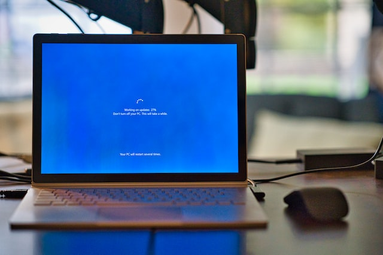
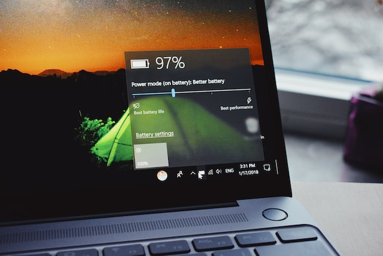
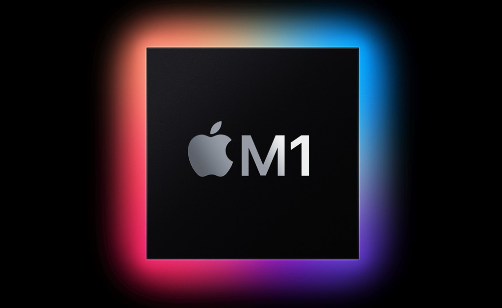

Yap, kata-kata deskripsi singkat di atas adalah lontaran kata-kata yang saya
terima dari teman-teman saya. Bukan hanya dari teman-teman, bahkan sebagian
dari anggota keluarga saya mengatakan hal yang sama. "Beli laptop kok mahal
banget sih? Liat tuh punya X, harga 5 juta doang bisa ngegame lancar".

Reaksi awal saya tentunya kesal, bahkan sekarang saya cenderung menghindari
orang-orang yang mengatakan sedemikian rupa. Di mata orang lain, mungkin laptop
hanyalah sebuah perangkat yang menunjang kebutuhan _Office_ bagi pekerja kantoran,
tugas bagi mahasiswa, atau _gaming_ bagi _gamer_ kelas berat.

Alasan saya kesal termasuk masuk akal, karena kebutuhan utama penggunaan laptop
saya sehari-hari adalah untuk pekerjaan. Sebagai programmer, sebuah
_Personal Computer_, entah itu Laptop, Desktop, ataupun AIO akan kita gunakan
penuh dari pagi sampai malam (bahkan 24 jam kalau kejar _deadline_).

Namun fakta bahwa saya mengeluarkan uang yang cukup besar untuk sebuah MacBook
tidak bisa dipungkiri, toh barangnya ada, saya bawa laptop ini di tas setiap
hari, jadi ya mau sekesal apapun juga ya harus dimaklumi.

Walaupun awalnya _blind buy_, tapi setelah satu tahun pemakaian, saya merasakan
perbedaan yang sangat jauh pada beberapa aspek jika dibanding dengan laptop
biasa. Alasannya beragam.

## Load Time

Foto oleh <a href="https://unsplash.com/es/@cbpsc1?utm_source=unsplash&utm_medium=referral&utm_content=creditCopyText">Clint Patterson</a> dari <a href="https://unsplash.com/photos/yGPxCYPS8H4?utm_source=unsplash&utm_medium=referral&utm_content=creditCopyText">Unsplash</a>

_Load Time_ berarti waktu berapa lama sebuah perangkat dapat menyelesaikan
suatu tugas. Sebagai contoh pada saat kita membuka _browser_, contohnya
_Google Chrome_, kita akan menunggu beberapa detik setelah kita meng-klik ikon
_browser_ tersebut. Berapa detik kita menunggu _Google Chrome_ terbuka
itu disebut dengan _Load Time_.

Sama halnya dengan _Game_, entah itu membuka daerah baru, atau pada saat
transisi ke suatu ruangan, atau sebelum kita melawan _final-boss_, akan ada
_loading_ sebelum kita bisa melaksanakan aktivitas kita selanjutnya.

Tentu saja, ngoding juga perlu Load Time cepat. Saya pernah mendengar beberapa
keluhan dari teman-teman programmer lainnya, bahkan teman-teman sesama mahasiswa
Teknik Informatika:

> Eh lu tau enggak? Gue kalau udah nungguin loading bisa sambil makan atau
> ngemil dulu. Atau tak tinggal boker. Lama banget dah! 🤦‍♂️

Atau bahkan lebih parah:

> Ghits, gue pernah ya nungguin Flutter keinstal, lama banget, sampai pas nunggu
> gue main HP kan. Tapi ketika gue main HP, gue lupa waktu tuh, tau-tau udah
> malam.

Buset dah. Tapi ya _load time_ tidak bisa kita salahkan sepenuhnya dalam kasus
ini, karena faktor utama penyebab _load time_ lama adalah ketidakmampuan
prosesor atau RAM dalam memproses dan mengalokasikan data yang diterima.
Tentu saja kecepatan HDD / SSD juga berpengaruh.

Saya sendiri memiliki pengalaman untuk mem-benchmark MacBook dengan laptop
ASUS X441UV saya yang lama. Untuk membuka sebuah project Flutter, sampai
_running_, perbedaan _load time_-nya sangat drastis.

| Device | Running Time |
| ------ | ------------ |
| MacBook Pro M1 2020 | 24s |
| ASUS X441UV | 1m 12s |

Jadi kesimpulannya, dengan mengeliminasi _load time_, kita sebagai pengembang
bisa berfokus ke hal lain yang lebih penting seperti memikirkan logika dari
suatu sistem yang dibangun. Mengeliminasi _load time_ juga menghasilkan waktu
produktif yang lebih lama.

## Battery Life

Foto oleh <a href="https://unsplash.com/@meymigrou?utm_source=unsplash&utm_medium=referral&utm_content=creditCopyText">Panos Sakalakis</a> dari <a href="https://unsplash.com/photos/35NiG1dYjtM?utm_source=unsplash&utm_medium=referral&utm_content=creditCopyText">Unsplash</a>

Pada dasarnya, kebutuhan laptop itu bisa dibawa kemana saja, tanpa perlu
mengkhawatirkan tidak ada stop kontak. Masalah utama pada laptop sekarang
adalah masalah baterai. Laptop-laptop pada umumnya, memiliki _battery cycle_
yang akan menurun seiring dengan penggunaan. Kasus yang saya alami pada laptop
ASUS saya, laptop itu bisa bertahan tanpa perlu nge-_charge_ di tahun pertama.
Tahun kedua sudah mulai ngedrop, dan harus _full charge_ di bulan ketiga.

Ada tiga opsi yang saya bisa lakukan:
1. Opsi termurah, Colok terus, risikonya kalau tiba-tiba tercabut atau mati listrik.
1. Agak mahal, ganti baterai.
1. Opsi mahal, ganti laptop.

Pada saat itu, sebagai pelajar SMK, saya tidak memiliki uang untuk membeli
baterai. Jadi saya ambil opsi pertama. Sebenarnya risikonya tinggi, jika
pada saat Windows Update, dayanya tercabut, ada kemungkinan Windowsnya _corrupt_.
Atau pada saat ngegame atau ngedesain, ada kemungkinan data progressnya hilang.

Hari ini, pada saat blog ini ditulis, MacBook saya sudah berusia 1 tahun lebih,
dan battery lifenya masih di angka 87%. Masih bisa _survive_ seharian penuh
dibawah _workload_ yang banyak.

Battery health 100% ke 87% dalam satu tahun termasuk boros karena ada sedikit
kesalahan yang saya perbuat, saya menginstal VSCode versi Intel sementara
MacBook saya menggunakan arsitektur ARM. Tentunya saat itu, terjadi
_battery drain_ dari 100% ke 20% dalam waktu 2 jam. Sangat boros.

## Performa

Foto dari [Tekno Cerdas](https://teknocerdas.com/berita/chip-m1-apple-silicon-pada-macbook-air-mengalahkan-macbook-pro/).

Siapa yang mengira bahwa Apple Silicon bisa melebihi performa prosesor Intel
yang pada saat itu terbaru dan terkuat? Dilansir dari [Techjourneyman](https://techjourneyman.com/blog/apple-silicon-evolution-vs-intel-and-amd/),
saat Apple Silicon M1 dirilis, ia berhasil mengalahkan prosesor Intel Generasi
ke-10 yang terbaiknya (i9-10980HK) sehingga Intel harus melawan kembali.

Tentunya Intel berhasil mengalahkan M1 dengan merilis i9-11900K, namun dikalahkan
lagi secara mutlak oleh M1 Max dan M1 Ultra. Secara performa, dan _Integrated GPU_,
M1 jauh di atas Intel, karena Intel bergantung kepada _External GPU_ seperti Nvidia.

"Dengan performa sebaik itu, dan kekuatan setinggi itu, bagimana penggunaan
baterainya, apakah boros?" Tidak. Karena arsitektur M1 yang merupakan ARM yang
berfokus kepada keseimbangan ukuran prosesor, penggunaan daya yang lebih rendah,
panas yang lebih rendah, kecepatan, dan kehidupan baterai yang lebih panjang.
Berbeda dengan prosesor yang memiliki arsitektur x86 yang mengoptimisasikan
performa, namun memakan daya yang sangat besar.

## Kekurangan

Tidak adil jika saya hanya mengutarakan kelebihan MacBook sementara tidak
mengutarakan kekurangannya. Tentunya, hal-hal yang saya rasakan ini memiliki
_impact_ yang sangat besar bagi saya:

1. _Learning Curve_ yang lumayan terjal. Sebagai pengguna MacBook baru, MacOS
   memiliki banyak fitur yang mengandalkan _shortcut_ jika ingin bekerja lebih
   cepat. Terlebih lagi, perbedaan UI dari Windows ke MacOS sangatlah berbeda.

1. Tidak modular, sekalinya Anda membeli MacBook, tidak ada opsi untuk
   meng-upgradenya dari sisi _storage_, RAM, ataupun prosesor. Ya, semua
   komponen telah tersolder ke _motherboard_.

1. Aplikasi Windows tidak bisa diinstal pada MacOS. Walaupun ada beberapa
   pengembang yang bisa membawa aplikasinya ke MacOS, namun kebanyakan juga
   tidak bisa diinstal begitu saja. Solusinya, Anda bisa menggunakan versi web
   dari aplikasi tersebut, atau diinstal pada sebuah Virtual Machine seperti
   _Parallels_.

1. Fitur-fitur yang sudah lama disediakan oleh Windows, belum ada di MacOS.
   Fitur yang sering saya butuhkan di Windows adalah _volume mixer_. _Software_
   simpel yang bertujuan untuk mengatur suara tiap aplikasi, tidak disediakan
   pada MacOS. Entah dalam tahap pengembangan, atau Apple sengaja tidak
   membuatnya.

1. Kapitalisme _at it's best_. Banyak program berbayar yang _overpriced_, bahkan
   untuk penambahan _storage_ iCloud, kita harus membayar _subscription_. Setiap
   fitur bawaan Apple seperti Music, TV, Podcasts semuanya berbayar.

1. _Port_. MacBook rilisan tahun 2020 ke atas, dengan seri 13-inch, tidak
   memiliki port yang cukup untuk kebutuhan sehari-hari. Hanya 2 port
   _thunderbolt type C_ yang disediakan oleh Apple, dan tidak ada port lain.
   Jadi terpaksa saya harus membeli dongle, yang tentunya tak kalah mahal juga.

## Akhir kata

Disamping mewahnya Logo Apple yang disajikan, banyak kelebihan dari MacBook
yang sudah saya rasakan. Namun apakah MacBook ini _worth to buy_, jujur, tidak.
Saya secara pribadi lebih _prefer_ ke Linux, dengan pengoptimasian yang sedemikian
rupa (namun rumit), Anda bisa mendapatkan performa setara MacBook atau lebih
dengan menggunakan Linux tanpa mengeluarkan _budget_ puluhan juta.

Bahkan bisa saya katakan, laptop ASUS X441UV saya hampir mencapai performa
MacBook M1 untuk _basic daily usage_ ketika menggunakan Arch Linux. Jadi, untuk
kalian yang ingin membeli produk Apple, pertimbangkan ulang _budget_-nya, ya 😬.