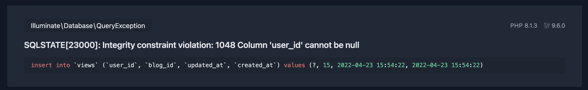

Thumbnail oleh [Markus Spiske](https://unsplash.com/@markusspiske?utm_source=unsplash&utm_medium=referral&utm_content=creditCopyText) di [Unsplash](https://unsplash.com/s/photos/code-error?utm_source=unsplash&utm_medium=referral&utm_content=creditCopyText)

Pada saat pengembangan blog ini, Saya ingin menambahkan sebuah fitur `view` yang digunakan untuk meninjau tulisan mana yang ramai pengunjung/pembaca. Tentunya akan ada dua kasus saat pembuatan `view` ini:
1. Pembaca yang terautentikasi (pada saat tulisan ini dibuat, form login belum dibuat), sistem akan mengirimkan `user_id` ke tabel `view`.
2. Pembaca yang **BELUM** terautentikasi/anonim, sistem akan mengirimkan `null` ke field `user_id`.

Skema migrasi yang Saya buat adalah seperti ini:

```php
Schema::create('views', function (Blueprint $table) {
    $table->id();
    $table->foreignId('user_id')->constrained()->nullable();
    $table->foreignId('blog_id')->constrained();
    $table->timestamps();
});
```

Testing tahap pertama, ketika User terautentikasi, data `view` dapat tersimpan dengan baik di database. Tanpa error. Namun Saya tersadar pada saat testing berjalan, session Saya masih ada, dan ketika saya log out, terjadilah error:



Ternyata cara penyelesaiannya cukup simpel, dan tidak membutuhkan waktu lama. Kita hanya perlu mengubah:

```php
// Sebelum
$table->foreignId('user_id')->constrained()->nullable();

// Setelah
$table->foreignId('user_id')->nullable()->constrained();
```

Kode selengkapnya:

```php
Schema::create('views', function (Blueprint $table) {
    $table->id();
    $table->foreignId('user_id')->nullable()->constrained();
    $table->foreignId('blog_id')->constrained();
    $table->timestamps();
});
```

Terima kasih sudah membaca!