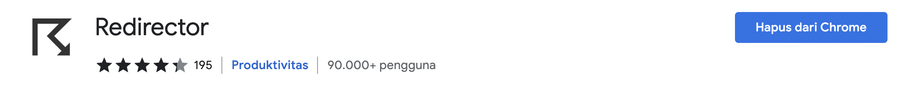
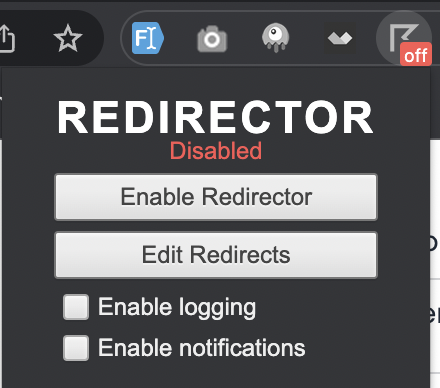
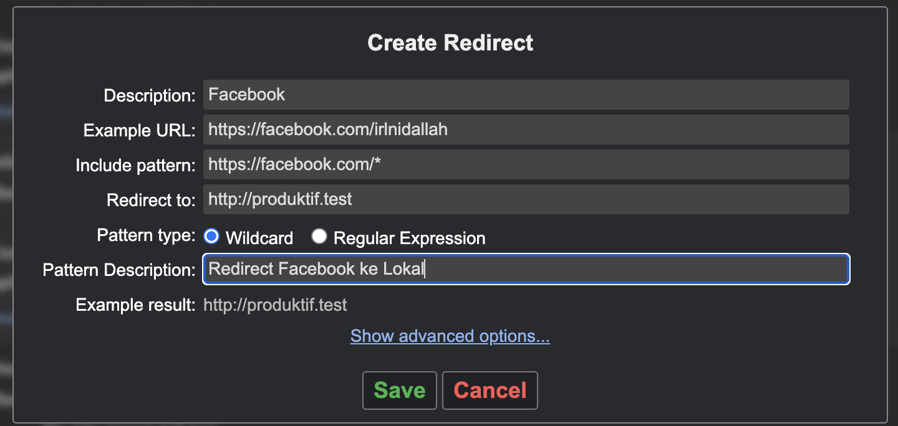
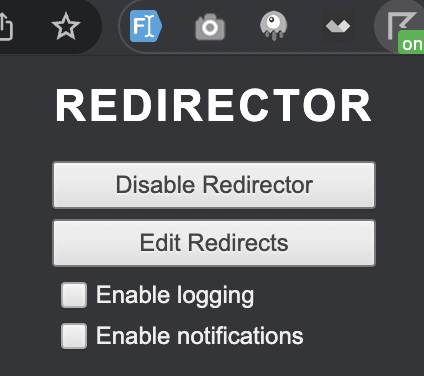

Kemarin Saya memposting sebuah [video](https://www.facebook.com/irlnidallah/posts/pfbid02bNTyEa2mgzTAykpnK9fDrF2gg6h48a5zzaDVUwjbgBChwCLKzQzg1Sdzp2SzwfPml?__cft__[0]=AZUsBR5X6qkEWqlacio4RZ4QiRS95EbsGLDskVZTJ5QNxfpn3uI4_AA_kq3yE0qqGQKKonvb7dZu7gZZrnF94bUkh_RmP7465IQ4ETVxr-eCYs2dg5ZrvXZGBwbOj782EzpcdFjO2S3WxPQssODYa2Xt&__tn__=%2CO%2CP-R) tentang *redirection* ke website lokal jika Saya ingin membuka YouTube atau media sosial lainnya yang notabene mengurangi waktu produktif. Videonya cukup viral, Saya lihat tulisan ini dibuat sudah ada 66 *shares*. Karena ada yang minta tutorial, ya sudah Saya buatkan disini 😅.

Sebagai catatan saja bahwa ini harus kalian lakukan manual, jadi nggak bisa otomatis apalagi di jam tertentu bisa ngeredirect. Kalian harus punya *concern* sendiri terhadap jam produktif kalian. Semoga sampai sini kalian paham. *Ah iya, barangkali temen-temen disini punya pengalaman buat bikin ekstensi Chrome dengan fungsi yang serupa, PM Saya di [Facebook](https://www.facebook.com/irlnidallah/) ya. Ntar kita kembangin bareng-bareng.*

Oke pertama, kalian harus install ekstensi ini, namanya [Redirector](https://chrome.google.com/webstore/detail/redirector/ocgpenflpmgnfapjedencafcfakcekcd). Secara pribadi Saya belum mencoba mencari ekstensi ini untuk Firefox ataupun Edge, nanti kalian cari sendiri.

Setelah diinstal, buka ekstensinya. Nanti ada interface seperti ini, kalian klik *Edit Redirects*.

Nanti kalian akan masuk ke halaman ekstensinya Redirector. Klik *Create new redirect*.

Nanti bakal ada modal yang muncul, kalian isi seperti ini:

Penjelasan:
* *Description* diisi dengan situs apa yang ingin kalian *redirect*. Contoh di atas, Facebook.
* *Example URL* diisi dengan contoh URL yang kalian ingin *redirect*, bisa diisi apa saja, tapi secara umum jika parameter *Include pattern* diisi sama Wildcard, ngeakses `https://facebook.com` pun bakal diredirect.
* *Include pattern* diisi dengan *Example URL*, bedanya setelah garis miring terakhir pakai *Wildcard*. Kalian bisa lihat contohnya di ekstensi ini setelah instalasi.
* *Redirect to* diisi dengan situs yang kalian ingin tuju. Contohnya saya buat ke `http://produktif.test`, Saya pake domain `.test` karena Saya menggunakan `Laravel Valet`. Kalian bisa isi dengan `http://127.0.0.1/<nama_project>` atau `http://localhost/<nama_project>` jika *development environment* kalian bukan menggunakan Valet.
* *Pattern type* bisa kalian pilih *Wildcard* atau *Regex*. Jika kalian pilih *Wildcard*, pastikan Include *pattern*-nya ada tanda bintang. Jika *Regex*, kalian harus memahami *pattern* dari URL yang ingin diredirect.
* *Pattern description* diisi dengan deskripsi pattern yang kalian buat.

Setelah itu, klik *Save*.

Kalian bisa import Redirector yang sudah Saya buat, situs yang Saya redirect:
* YouTube
* Facebook
* Twitter
* Instagram
* Tokopedia (ya, klo gabut Saya sering bolak-balik sini)

Unduh [`Redirector.json`](https://shiroyuki.dev/files/Redirector.json).

Untuk halaman redirectnya sendiri, Saya yakin kalian sudah bisa buat sendiri. Atau jika ingin pakai kode Saya, cek [di sini](https://gist.github.com/NikarashiHatsu/44c9925a2b2f6605d082e4c65143690c). Setelah semua siap, pastikan Redirectornya nyala ya.

Sekian tutorial singkatnya. Semoga membantu, dan terima kasih sudah membaca!

Thumbnail oleh [Robert Rugiero](https://unsplash.com/@robert2301?utm_source=unsplash&utm_medium=referral&utm_content=creditCopyText) dari [Unsplash](https://unsplash.com/s/photos/direction?utm_source=unsplash&utm_medium=referral&utm_content=creditCopyText).