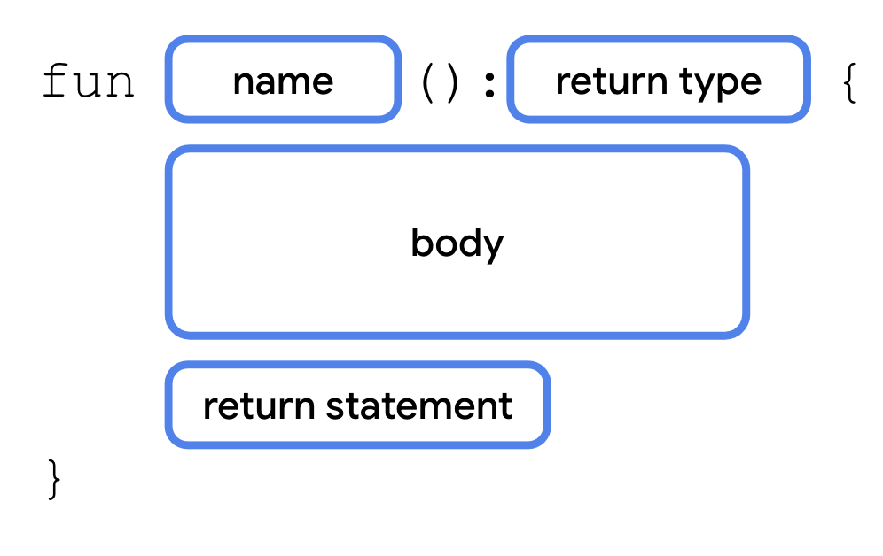
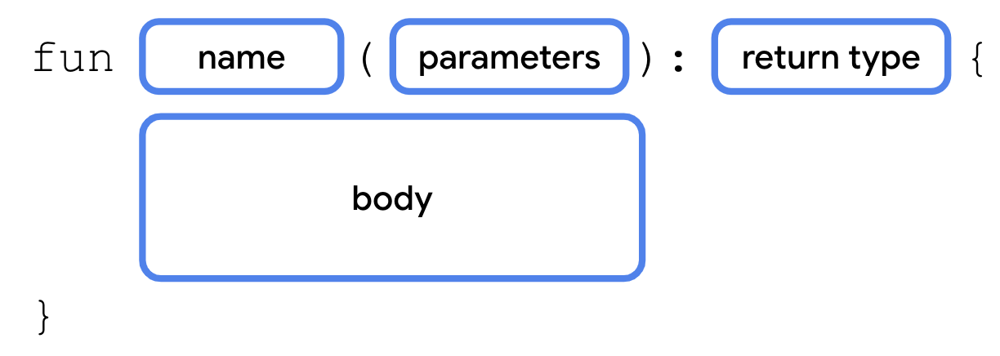

Hai hai, ketemu lagi di artikel #JuaraAndroid2023. Disini Saya belajar tentang fungsi. Sebelumnya kita melihat program sederhana yang mencetak `Hai, Ibu!`, nah secara tidak langsung, program tersebut memiliki dua fungsi, yaitu:
- `main()` yang dibutuhkan di setiap program Kotlin, sebagai permulaan dari program.
- `println()` yang berfungsi untuk mencetak teks.

Fungsi sejatinya digunakan untuk memecah blok kode menjadi beberapa baris kode yang bisa digunakan sewaktu-waktu. Teman-teman mungkin menyadari bahwa fungsi `main()` tidak dipanggil secara eksplisit oleh pengembang, namun fungsinya tetap terpanggil pada saat program dijalankan, mengapa? Hal itu dikarenakan kompiler Kotlin menggunakan `main()` sebagai permulaan program.


## Mendefinisikan dan memanggil fungsi

Yap, fungsi, seperti yang kita tahu bisa didefinisikan dan dipanggil setiap waktu. Anggap saja kita ingin membuat sebuah fungsi yang digunakan untuk mencetak ucapan selamat ulang tahun.

```kt
fun main() {
    println("Selamat ulang tahun, Wafda! 🎉")
    println("Sekarang umurmu 18 tahun!")
}
```

Program sederhana diatas akan membuat output seperti ini:

```
Selamat ulang tahun, Wafda! 🎉
Sekarang umurmu 18 tahun!
```

Sekarang, bagaimana caranya untuk kita agar bisa membuat fungsi tersebut bisa dipakai sewaktu-waktu? Tentunya dengan cara membuat fungsi baru lagi, anggap saja fungsi baru tersebut akan kita namakan `ucapanUltah()`, berikut contoh kodenya:

```kt
fun main() {
    ucapanUltah()
}

fun ucapanUltah() {
    println("Selamat ulang tahun, Wafda! 🎉")
    println("Sekarang umurmu 18 tahun!")
}
```

Cukup simpel bukan? Lalu, tetapi...bagaimana jika kita ingin mengubah nama orang yang ulang tahun beserta umurnya? Kita tidak mungkin membuat setiap fungsi seperti `ucapanUltahWafdaKe18()` serta `ucapanUltahWafdaKe19()` dan seterusnya kan? Disitulah argumen / parameter fungsi dibutuhkan. Akan kita bahas di bagian selanjutnya.


## Mengembalikan sebuah value dari sebuah fungsi

Jika teman-teman baru dalam pemrograman, bahasa yang *strictly-typed* mungkin akan menjadi hal yang sulit dicerna, namun, karena Kotlin adalah bahasa yang cukup dinamis tetapi tetap *strict*, bisa Saya katakan bahwa Kotlin adalah bahasa yang sempurna untuk dipelajari sebagai pemula.

*Return value* mengacu kepada nilai yang dikembalikan oleh sebuah fungsi atau ekspresi. Anggaplah kita ingin membuat sebuah fungsi yang berfungsi untuk menambahkan angka `a` dan angka `b`. Apa yang kita ekspektasikan? Tentu saja jumlah dari `a + b`, dengan tipe data angka.

```kt
fun tambah(a: Int, b: Int): Int {
    return a + b;
}
```

Jika fungsi yang teman-teman buat adalah fungsi singkat, tanpa ada pengoperasian yang kompleks, teman-teman bisa membuat *inline function* atau *one-line function*, yaitu fungsi yang dibuat hanya dengan menggunakan 1 baris kode:

```kt
fun tambah(a: Int, b: Int): Int = a + b
```

Jadi, secara anatomi fungsi yang ada pada Kotlin, sejauh ini kita bisa simpulkan seperti berikut:




## Return type

Secara default, jika teman-teman tidak menspesifikasikan *return type*, maka Kotlin akan secara otomatis menggunakan *return type* `Unit`. `Unit` pada Kotlin kurang lebih sama seperti:
- `void` pada Java;
- `Void` / empty tuple `()` pada Swift;
- `None` pada Python;
- `self` / `static` pada PHP; dll.

Yuk kita belajar cara menggunakan *return type* dengan memodifikasi fungsi `ucapanUltah()` yang sudah kita buat di atas.

1. Pada fungsi `ucapanUltah()`, tambahkan titik dua `:` setelah kurung tutup, dan spesifikasikan *return type*-nya sebagai `Unit`

```kt
fun main() {
    ucapanUltah()
}

fun ucapanUltah(): Unit {
    println("Selamat ulang tahun, Wafda! 🎉")
    println("Sekarang umurmu 18 tahun!")
}
```

2. Kita jalankan programnya, dan semuanya berjalan normal seperti biasa

```
Selamat ulang tahun, Wafda! 🎉
Sekarang umurmu 18 tahun!
```

Perhatikan bahwa dengan *return type* `Unit`, ataupun tanpa *return type* sama sekali, program masih bisa berjalan dengan normal.

### Mengembalikan `String` dari fungsi `ucapanUltah()`

Untuk mendemokan bagaimana sebuah fungsi dapat mengembalikan sebuah nilai, kita akan modifikasi `ucapanUltah()` untuk mengembalikan `String`, alih-alih kita mencetak outputnya ke konsol.

1. Ubah *return type* `Unit` ke `String`

```kt
fun main() {
    ucapanUltah()
}

fun ucapanUltah(): String {
    println("Selamat ulang tahun, Wafda! 🎉")
    println("Sekarang umurmu 18 tahun!")
}
```

2. Ketika dijalankan, kita akan mendapatkan error, karena fungsi membutuhkan *return type* yang valid. Karena tidak ada nilai yang dikembalikan / di-*return*, maka compiler bingung dan mencetak Exception:

```
A 'return' expression required in a function with a block body ('{...}')
```

Tapi *don't worry*, kita tetap bisa mengubah kode, ingat moto kita bahwa "Jika kode tersebut salah, berarti kita menuju jalan yang benar".

3. Karena kita hanya bisa menggunakan 1 *return* pada setiap fungsi, maka kita harus mengubah fungsi `println()` menjadi masing-masing variabel yang merepresentasikan ucapan

```kt
fun ucapanUltah(): String {
    val ucapanNama = "Selamat ulang tahun, Wafda! 🎉"
    val ucapanUsia = "Sekarang umurmu 18 tahun!"
}
```

4. Menggunakan sintaks *string template* yang ada di seri [ke-3](../variabel-pada-kotlin/#string-template), kita bisa menggabungkan 2 pesan di atas menjadi 1 return.

Kita juga akan menggunakan karakter `\n` yang digunakan untuk memisah baris.

```kt
fun ucapanUltah(): String {
    val ucapanNama = "Selamat ulang tahun, Wafda! 🎉"
    val ucapanUsia = "Sekarang umurmu 18 tahun!"
    return "$ucapanNama\n$ucapanUsia"
}
```

5. Pada fungsi `main()`, karena kita telah mengubah fungsi `ucapanUltah()` untuk mengembalikan sebuah nilai, teman-teman bisa simpan hasil kembaliannya pada sebuah variabel string. Sehingga kode lengkapnya terlihat seperti ini:

```kt
fun main() {
    val ucapan: String = ucapanUltah()
    println(ucapan)
}

fun ucapanUltah(): String {
    val ucapanNama = "Selamat ulang tahun, Wafda! 🎉"
    val ucapanUsia = "Sekarang umurmu 18 tahun!"
    return "$ucapanNama\n$ucapanUsia"
}
```

Hasil dari program di atas adalah sebagai berikut:

```
Selamat ulang tahun, Wafda! 🎉
Sekarang umurmu 18 tahun!
```

Karena `ucapanUltah()` adalah hasil dari *return* langsung, kita bisa menggunakan secara langsung fungsi `ucapanUltah()` ke `println()` sehingga kita tidak perlu mengalokasikan sedikit memori ke variabel ucapan.

```kt
fun main() {
    println(ucapanUltah())
}

fun ucapanUltah(): String {
    val ucapanNama = "Selamat ulang tahun, Wafda! 🎉"
    val ucapanUsia = "Sekarang umurmu 18 tahun!"
    return "$ucapanNama\n$ucapanUsia"
}
```


## Parameter / Argumen

Secara tidak langsung, jika teman-teman perhatikan, fungsi `println()` memiliki 1 argumen yang menerima `String` untuk dicetak pada terminal / konsol. Jadi, sebenarnya sejauh ini teman-teman sudah mengerti cara menggunakan parameter.

Secara umum, parameter adalah nilai yang diberikan ke fungsi, atau konstruktor saat mereka dipanggil. Sehingga parameter yang digunakan dapat diproses pada blok kode sebuah fungsi. Anatominya adalah sebagai berikut:



Tentu saja, tidak ada batas dalam penggunaan parameter yang ingin teman-teman gunakan, jadi, bebaslah berkreasi!

Untuk kasus ini, yuk kita ubah fungsi `ucapanUltah()` sehingga bisa menerima Nama dan Usia:

```kt
fun ucapanUltah(nama: String, usia: Int): String {
    val ucapanNama = "Selamat ulang tahun, $nama! 🎉"
    val ucapanUsia = "Sekarang umurmu $usia tahun!"
    return "$ucapanNama\n$ucapanUsia"
}
```

Apa keuntungan yang kita dapat dari perubahan fungsi tersebut? Kita bisa secara dinamis mengubah Nama dan Usia sesuai dengan data yang kita inginkan. Seperti contoh:

```kt
fun main() {
    println(ucapanUltah("Wafda", 18))
}

fun ucapanUltah(nama: String, usia: Int): String {
    val ucapanNama = "Selamat ulang tahun, $nama! 🎉"
    val ucapanUsia = "Sekarang umurmu $usia tahun!"
    return "$ucapanNama\n$ucapanUsia"
}
```

Program di atas akan mencetak teks seperti berikut:

```
Selamat ulang tahun, Wafda! 🎉
Sekarang umurmu 18 tahun!
```

Karena fungsi bersifat bisa dipanggil berkali-kali, sesuai dengan apa yang kita inginkan, maka kita bisa menggunakan fungsi tersebut berulang kali, sesuka hati, terserah kita:

```kt
fun main() {
    println(ucapanUltah("Wafda", 18))
    println(ucapanUltah("Wangi", 14))
}

fun ucapanUltah(nama: String, usia: Int): String {
    val ucapanNama = "Selamat ulang tahun, $nama! 🎉"
    val ucapanUsia = "Sekarang umurmu $usia tahun!"
    return "$ucapanNama\n$ucapanUsia"
}
```

Hasil dari program di atas adalah sebagai berikut:

```
Selamat ulang tahun, Wafda! 🎉
Sekarang umurmu 18 tahun!
Selamat ulang tahun, Wangi! 🎉
Sekarang umurmu 14 tahun!
```

*Pretty fun* ya? Definitely *fun as hell*.


## Named Arguments

Fungsi `ucapanUltah()` yang telah kita buat sejauh ini menerima 2 parameter, yaitu `nama` dan `usia`. Namun pada saat pemanggilan `ucapanUltah()`, secara sekilas kita tidak bisa mengetahui parameter apa yang kita isikan.

IDE modern seperti VSCode atau Android Studio akan secara otomatis memberikan informasi argumen apa saja yang teman-teman butuhkan, namun pada IDE yang lebih simpel seperti Notepad++ atau Sublime Text yang tidak memiliki fitur tersebut, teman-teman sesama programmer akan mendapat suatu kebingungan. "Lho tetiba ada fungsi `ucapanUltah()` tapi gak jelas parameter apa yang dipakai".

Jadi, untuk menambah keterbacaan kode, kita menggunakan *Named Arguments*. Pengimplementasiannya pada fungsi `main()` akan terlihat sebagai berikut:

```kt
fun main() {
    println(ucapanUltah(nama = "Wafda", usia = 18))
    println(ucapanUltah(nama = "Wangi", usia = 14))
}
```

Lalu apa keuntungan dari *Named Arguments* ini? Pertama, keterbacaan kode menjadi lebih baik; Kedua, walaupun posisi argumen dibolak-balik, fungsi akan tetap berjalan karena kompiler mengetahui argumen apa yang digunakan:

```kt
fun main() {
    println(ucapanUltah(nama = "Wafda", usia = 18))
    println(ucapanUltah(usia = 14, nama = "Wangi"))
}
```

Kode di atas akan tetap berjalan normal seperti biasa dengan output sebagai berikut

```
Selamat ulang tahun, Wafda! 🎉
Sekarang umurmu 18 tahun!
Selamat ulang tahun, Wangi! 🎉
Sekarang umurmu 14 tahun!
```


## Default Arguments

Kita mengetahui bahwa `ucapanUltah()` sekarang memiliki 2 argumen, namun apa yang terjadi jika fungsi `ucapanUltah()` dipanggil langsung tanpa mengirimkan nilai-nilai argumennya? Anggap kita memiliki sebuah program seperti ini:

```kt
fun main() {
    println(ucapanUltah())
}

fun ucapanUltah(nama: String, usia: Int): String {
    val ucapanNama = "Selamat ulang tahun, $nama! 🎉"
    val ucapanUsia = "Sekarang umurmu $usia tahun!"
    return "$ucapanNama\n$ucapanUsia"
}
```

Kotlin akan memberikan Exception / error seperti ini:

```
No value passed for parameter 'nama'
No value passed for parameter 'usia'
```

Disinilah *Default Arguments* dibutuhkan, jadi, walaupun tanpa nilai argumen yang diberikan, program akan tetap bisa berjalan menggunakan nilai *default* yang sudah dispesifikasikan. Mari ubah fungsi `ucapanUltah()` kita:

```kt
fun ucapanUltah(nama: String = "Aghits", usia: Int = 22): String {
    val ucapanNama = "Selamat ulang tahun, $nama! 🎉"
    val ucapanUsia = "Sekarang umurmu $usia tahun!"
    return "$ucapanNama\n$ucapanUsia"
}
```

Kode lengkapnya akan terlihat seperti ini, dengan tambahan beberapa contoh ucapan yang sudah kita buat di atas:

```kt
fun main() {
    println(ucapanUltah())
    println(ucapanUltah(nama = "Wafda", usia = 18))
    println(ucapanUltah(usia = 14, nama = "Wangi"))
}

fun ucapanUltah(nama: String = "Aghits", usia: Int = 22): String {
    val ucapanNama = "Selamat ulang tahun, $nama! 🎉"
    val ucapanUsia = "Sekarang umurmu $usia tahun!"
    return "$ucapanNama\n$ucapanUsia"
}
```

Sekarang, programnya akan bisa berjalan tanpa ada error. Yay!

```
Selamat ulang tahun, Aghits! 🎉
Sekarang umurmu 22 tahun!
Selamat ulang tahun, Wafda! 🎉
Sekarang umurmu 18 tahun!
Selamat ulang tahun, Wangi! 🎉
Sekarang umurmu 14 tahun!
```

## Ringkasan
- Fungsi didefinisikan menggunakan *keyword* `fun`;
- Fungsi membantu program yang besar sehingga lebih mudah dimaintain, dan mencegah repetisi kode;
- Fungsi dapat mengembalikan sebuah nilai yang bisa disimpan dalam variabel;
- Fungsi dapat mengambil *parameter* sehingga dapat digunakan dalam *body* dari sebuah fungsi;
- Argumen adalah nilai-nilai yang dikirimkan pada saat pengambilan fungsi;
- Teman-teman bisa menggunakan *nama argumen* pada saat pemanggilan fungsi. Ketika menggunakan *named arguments*, teman-teman bisa membolak-balik orientasi argumen tanpa memengaruhi fungsi sedikitpun;
- Teman-teman bisa menspesifikasikan *default argument* yang memungkinkan teman-teman bisa memanggil fungsi tersebut tanpa menggunakan argumen apapun;