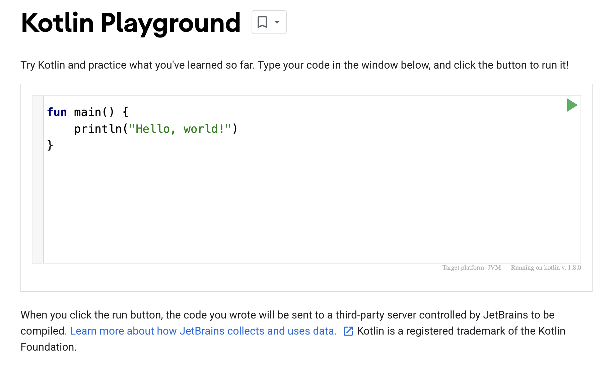
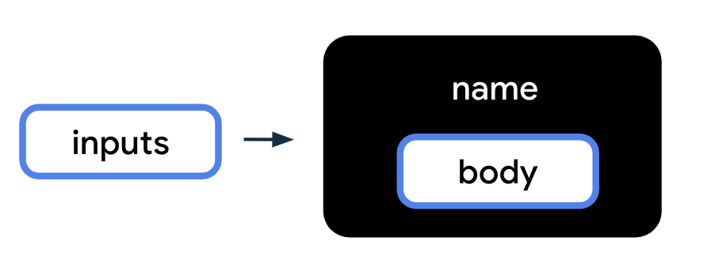
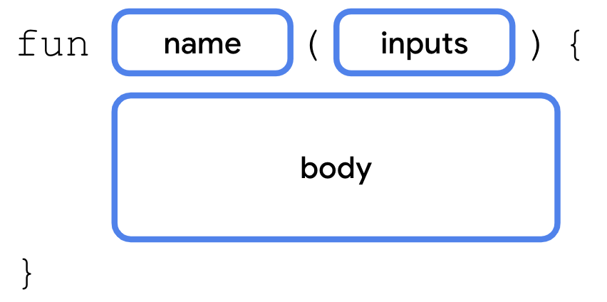
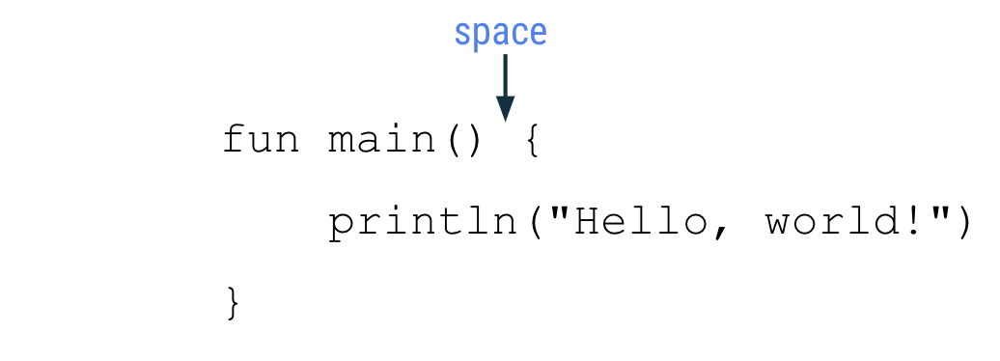
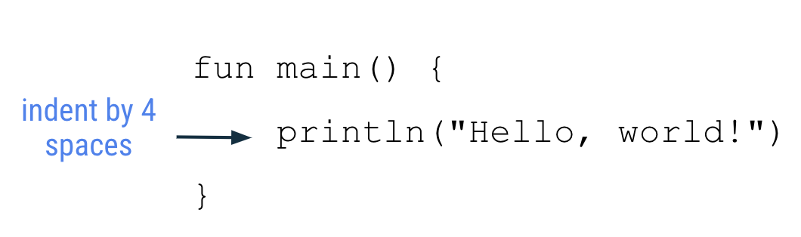
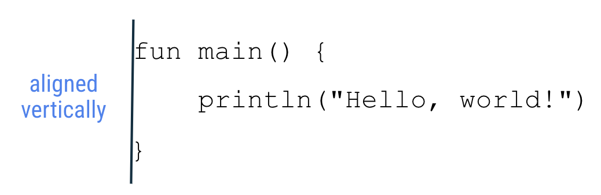

Pada kesempatan kali ini, Saya akan membuat aplikasi Android menggunakan Kotlin. Tapi sebelum itu, tentu saja Saya harus mempelajari *basic*nya terlebih dahulu. Kotlin adalah bahasa pemrograman yang direkomendasikan oleh Google untuk membuat aplikasi Android.

Sebuah bahasa pemrograman modern yang membantu pengembang untuk menjadi lebih produktif. Dengan kode yang lebih sedikit, Kotlin dapat memperoleh fungsionalitas yang sama dibanding dengan bahasa pemrograman lainnya. Aplikasi yang dibuat Kotlin juga lebih jarang *crash*, sehingga aplikasi yang dibuat dapat lebih stabil.

Untuk pengembangnya sendiri, secara *developer-experience*, dengan Kotlin kita dapat membuat aplikasi Android dengan waktu yang lebih singkat. *Let's go* gak sih?


## Kotlin Playground

Jadi, Google ini punya Kotlin Playground, sebuah *codelab* yang disajikan untuk kita developer untuk bermain-main dengan kode Kotlin. Berikut adalah *screenshotnya*:
 *In the background*, Kotlin Playground menggunakan Java Virtual Machine, tentu saja tetap menggunakan Java sebagai bahasa utamanya. Jadi kode Kotlin yang kita buat akan di-*compile* terlebhi dahulu.


## Here comes the programming...

Saatnya memulai mengkodingan. Pertama-tama, Saya belajar untuk membuat / mendefinisikan sebuah fungsi. Sebuah fungsi / *function* adalah sebuah set instruksi yang digunakan untuk melakukan sebuah pekerjaan.

Untuk membuat sebuah fungsi, ada beberapa bagian yang dibutuhkan:
- Fungsi membutuhkan sebuah **nama**, sehingga bisa dipanggil nanti;
- Fungsi juga *bisa saja* membutuhkan beberapa **input** atau informasi yang dibutuhkan ketika fungsi dipanggil. Fungsi menggunakan inputan-inputan tersebut untuk menyelesaikan tujuannya. Beberapa input bisa jadi opsional, bahkan tidak memerlukan input satupun.
- Fungsi harus memiliki **body**, yang mencakup instruksi-instruksi untuk melakukan sebuah pekerjaan.



Untuk menerjemahkan diagram di atas ke sintaks Kotlin, kita menggunakan *keywork* **fun** (menyenangkan, ya? :smile:) yang harus didefinisikan terlebih dahulu, lalu dilanjut oleh nama fungsinya, dilanjut oleh input-input dalam tanda kurung, lalu dialnjut oleh kurawal diantara **body**-nya.



Penamaan fungsi juga tidak bisa sembarangan, ada beberapa aturan yang harus diikuti seperti:
- Tidak boleh menggunakan [Kotlin Keyword](https://kotlinlang.org/docs/keyword-reference.html);
- Dianjurkan menggunakan penulisan *camelCase*, misal `calculateTip`, `displayErrorMessage`, atau `takePhoto`;

Berikut adalah program pertama Saya menggunakan Kotlin:

```kt
fun main() {
    println("Halo, Ibu!")  // Halo, Ibu!
}
```

Saya belum bisa memahami cara menggunakan input parameter / argumen di bahasa ini, mungkin akan dijelaskan di bagian selanjutnya. :grinning_face_with_sweat:


## Kotlin Function Styling Guide

Karena Saya ingin menjadi developer hebat dan tidak abal-abal, tentunya kerapihan kode juga Saya pelajari betul. Tentunya, ini akan membantu Saya dan tim (semoga, kedepannya) untuk membuat sebuah aplikasi bersama-sama. Jadi, ada beberapa rekomendasi yang disarankan oleh Google:
- Nama fungsi harus berbentuk `camelCase`, dan harus menggunakan Kata Kerja atau Frasa Kata Kerja;
- Setiap *statement* harus berada dalam barisnya sendiri;
- Kurawal pembuka harus ada di akhir barus dimana fungsi berada;
- Harus ada spasi sebelum kurawal pembuka;
  
- *Body* fungsi harus di-inden dengan 4 spasi, bukan menggunakan tab;
  
- Kurawal penutup harus berada di baris akhir, sejajar dengan *keyword* `fun`;
  


## Ringkasan
- Sebuah program Kotlin membutuhkan fungsi `main` sebagai entri program;
- Untuk mmbuat sebuah fungsi, gunakan *keyword* `fun`, dilanjut dengan nama fungsi, input-input jika ada diapit dengan tanda kurung, dilanjut dengan *body* yang diapit dengan kurawal;
- Nama fungsi harus menggunakan `camelCase`;
- Menggunakan `println()` untuk mencetak teks ke output;
- Mematuhi aturan penulisan Kotlin;
- Kesalahan itu wajar, *troubleshooting is eternal*;