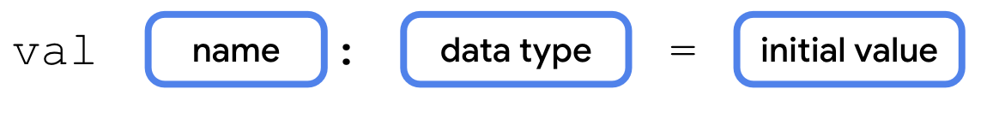
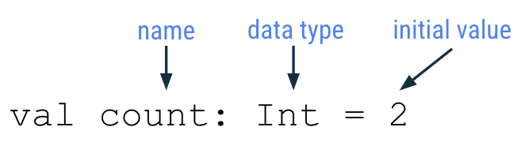
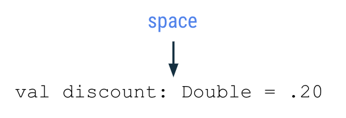
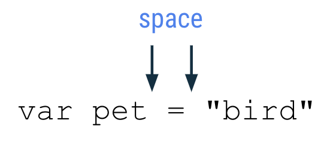

Pada kesempatan kali ini, Saya akanbelajar untuk membuat variabel pada Kotlin. Kita kembali ke pelajaran SD dulu sebentar, yuk. Dulu, pada saat kita belajar untuk menghitung persegi panjang, ada beberapa informasi yang kita butuhkan untuk menentukan apakah persegi panjang itu valid:
1. Bidang tersebut memiliki `panjang`;
2. Bidang tersebut memiliki `lebar`;
3. Bidang tersebut tidak boleh memiliki `panjang` dan `lebar` yang sama, jika sama, maka sudah bisa dipastikan bidang datar tersebut adalah sebuah Persegi.

Nah, `panjang` dan `lebar` inilah yang kita sebut sebagai variabel. Supaya kita dapat mengingat rumus tersebut dengan mudah, maka diperpendek lah variabel tersebut menjadi `p` dan `l`. Simpel kan? Itulah variabel, *in a nutshell*.


## Tipe Data

Ada beberapa tipe data yang harus kita pahami, supaya kita bisa membuat aplikasi yang bebas dari *bug*:
| Tipe Data Kotlin | Data apa yang bisa digunakan                                                                                            | Contoh                         |
|------------------|-------------------------------------------------------------------------------------------------------------------------|--------------------------------|
| `String`         | Teks                                                                                                                    | "Tambah kontak" "Cari" "Masuk" |
| `Int`            | Angka integer                                                                                                           | 32 1293490 -59281              |
| `Double`         | Angka desimal                                                                                                           | 2.0 501.0292 -31723.99999      |
| `Float`          | Angka desimal, namun kurang akurat daripada `Double`, memiliki `f` atau `F` di akhir angka                              | 5.0f -1630.209f 1.2940278F     |
| `Boolean`        | `true` atau `false`. Gunakan tipe data ini jika hanya ada dua value. `true` dan `false` termasuk *keywords* pada Kotlin | `true` `false`                 |


### Tipe data untuk Angka

Ternyata, ada tipe data lainnya yang merepresentasikan angka. Teman-teman dapat menggunakan tipe data ini untuk penggunaan memori yang lebih optimal:

| Tipe    | Ukuran (bits) | Value minimal                      | Value maksimal                       |
|---------|---------------|------------------------------------|--------------------------------------|
| `Byte`  | 8             | -128                               | 127                                  |
| `Short` | 16            | -32768                             | 32767                                |
| `Int`   | 32            | -2,147,483,648 (-2<sup>31</sup>)             | 2,147,483,647 (2<sup>31</sup> - 1)             |
| `Long`  | 64            | -9,223,372,036,854,775,808 (-2<sup>63</sup>) | 9,223,372,036,854,775,807 (2<sup>63</sup> - 1) |


### Tipe data Float

Untuk bilangan ril, Kotlin menyediakan tipe *floating-point* `Float` dan `Double` yang melekat pada [standar IEEE 754](https://en.wikipedia.org/wiki/IEEE_754). `Float` mencerminkan *single-precision*, sementara `Double` mencerminkan *double-precision*.

Perbedaannya adalah:

| Tipe     | Ukuran (bits) | Bit signifikan | Bit eksponen | Digit desimal |
|----------|---------------|----------------|--------------|---------------|
| `Float`  | 32            | 24             | 8            | 6-7           |
| `Double` | 64            | 53             | 11           | 15-16         |

Untuk menginisialisasi variabel `Double` atau `Float`, adalah dengan cara menggunakan angka yang dipisahkan oleh titik (`.`). Contohnya:

```kt
val pi = 3.14 // double
// val one: Double = 1 // Error: type mismatch
val oneDouble = 1.0 // double
```

Untuk menspesifikasikan `Float` secara eksplisit, gunakan suffix `f` atau `F`. Jika pecahannya lebih dari 6-7 digit, maka angka tersebut akan dibulatkan:

```kt
val e = 2.7182818284 // Double
val eFloat = 2.7182818284f // Float, angka aslinya adalah 2.7182817
```

Berbeda dengan bahasa pemrograman lainnya, Kotlin tidak memiliki konversi antar angka. Contohnya, sebuah fungsi dengan parameter `Double` hanya bisa digunakan oleh variabel `Double`, bukan `Float` atau `Int`, atau tipe data numerik lainnya:

```kt
fun main() {
    fun printDouble(d: Double) {
        print(d)
    }

    val i = 1
    val d = 1.0
    val f = 1.0f

    printDouble(d) // 1.0
    // printDouble(i) // Error: Type mismatch
    // printDOuble(f) // Error: Type mismatch
}
```

Untuk referensi selengkapnya, teman-teman bisa baca di [Konsep Angka Kotlin](https://kotlinlang.org/docs/numbers.html).


## Anatomi Variabel

Sebuah variabel secara singkat membutuhkan `expression` dan `value`. Contohnya sebuah variabel `count` memiliki value `2`.

```kt
fun main() {
    val count: Int = 2
    println(count) // 2
}
```

Pada Kotlin sendiri, pendeklarasian variabel menggunakan keyword `val`, diikuti dengan `expression` atau `name`, lalu `data type` (jika ingin dideklarasikan secara eksplisit), lalu `=`, dilanjutkan dengan `initial value`. Kurang lebih seperti ini ilustrasinya:



Dengan konteks variabel `count` di atas, kita dapat mengatakan bahwa variabel `count` memiliki tipe data `Int` dan memiliki `initial value` ke `2`:



Untuk penulisan nama variabel tersendiri, Google menyarankan untuk:
- Tidak menggunakan (keyword Kotlin)[https://kotlinlang.org/docs/keyword-reference.html] sebagai nama variabel;
- Menggunakan nama yang mendeskripsikan data yang akan disimpan;
- Menggunakan `camelCase`, contoh `numberOfEmails`, `cityName`, `bookPublicationDate`;


## String Template

Terkadang kita ingin menggabungkan tipe data satu ke tipe data lainnya untuk menyajikan informasi. Pada kasus ini, anggap saja kita ingin menampilkan "Anda memiliki 2 pesan yang belum dibaca". Jadi, ayo coba kita buat:

1. Kita buat aplikasi sederhana, yang digunakan untuk menampilkan pesannya terlebih dahulu tanpa angka:
```kt
fun main() {
    val count: Int = 2
    println("Anda memiliki pesan yang belum dibaca")
}
```
2. Jalankan program tersebut, lalu kita akan melihat pesan `Anda memiliki pesan yang belum dibaca`. Tentunya pesan ini tidak masuk akal, karena kita tidak tahu berapa banyak pesan yang belum kita baca.
3. Untuk memperbaiki output tersebut, kita membutuhkan sebuah string template. Expresi untuk menggunakan string template adalah menggunakan simbol dolar (`$`), yang dilanjut oleh nama variabel.
```kt
fun main() {
    val count: Int = 2
    println("Anda memiliki $count pesan yang belum dibaca")
}
```
4. Ketika kita jalankan programnya, maka output akan menampilkan `Anda memiliki 2 pesan yang belum dibaca`.


## Type Inference

Terkadang kita *malas* atau bahkan tidak mengetahui tipe data apa yang dikirimkan oleh server kepada aplikasi kita. Untuk itu, kita bisa men-ignore tipe data yang ingin kita gunakan pada saat pendeklarasian variabel.


Hati-hati, walaupun diperbolehkan, namun keambiguan tipe data bisa jadi berdampak buruk kepada aplikasi yang Anda buat. Jadi, pastikan untuk memvalidasi tipe data apa yang akan digunakan, atau definisikan tipe data yang ingin Anda pakai secara eksplisit.


Sebagai contoh kita ingin mempersingkat waktu pengembangan dengan cara tidak menuliskan tipe data yang digunakan, kita bisa saja menuliskan
```kt
val count = 2

// kode di atas sama saja dengan:
val count: Int = 2
```

Kompiler Kotlin mengetahui bahwa kamu ingin menyimpan `2` ke dalam variabel `count`, jadi dia akan menggunakan tipe `Int` secara otomatis. Namun perlu diingat, jika tidak ada *initial value* yang digunakan pada saat teman-teman membuat variabel, maka Kotlin mewajibkan untuk meulis tipe data. Contoh
```kt
val count: Int
val videoTitle: String
```


## Operasi Aritmetika pada String Template

Seringkali kita ingin melakukan operasi aritmetika secara langsung tanpa menggunakan variabel untuk mempersingkat waktu, anggap saja kita ingin membuat sebuah pesan "Anda memiliki `n` pesan belum dibaca", namun kita juga memiliki beberapa pesan yang sudah dibaca.

Untuk mencapai hal ini, kita bisa menggunakan operasi aritmetika secara langsung, contoh:
```kt
fun main() {
    val unreadCount: Int = 5
    val readCount: Int = 100
    println("Anda memiliki ${unreadCount - readCount} pesan dalam inbox Anda")
}
```

Atau seperti ini:
```kt
fun main() {
    val numberOfPhotos: Int = 100
    val photosDeleted: Int = 5
    println("Anda memiliki $numberOfPhotos foto")
    println("$photosDeleted sudah dihapus")
    println("${numberOfPhotos - photosDeleted} foto yang tersisa")
}
```


## Memperbarui data variabel

Pada saat pengembangan, value dari variabel tentunya akan berubah seiring waktu teman-teman mendapatkan datanya secara asinkronus dari server, atau berubah karena inputan pengguna. Untuk mencapai hal ini, kita harus menggunakan *keyword* `var`.

Perbedaan antara `val` dan `var` adalah sebagai berikut:
- `val` - *Initial value* tidak dapat diubah
- `var` - *Initial value* dapat diubah

Contohnya:
```kt
fun main() {
    val cartTotal = 0
    cartTotal = 20
    // println("Total: $cartTotal") // Val cannot be reassigned
}
```

Variabel dengan *keyword* `val` adalah sebuah variabel yang bersifat *read-only*, yaitu variabel yang hanya bisa dibaca. Setelah variabel tersebut di-*assign*, maka teman-teman tidak dapat mengubah isinya.

```kt
fun main() {
    var cartTotal = 0
    println("Total: $cartTotal") // 0

    cartTotal = 20
    println("Total: $cartTotal") // 20
}
```

Ingat bahwa teman-teman harus menggunakan `var` pada saat mendeklarasi variabel jika kamu berekspektasi bahwa isinya dapat berubah. Selain itu, selalu gunakan `val` untuk mendeklarasikan variabel. Praktek ini memastikan kode teman-teman jauh lebih aman.


## Operator Increment dan Decrement

Operator ini, sama saja seperti bahasa pemrograman lainnya, digunakan untuk menambah atau mengurangi sebuah value. Ada beberapa cara untuk menggunakan `increment` atau `decrement`:

```kt
var count = 10

// Increment
// Cara 1:
println("Anda memiliki $count pesan yang belum dibaca") // 10
count = count + 1
println("Anda memiliki $count pesan yang belum dibaca") // 11

// Cara 2
println("Anda memiliki $count pesan yang belum dibaca") // 11
count++
println("Anda memiliki $count pesan yang belum dibaca") // 12

// Decrement
// Cara 1:
println("Anda memiliki $count pesan yang belum dibaca") // 12
count = count - 1
println("Anda memiliki $count pesan yang belum dibaca") // 11

// Cara 2:
println("Anda memiliki $count pesan yang belum dibaca") // 11
count--
println("Anda memiliki $count pesan yang belum dibaca") // 10
```


## String Concatenation

Teman-teman juga dapat menyatukan dua string menggunakan simbol plus (`+`)

```kt
fun main() {
    val nextMeeting = "Next meeting"
    val date = "January 1"
    println(nextMeeting + date) // Next meetingJanuary 1
}
```

Dilihat dari contoh di atas, bisa dilihat bahwa Kotlin akan secara otomatis menggabungkan dua string menjadi satu. Namun, secara formatting akan terlihat jelek, kita bisa memperbaiki kode tersebut menjadi seperti ini:

```kt
fun main() {
    val nextMeeting = "Next meeting: "
    val date = "January 1"
    val reminder = nextMeeting + date
    println(nextMeeting + date) // Next meeting: January 1
}
```


## String Escaping

Seperti bahasa pemrograman lainnya, Kotlin juga dapat men-escape string dengan menggunakan simbol *backslash* (`\`). Seperti contoh:

```kt
fun main() {
    println("Say \"hello\"") // Say "hello"
}
```


## Kotlin String Styling Guide

Sebelumnya, kita sudah mengenal gaya penulisan untuk fungsi yang direkomendasikan oleh Google, nah, sekarang kita juga akan mempelajari bagaimana cara penulisan variabel yang baik dan benar:
- Nama variabel harus menggunakan `camelCase`
- Setelah deklarasi variabel, harus ada spasi setelah titik dua untuk menspesifikasikan tipe data
  
- Harus ada spasi sebelum dan sesudah operator seperti operator assignment (`=`), penambahan (`+`), pengurangan (`-`), perkalian (`*`), dan pembagian (`/`), dll
  
- Sejalan dengan kompleksitas program yang dibuat, ada anjuran untuk menmbatasi 100 karakter per-baris, untuk memastikan kemudahan dan keterbacaan kode secara horizontal.


## Komentar

Ada dua tipe komentar yaitu *inline* dan *multi-line*, berikut adalah contohnya:

```kt
// Ini adalah komentar *inline*
```

```kt
/**
 * Ini adalah komentar multi-line yang dapat digunakan
 * ketika teman-teman membuat suatu fungsi atau variabel
 * yang membutuhkan penjelasan panjang lebar.
 */
```

Contoh penggunaannya dalam program untuk menjelaskan apa yang terjadi:
```kt
/**
 * Program ini menampilkan berapa banyak pesan
 * dalam inbox pengguna
 */
fun main() {
    // Buat variabel untuk pesan-pesan yang belum dibaca
    var count = 10
    println("Anda memiliki $count pesan yang belum dibaca") // Anda memiliki 10 pesan yang belum dibaca

    // Kurangi 1 pesan
    count--
    println("Anda memiliki $count pesan yang belum dibaca") // Anda memiliki 9 pesan yang belum dibaca
}
```


## Ringkasan

Ringkasan dari pembelajaran kali ini adalah:

- Sebuah variabel adalah sebuah kontainer untuk suatu data;
- Variabel harus dideklarasikan sebelum digunakan;
- Gunakan *keyword* `val` untuk variabel yang *read-only* dan tidak bisa diubah;
- Gunakan *keyword* `var` untuk variabel yang *mutable* atau bisa diubah;
- Penggunaan `val` lebih dianjurkan daripada `var`;
- Untuk mendeklarasikan sebuah variabel, mulai keyword dengan `val` atau `var`, dilanjut dengan nama variabel, tipe data, dan *initial value*, contohnya `val count: Int = 2`;
- Dengan *Type Inference*, penulisan tipe data dapat diabaikan jika *initial value* diberikan;
- Tipe data Kotlin dasar meliputi `Int`, `String`, `Boolean`, `Float`, dan `Double`;
- Gunakan operator assignment (`=`) untuk meng-assign sebuah value ke dalam variabel, pada saat deklarasi atau memperbarui data variabel;
- Gunakan *increment operator* (`++`) untuk menambahkan 1 value kepada sebuah integer, dan *decrement operator* (`--`) untuk mengurangi 1 value kepada sebuah integer;
- Gunakan simbol plus (`+`) untuk menggabungkan String. Penggabungan variabel juga dapat digunakan pada tipe data lainnya seperti `Int` dan `Boolean` ke `String`;