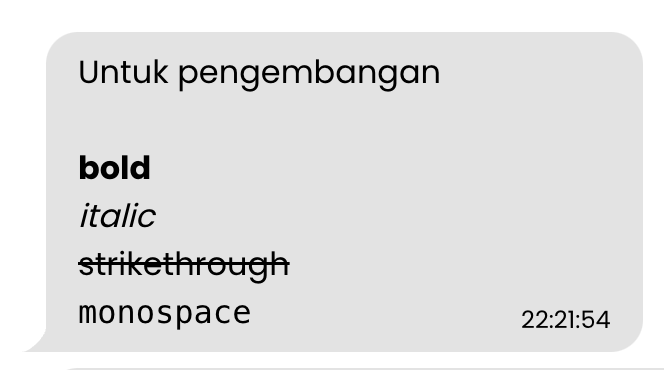
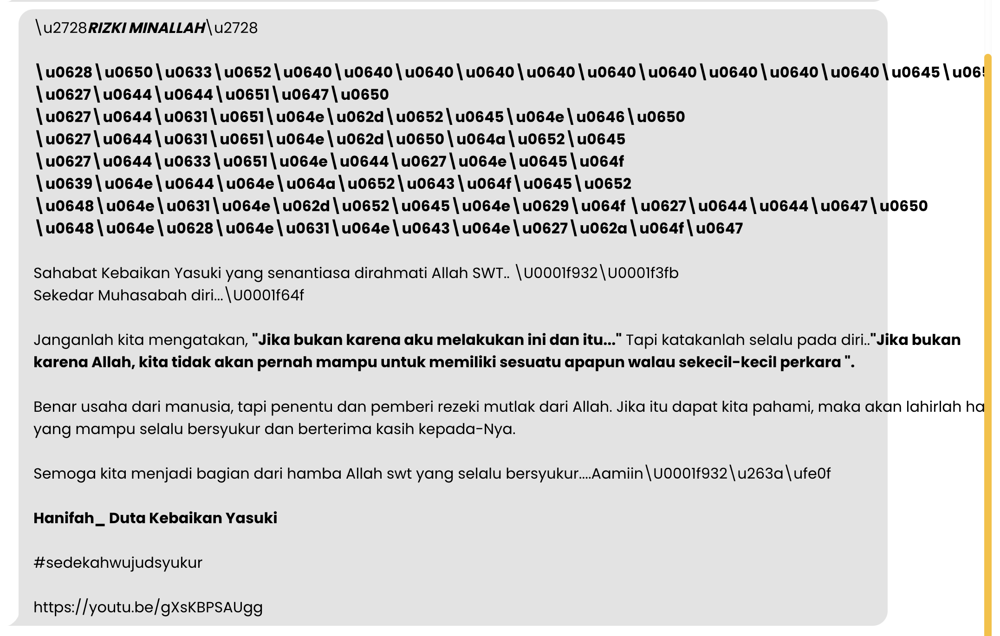
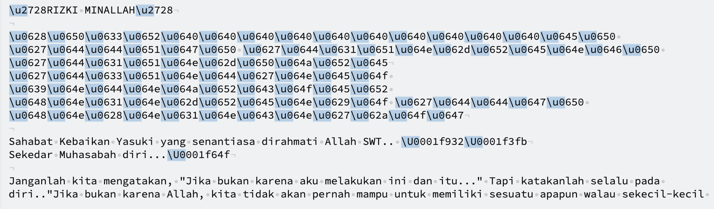
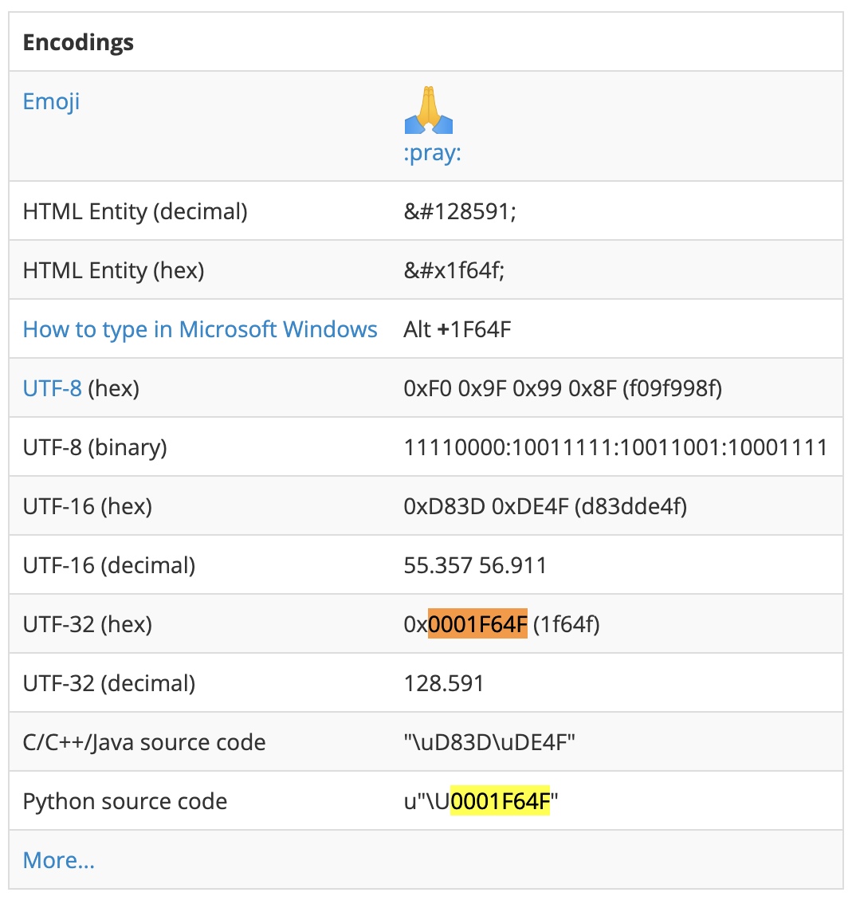
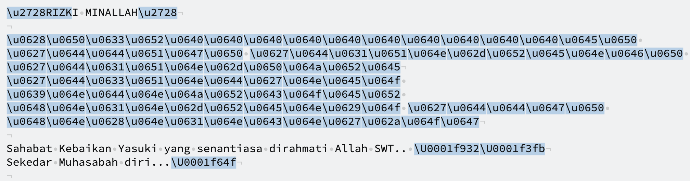
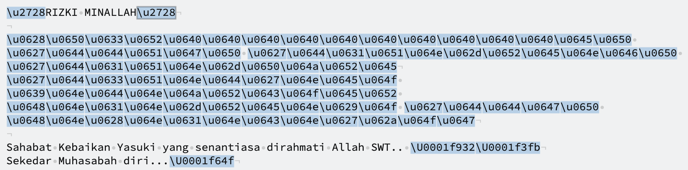

Selamat datang di Part 2 dari tutorial ini. Kita lanjut membahas tentang
pengimplementasian formatting menggunakan RegEx.

### 2. Formatting yang tidak ter-render secara langsung

Sebagai pengingat, kita butuh 4 macam formatting yang harus diimplementasikan:
- Bold, direpresentasikan dengan string yang diapit oleh bintang ( \*string\* )
- Italic, direpresentasikan dengan string yang diapit oleh garis bawah ( \_string\_ )
- Strikethrough, direpresentasikan dengan string yang diapit oleh _tilde_ ( \~string\~ )
- Monospace, direpresentasikan dengan string yang diapit oleh tiga _backtick_ ( \```string\``` )

Pada RegEx, kita harus bisa menerjemahkan sebuah pola yang ada ke dalam bahasa
RegEx. Seperti contoh di bawah ini adalah sebuah pola RegEx yang digunakan untuk
mendapatkan kata atau kalimat yang diapit oleh bintang, RegEx ini akan kita
gunakan untuk _formatting_ **bold**:

`/\*(.*?)\*/` - Pola Ekspresi Regular untuk _formatting_ **bold** pada WhatsApp.
Percaya atau tidak, itu adalah pola yang valid. Bagaimana cara membacanya? Akan
saya jelaskan secara singkat.

- `/` garis miring yang ada di awal dan di akhir pola RegEx disebut sebagai `Delimiter`.
  `Delimiter` ini berfungsi untuk membatasi _scope_ dari pola RegEx yang akan
  dibaca;
- `\*` setelah garis miring di awal dan sebelum garis miring di akhir menandakan
  bahwa ada simbol "bintang" di awal dan di akhir kata atau kalimat;
- `()` dalam kurung berfungsi sebagai penanda "grup". Grup pada RegEx berfungsi
  untuk membuat sebuah "capture group" untuk mengekstrak sebuah substring;
- `.` dalam RegEx PHP berarti mencari semua karakter, entah itu string, integer,
  atau simbol, kecuali `line break`;
- `*` berarti mencocokkan 0 atau lebih karakter yang ada pada pola; serta
- `?` adalah _lazy_, yang berarti RegEx akan mencari karakter sesedikit mungkin.
  Secara _default_, _quantifier_ RegEx bersifat _greedy_ yang berarti mencari
  karakter sebanyak mungkin.

Bagaimana, pusing 😅? Demikian juga saya yang mencoba untuk membuat fitur ini.
Namun karena pengalaman, hal seperti ini berhasil saya capai dengan cepat.
Berikut adalah daftar RegEx yang berhasil saya kompulir untuk _formatting_ pesan
WhatsApp:

| Tipe format | Pola RegEx |
|---|---|
| **Bold** | `/\*(.*?)\*/` |
| _Italic_ | `/\_(.*?)\_/` |
| ~~Strikethrough~~ | `/\~(.*?)\~/` |
| `Monospace` | `/\```(.*?)\```/` |

Setelah mendapatkan pola-pola tersebut, saya implementasikan ke dalam
`WhatsAppService`:

```php
<?php

namespace App\Services;

class WhatsAppService
{
    public static function format_message(string $raw_message): string
    {
        $nl2br_message = nl2br($raw_message);
        $bold = preg_replace('/\*(.*?)\*/', '<b>$1</b>', $nl2br_message);
        $italic = preg_replace('/\_(.*?)\_/', '<i>$1</i>', $bold);
        $strikethrough = preg_replace('/\~(.*?)\~/', '<strike>$1</strike>', $italic);
        $monospace = preg_replace('/\```(.*?)\```/', '<code>$1</code>', $strikethrough);

        return $monospace;
    }
}
```

Kita lihat hasilnya pada aplikasi



...daaan berhasil. Sebuah pencapaian yang menurut saya luar biasa keren. Suatu
langkah untuk sebuah aplikasi yang lebih sempurna.

### 3. Unicode UTF-16 dan UTF-32
Unicode yang saya lansir dari Wikipedia adalah sebuah standar teknis yang
dirancang untuk mengizinkan teks dan simbol dari semua sistem tulisan di dunia
untuk ditampilkan dan dimanipulasi. Namun, tidak semua Unicode yang dikirimkan
bisa di-_parse_ dan di-_render_ begitu saja, harus ada tahap konversi lagi
sehingga karakter yang diinginkan bisa ditampilkan.

UTF-8 adalah standar _encoding_ yang digunakan pada kebanyakan _website_ dan
_browser_. Secara umum, _browser_ dan _search engine_ akan gagal untuk memproses
UTF-16, karenanya UTF-16 tidak digunakan pada teknologi _website_.

Oke, langsung saja ke permasalahan utamanya. Diberikan contoh kasus seperti ini:



Berdasarkan dari pengalaman sebelumnya, saya memikirkan skenario berikut:
1. Hilangkan `\u` dan `\U` pada _plain teks_; lalu
1. Tampilkan hasil teks dari unicode tersebut ke bentuk HTML dengan me-_wrap_
   hasil penggantian polanya dengan `&#$1;`

Awalnya, saya menggunakan RegEx sebagai berikut `/(\\\(u|U)[a-zA-Z0-9])/`, namun
setelah saya coba mengecek bagaimana pola ini bekerja di [Regexr.com](https://regexr.com),
ternyata terdapat kesalahan pada pola yang saya buat:



Karena pada awalnya saya mengira ini adalah emoji, maka saya mengambil salah
satu unicode acak `0001f64f`, lalu mencoba mencarinya di Google. Berikut adalah
_screenshot_ yang saya ambil dari laman [fileformat.com](https://www.fileformat.info/info/unicode/char/1f64f/index.htm)



"Betul saja, yang saya dapatkan adalah emoji!" ucap saya dalam hati. Setelah
berhasil mengidentifikasi unicode tersebut adalah sebuah emoji yang dikonversi
dari UTF-32, saya harus mengubahnya ke dalam bentuk UTF-8, atau langsung sebagai
_Hexadecimal HTML Entity_. Saya pun merubah pola RegEx yang sudah saya buat
menjadi seperti ini

```diff
- /(\\\(u|U)[a-zA-Z0-9])/
+ /(\\\(u|U)[a-zA-Z0-9]{4,8})/
```

Ya, saya hanya menambahkan prasyarat bahwa karakter unicode yang harus saya ambil
harus memiliki panjang 4 s/d 8 karakter. Namun apa yang saya dapat? Kesalahan pola,
lagi 😅.



Jika teman-teman lihat hasil _match_ yang ada pada kalimat pertama, pola RegEx
yang saya buat mengambil `\u2728RIZK`. `RIZK` adalah pola yang tidak
ingin saya ambil. Bagaimanakah solusinya?

Simpelnya, saya ubah _range_ huruf yang saya cari. Cukup dari `a-f` dan `A-F`.
```diff
- /(\\\(u|U)[a-zA-Z0-9]{4,8})/
+ /(\\\(u|U)[a-fA-F0-9]{4,8})/
```

Saya pun berhasil mendapatkan pola RegEx yang sesuai dan bisa diimplementasikan
ke aplikasi:



Jadi, pola RegEx yang "Fix" adalah seperti ini `/(\\\(u|U)[a-fA-F0-9]{4,8})/`.
Sedikit penjelasan:
- `/` garis miring yang ada di awal dan di akhir pola RegEx disebut sebagai `Delimiter`.
  `Delimiter` ini berfungsi untuk membatasi _scope_ dari pola RegEx yang akan
  dibaca;
- `\\\` tiga _backslash_ digunakan untuk meng-_escape_ karakter _backslash_ pada
   PHP;
- `()` dalam kurung berfungsi sebagai penanda "grup". Grup pada RegEx berfungsi
  untuk membuat sebuah "capture group" untuk mengekstrak sebuah substring. Grup
  pada RegEx di atas berisi `(u|U)` yang berarti kita menerima huruf `u` kecil
  atau `U` kapital setelah _backslash_; dilanjutkan dengan
- `[a-fA-F0-9]` yang berarti kita menerima huruf kecil `a` sampai dengan `f`,
  huruf `A` sampai dengan `F` kapital, lalu angka `0` sampai dengan `9`.
- `{4,8}` berarti kita menerima karakter apapun yang ada pada prasyarat
  sebelumnya yaitu `[a-fA-F0-9]` dengan panjang sebanyak 4 sampai dengan 8 
  karakter.

Begitulah cerita bagaimana saya mendapatkan pola UTF-16 dan UTF-32. Lalu
bagaimana cara saya mengubah pola yang sudah didapatkan supaya bisa ditampilkan
dalam bentuk HTML? Kita lanjut ke [Part 3](../whatsapp-text-formatting-pada-php-part-3), sampai jumpa di sana 👋!

---

Thumbnail oleh <a href="https://unsplash.com/@asterfolio?utm_source=unsplash&utm_medium=referral&utm_content=creditCopyText">Asterfolio</a> dari <a href="https://unsplash.com/wallpapers/apps/whatsapp?utm_source=unsplash&utm_medium=referral&utm_content=creditCopyText">Unsplash</a>
