Pugugo adalah suatu sistem yang dapat digunakan oleh Korporat sebagai media pembagian lowongan kerja, serta dapat digunakan oleh Pelamar untuk melamar suatu pekerjaan pada suatu korporat / perusahaan. Aplikasi ini memiliki beberapa modul yang masing-masing akan dijelaskan pada bagiannya tersendiri.

**Preambule**

Secara teknis, aplikasi ini dirancang menggunakan *stack* sebagai berikut:
1. Laravel 10
2. Laravel Livewire 3
3. Tailwind CSS
4. Alpine.JS

## Autentikasi

Autentikasi adalah proses untuk memverifikasi identitas pengguna atau sistem. Dalam bahasa yang lebih sederhana, autentikasi bertujuan untuk memastikan bahwa pengguna yang mencoba mengakses sesuatu adalah orang yang berhak melakukannya.

Mirip dengan verifikasi identitas di dunia nyata, misalnya saat penjagaan keamanan meminta kartu identitas pengunjung, autentikasi digital berfungsi untuk meminimalisir akses yang tidak sah ke informasi atau sistem sensitif. Proses ini menjadi langkah awal yang krusial dalam menjaga keamanan data dan mencegah penyalahgunaan informasi.

### Login / Masuk

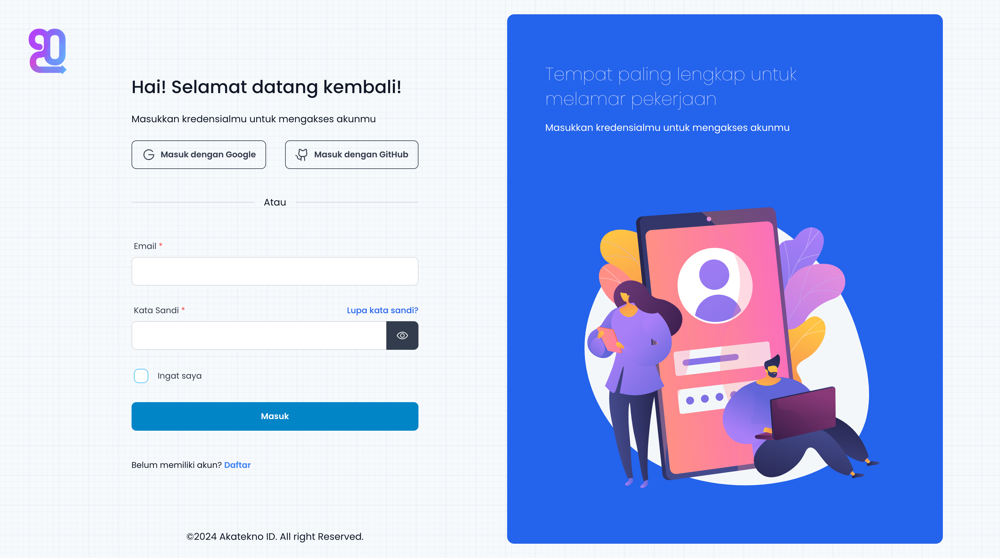

Modul ini memungkinkan pengguna yang sudah terdaftar untuk dapat masuk ke aplikasi dengan memberikan data Email dan Kata Sandi. Pada halaman ini terdapat beberapa pintasan untuk dapat masuk melalui akun Google, atau GitHub; serta terdapat juga pintasan untuk mengakses halaman Lupa Kata Sandi jika suatu saat pengguna melupakan kata sandinya.

### Daftar / Registrasi

Registrasi mengacu pada proses verifikasi identitas pengguna baru yang ingin mendaftarkan akun di aplikasi. Proses ini melibatkan beberapa langkah dan terbagi menjadi dua:

#### **Daftar Sebagai Pelamar**

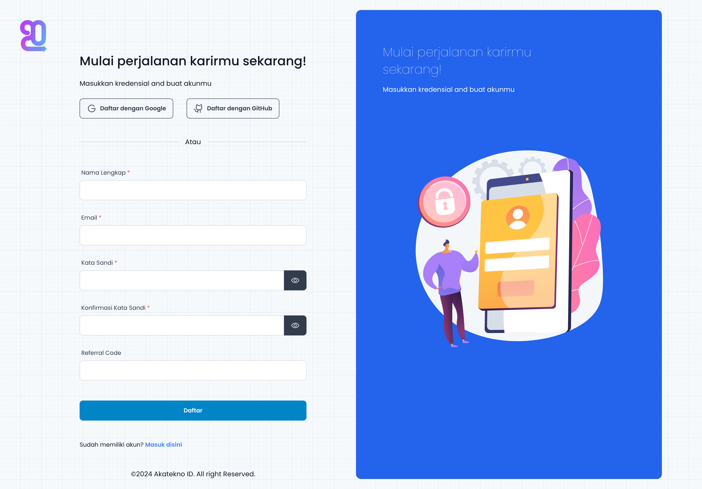

Untuk dapat mendaftar sebagai pelamar, akan terdapat beberapa inputan yang harus diisi yaitu:
1. Nama Lengkap - diisi dengan nama lengkap pengguna.
2. Email - diisi dengan email yang valid karena akan digunakan untuk verifikasi.
3. Kata Sandi - diisi dengan Kata Sandi yang aman, kuat, serta mudah diingat.
4. Konfirmasi Kata Sandi - diisi persis dengan inputan Kata Sandi.
5. Referral Code (opsional) - diisi dengan kode referral pengguna lain yang memiliki Premium Plan.

Setelah mengisi seluruh data, pengguna akan dapat mengakses sistem, namun akan terdapat pesan untuk segera memverifikasikan emailnya.
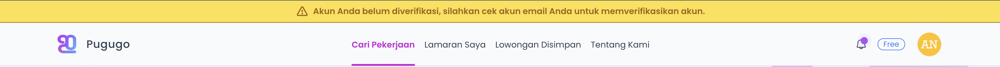

Pengguna yang belum memverifikasikan emailnya akan memiliki akses terbatas seperti:
1. Tidak dapat melamar pekerjaan.
2. Tidak dapat mencari lowongan secara lengkap.
3. Tidak dapat melihat detail perusahaan.

Tampilan email yang akan diterima oleh pengguna dapat dilihat seperti berikut:
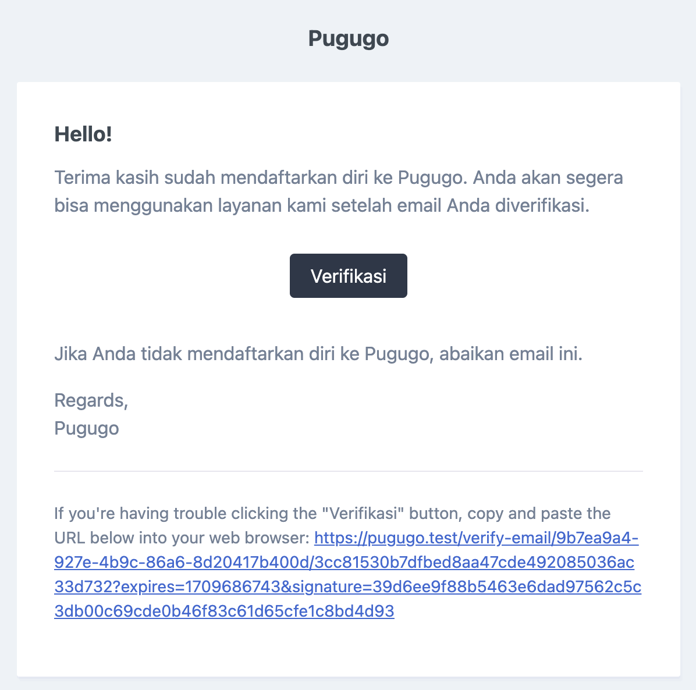

Setelah email diverifikasi oleh pengguna, maka pengguna tersebut dapat mengakses seluruh modul sistem yang tersedia tanpa adanya limitasi.

#### **Daftar Sebagai Korporat**

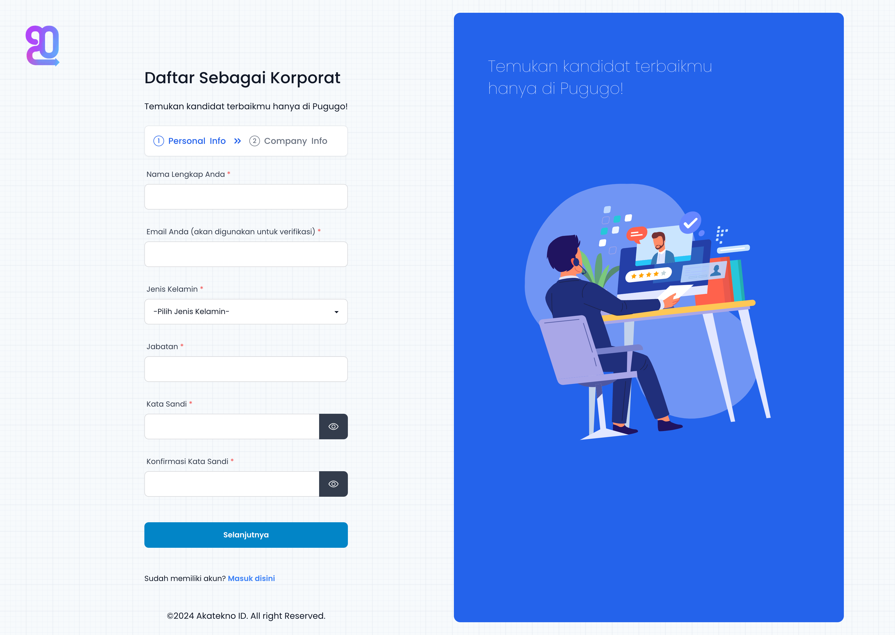

Untuk dapat mendaftar sebagai korporat, akan terdapat dua langkah yang masing-masing memiliki beberapa inputan:

1. Informasi Personal, yang mewajibkan korporat yang mendaftar untuk mengisi identitas PIC (HRD, Pimpinan Perusahaan, atau seseorang yang berhak untuk memegang akun Pugugo). Data-data yang harus diberikan adalah:
   1. Nama Lengkap PIC - diisi dengan nama lengkap PIC.
   2. Email PIC - diisi dengan email PIC yang valid.
   3. Jenis Kelamin - pilih salah satu dengan jenis kelamin PIC yang sesuai.
   4. Jabatan - diisi dengan jabatan orang yang mendaftarkan perusahaannya.
   5. Kata Sandi - diisi dengan Kata Sandi yang aman, kuat, serta mudah diingat.
   6. Konfirmasi Kata Sandi - diisi persis dengan inputan Kata Sandi.

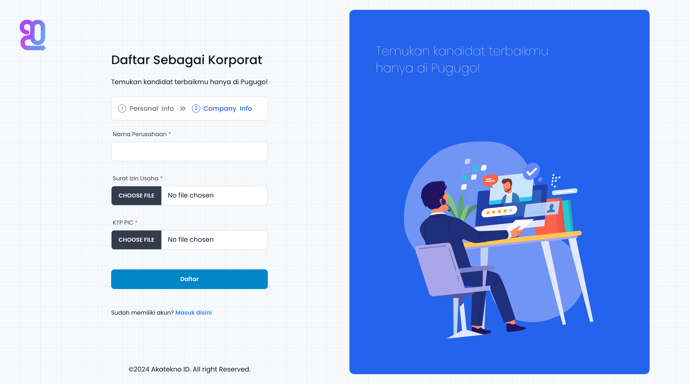

2. Informasi Korporat, dengan inputan sebagai berikut:
   1. Nama Perusahaan - diisi dengan nama Perusahaan.
   2. Surat Izin Usaha - unggah SIU Perusahaan, input unggahan yang menerima file berupa gambar (jpg, png) atau PDF.
   3. KTP PIC - unggah KTP PIC akun Pugugo, input unggahan yang menerima file berupa gambar (jpg, png) atau PDF.

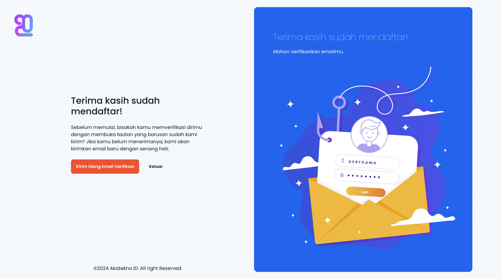

Setelah mengisi seluruh data dengan lengkap, seperti halnya verifikasi akun pelamar, korporat akan melihat halaman verifikasi terlebih dahulu untuk dapat mengakses sistem. Akun korporat harus melakukan beberapa langkah-langkah yang terkirim pada email PIC dan memverifikasikan akunnya secara bersamaan.

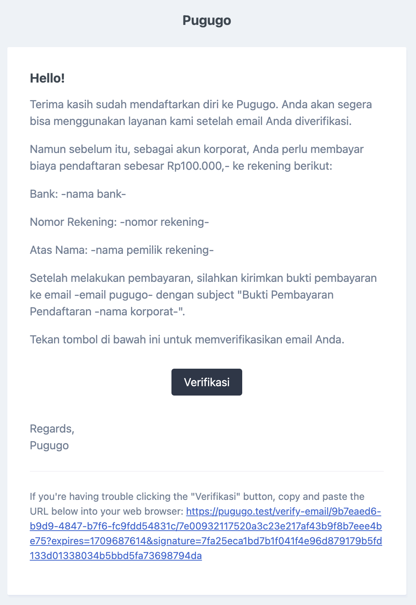

Walaupun korporat sudah memverifikasikan emailnya secara mandiri, namun diperlukan proses verifikasi pembayaran awal, verifikasi SIU, serta pencocokan identitas KTP dengan identitas PIC yang didaftarkan ke sistem.

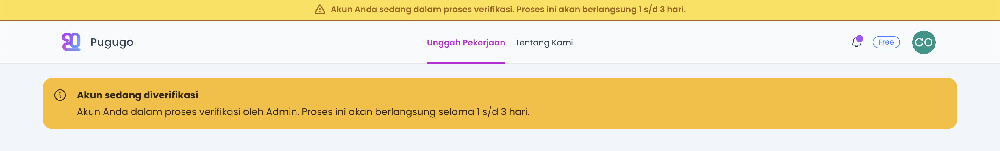

Setelah Admin Pugugo sudah memverifikasikan data identitas perusahaan dan PIC secara manual, maka akun korporat tersebut dapat menerbitkan lowongan kerja yang ada di perusahaannya.

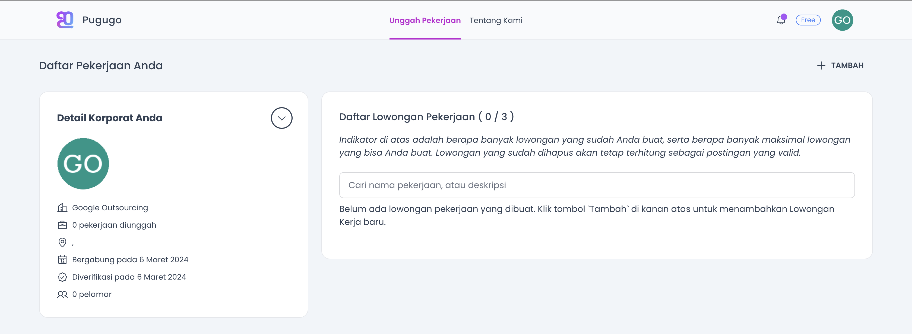


**Penting!** Pastikan Anda bersungguh-sungguh untuk menggunakan fitur pendaftaran korporat. Ketidaksesuaian data akan berakibat pada tidak terverifikasinya akun korporat dan dapat berujung pada *blacklist* sistem kami. Kami tidak menyediakan opsi *refund* untuk pembayaran awal administratif korporat.


### Lupa Kata Sandi

Lupa kata sandi merujuk pada situasi di mana pengguna tidak dapat mengingat kata sandi yang digunakan untuk login ke akun mereka. Hal ini bisa terjadi karena berbagai alasan, seperti:

1. Pengguna lupa kata sandi yang sebenarnya.
2. Pengguna salah mengetikkan kata sandi.
3. Pengguna belum pernah membuat akun dan menggunakan kata sandi "default" yang diberikan oleh aplikasi.

Sebagian besar aplikasi web yang mengharuskan login menyediakan fitur "lupa kata sandi" untuk membantu pengguna yang mengalami situasi tersebut. Fitur ini biasanya berupa tautan atau tombol yang terletak di halaman login.

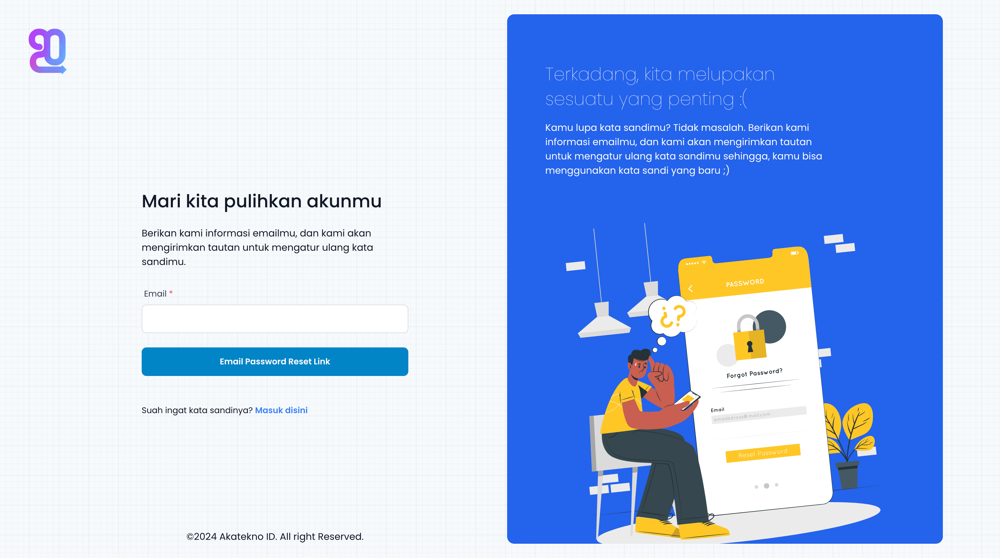

Untuk mengatur ulang kata sandi, Anda harus memasukkan alamat email yang pernah Anda daftarkan melalui sistem. Sistem akan mengirimkan sebuah tautan yang dapat membantu Anda untuk mengatur ulang kata sandi.

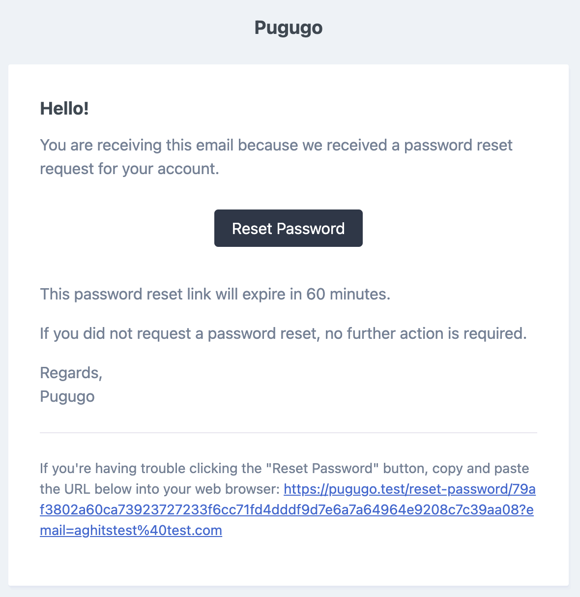

Setelah Anda mengakses tautan yang dikirimkan ke email, Anda akan melihat sebuah halaman yang berisikan 3 inputan yaitu:
1. Email - terisi otomatis, tidak dapat diubah
2. Kata Sandi - diisi dengan kata sandi yang baru.
3. Konfirmasi Kata Sandi - diisi persis dengan inputan Kata Sandi.

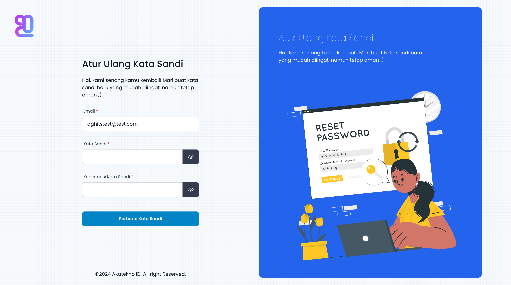

Setelah Anda menekan tombol `Perbarui Kata Sandi`, Anda akan dialihkan kembali ke halaman Login untuk masuk ke sistem Pugugo.

## Korporat

Pada bagian ini, Anda akan mempelajari bagaimana untuk melengkapi profil, menerbitkan lowongan kerja, menerima pelamar, serta meningkatkan akun ke Premium.

### Melengkapi Profil

Untuk melengkapi profil, Anda harus menekan tombol akun yang ada di kanan atas, lalu klik sub-menu Profil.

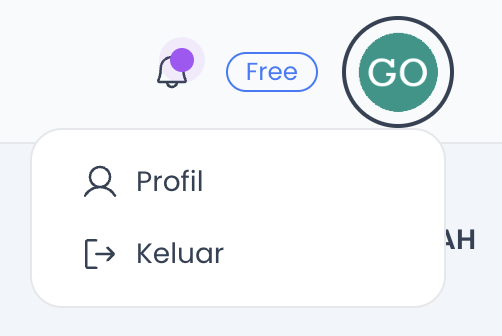

Setelah itu, Anda akan melihat halaman profil seperti ini.

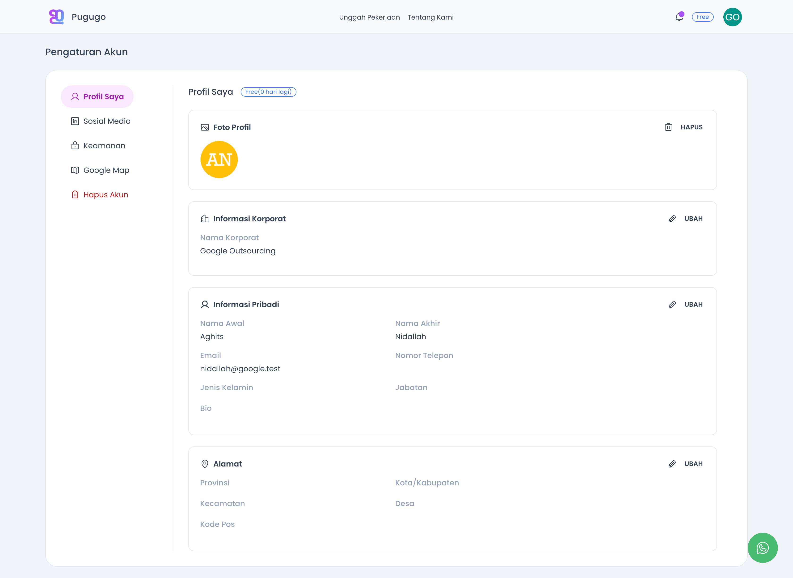

Di bagian kiri, terdapat beberapa menu yang digunakan untuk mengatur profil Anda.

1. Profil Saya - berisi informasi profil yang harus Anda lengkapi.
2. Sosial Media - berisi informasi sosial media boleh dilengkapi untuk meningkatkan kredibilitas.
3. Keamanan - berisi form untuk mengubah kata sandi login.
4. Google Map - berisi informasi Google Map yang di-*embed* untuk memberikan informasi kepada pelamar di mana lokasi kantor berada.

Di bagian kanan berisi inputan-inputan dari masing-masing menu yang ada di bagian kiri. *Screenshot* di atas menunjukkan bahwa halaman saat ini adalah halaman `Profil Saya`. Masing-masing bagian akan dijelaskan secara lengkap.

#### Profil Saya

Menu ini berisi informasi pribadi dan informasi perusahaan. Terdapat beberapa sub-bagian yang butuh dilengkapi.

1. **Foto Profil**

Foto Profil diisi dengan logo korporat atau perusahaan Anda. Harap menggunakan logo yang jelas dengan resolusi yang direkomendasikan 512x512 dengan format PNG atau format JPG.

2. **Informasi Korporat**

Informasi Korporat diisi dengan nama perusahaan Anda.

3. **Informasi Pribadi**

Informasi Pribadi diisi dengan identitas diri Anda. Terdapat beberapa inputan yaitu:
- Nama Awal, diisi dengan nama awal Anda.
- Nama Akhir, diisi dengan nama akhir Anda, jika nama akhir Anda mengandung lebih dari 1 kata, maka cantumkan seluruh nama Anda kecuali nama awal.
- Email, diisi dengan email Anda, digunakan untuk login, disarankan untuk tidak mengganti email jika tidak ada pendelegasian akun.
- Nomor Telepon, diisi dengan nomor telepon yang valid, gunakan angka 62 di awal, dan isikan seluruh nomor tanpa ada spasi atau strip.
- Jenis Kelamin, pilih salah satu yang sesuai dengan jenis kelamin Anda.
- Jabatan, diisi dengan posisi yang Anda jabat sekarang.
- Bio, diisi dengan biodata singkat Anda, tidak perlu diisi secara lengkap.

4. **Alamat**

Informasi Alamat diisikan dengan alamat kantor saat ini. Terdapat pilihan Provinsi, Kota/Kabupaten, Kecamatan, Desa, serta Kode Pos.

#### Sosial Media

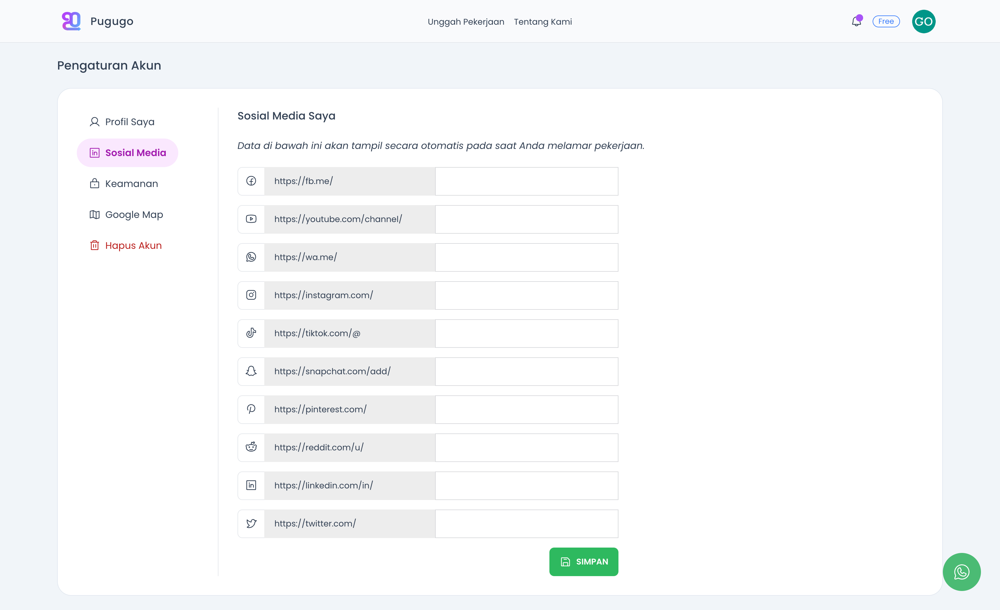

Pada bagian ini terdapat beberapa sosial media yang dapat kami akomodir dan ditampilkan ke Detail Informasi Perusahaan, tujuannya adalah untuk menunjukkan kredibilitas tambahan bahwa perusahaan yang Anda pegang adalah sebuah perusahaan yang valid dan dapat diakui. Sosial Media yang kami akomodir antara lain:

- Facebook
- YouTube
- WhatsApp
- Instagram
- TikTok
- Snapchat
- Pinterest
- Reddit
- LinkedIN
- X (sebelumnya dikenal dengan Twitter)

Untuk mengisi sosial media, diharapkan untuk hanya mencantumkan ID dari masing-masing sosial media, karena kami sudah mengakomodir potongan tautan yang digunakan untuk masing-masing sosial media.

#### Keamanan

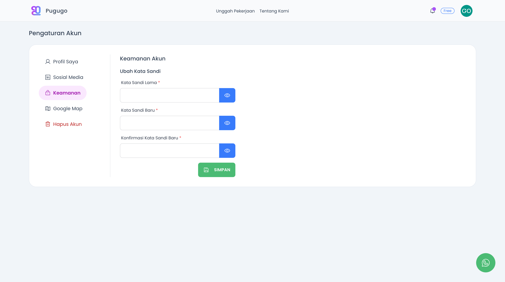

Menu Keamanan ini diperuntukkan hanya untuk mengubah kata sandi. Kami sarankan untuk mengubah kata sandi Anda minimal 1 tahun sekali untuk menghindari akses secara *bruteforce*.

#### Google Map

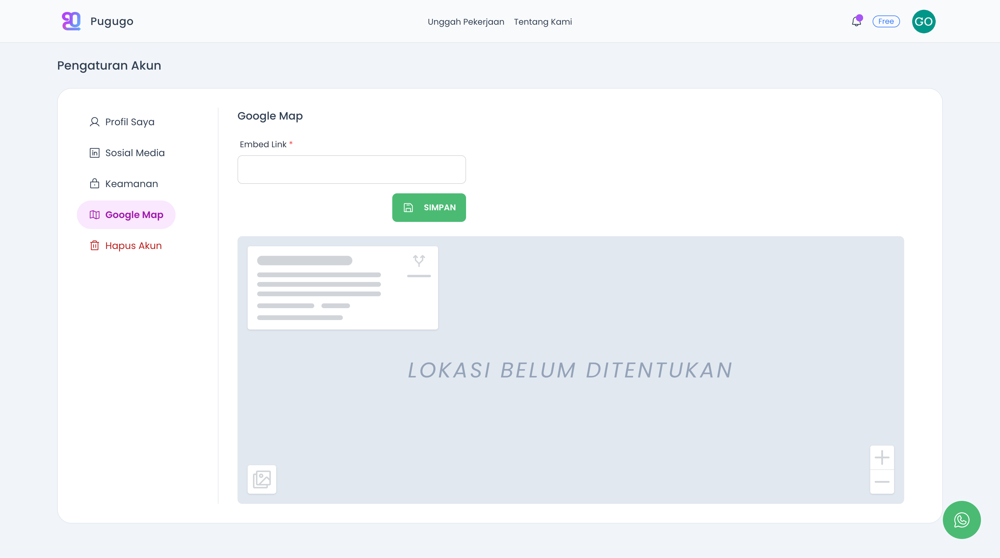

Menu Google Map ini digunakan untuk menandakan di mana kantor Anda berada. Untuk menggunakan *embed* Google Map, silahkan ikuti langkah-langkah berikut:

1. Buka Google Map, dan cari tempat kantor Anda berada. Lalu klik tombol Bagikan atau *Share*.

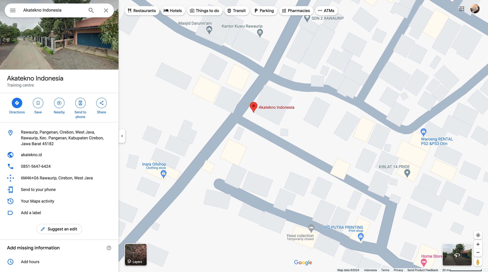

2. Akan terbuka dialog bagikan dari Google Maps, klik tab `Embed a map`, pilih ukuran yang disarankan yaitu `Small` atau `Medium`, lalu tekan tombol `Copy HTML`.

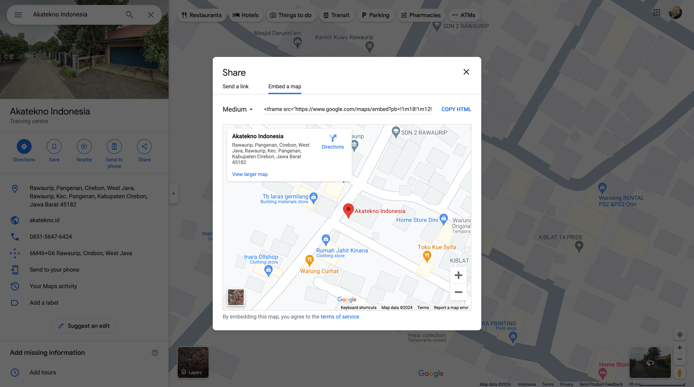

3. Tempelkan kode *embed* ke inputan `Embed Link` yang tersedia pada aplikasi, lalu klik Simpan.

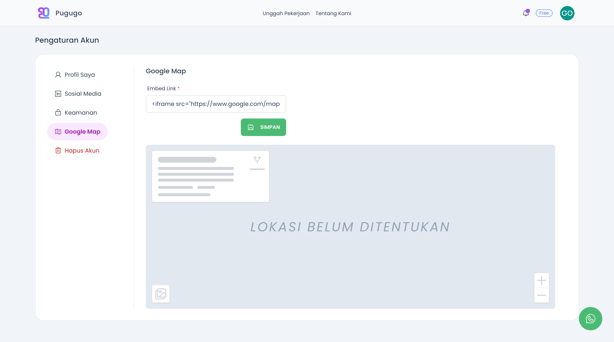

4. Anda akan melihat sebuah dialog bahwa inputan berhasil disimpan dan Anda akan dapat melihat bahwa identitas lokasi perusahaan Anda sudah muncul.

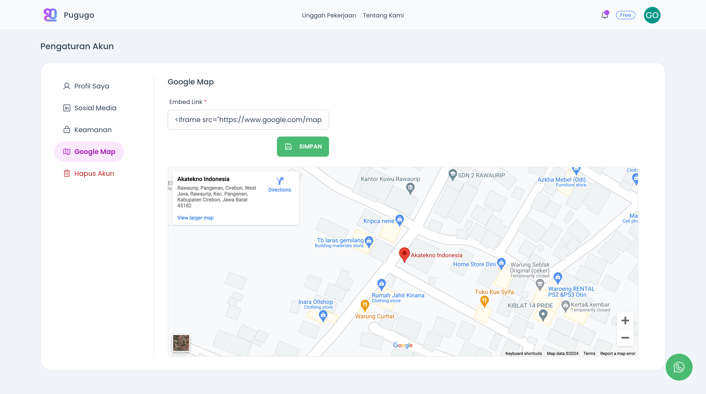

### Menambah Lowongan Pekerjaan

Pada bagian ini Anda akan mempelajari bagaimana caranya untuk menambah Lowongan Pekerjaan. Mohon untuk ikuti langkah-langkah berikut dengan seksama.

1. Buka menu `Unggah Pekerjaan` yang terdapat pada menu utama.

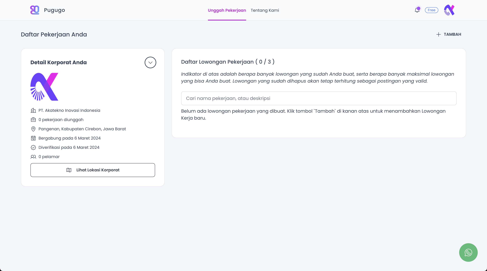

Anda akan melihat beberapa informasi seperti berapa banyak lowongan pekerjaan yang dapat Anda buat, lalu daftar lowongan kerja yang sudah Anda buat. Pada *screenshot* di atas tidak terdapat satu-pun lowongan kerja yang sudah diterbitkan, mari kita terbitkan salah satu.

2. Klik tombol Tambah yang ada di kanan atas, tepat di bawah profil Anda. Setelah itu Anda akan melihat beberapa lowongan data lowongan pekerjaan yang harus anda isikan.

Pada *Step 1: Administrasi*, Anda akan melihat inputan sebagai berikut.

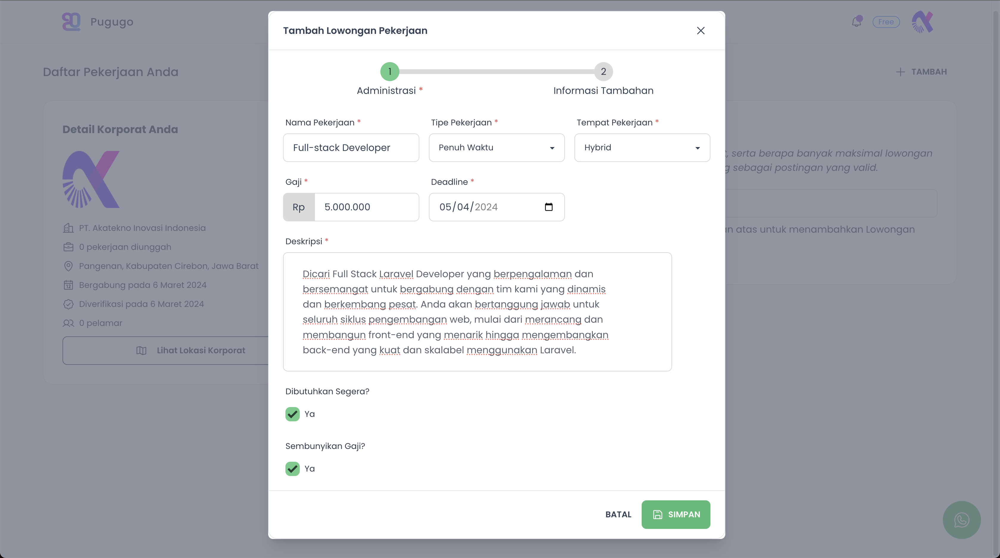

Mohon isikan inputan berikut sesuai dengan ketentuan yang kami sediakan:
- Nama Pekerjaan - diisi dengan nama pekerjaan yang sedang Anda butuhkan.
- Tipe Pekerjaan - pilih salah satu yang sesuai dengan tipe pekerjaan yang Anda butuhkan, opsi yang tersedia adalah Harian, Magang, Penuh Waktu, Paruh Waktu, dan Kontrak.
- Tempat Pekerjaan - pilih salah satu yang sesuai dengan tempat yang akan Anda berikan untuk pelamar, opsi yang tersedia adalah *On-site*, *Remote*, serta *Hybrid*.
- Gaji - diisi dengan angka gaji eksak, boleh diisi dengan gaji minimum yang akan diterima atau diisi dengan gaji rata-rata karyawan lain yang ada di perusahaan Anda.
- Deadline - pilih tenggat waktu lowongan kerja ini ditampilkan di aplikasi. Batas waktu yang disediakan oleh aplikasi adalah 1 bulan (terhitung 30 hari) sejak hari lowongan kerja dibuat.
- Deskripsi - diisi dengan deskripsi lengkap, **tanpa job desc, kualifikasi, preferensi korporat, serta fasilitas untuk pelamar**.
- Dibutuhkan Segera (opsional) - centang jika lowongan pekerjaan dibutuhkan dengan segera.
- Sembunyikan Gaji (opsional) - centang jika gaji dari pekerjaan yang Anda buat memiliki sifat variatif berdasarkan kemampuan pelamar atau butuh negosiasi.

Setelah semua inputan pada *Step 1* selesai diinputkan, silahkan menuju ke *Step 2* untuk pengisian *Job Desc*, Kualifikasi, Preferensi Korporat, dan Fasilitas untuk Pelamar.

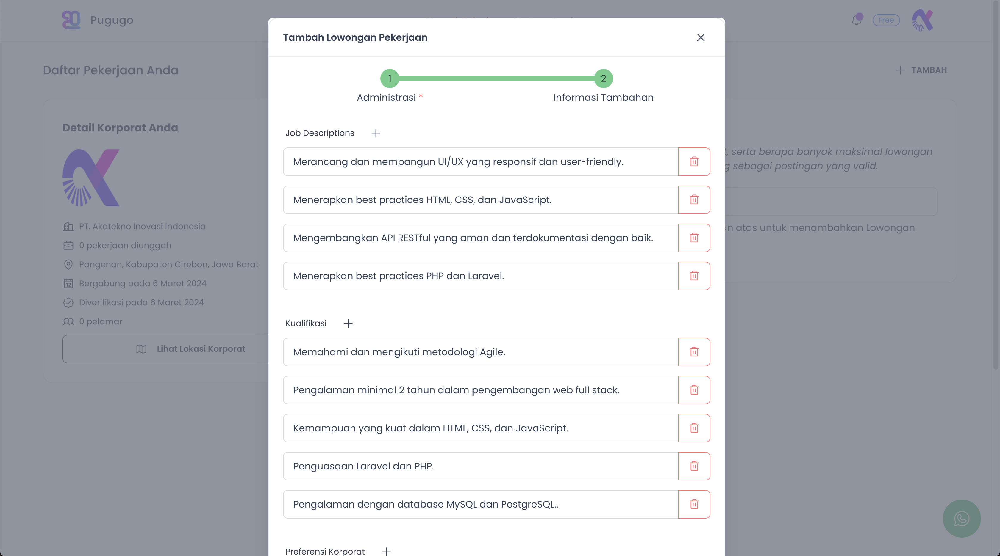

Pada *Step 2* ini terdapat beberapa inputan dinamis yang bisa ditambahkan dan dihapus, diantaranya:

- *Job Descriptions* - diisi dengan *job desc* yang harus dilakukan oleh pelamar pada saat mereka diterima di perusahaan Anda, pastikan Anda menggunakan 1 inputan untuk 1 *job desc*.
- Kualifikasi - diisi dengan kualifikasi pelamar sesuai yang Anda cari.

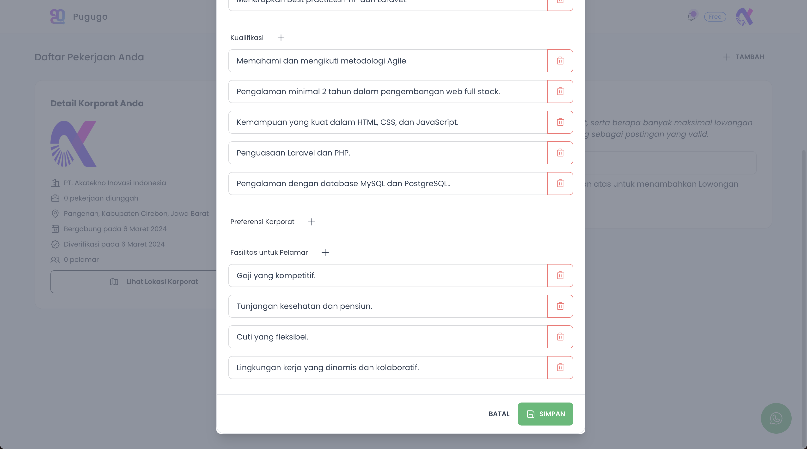

- Preferensi Korporat - diisi dengan bagaimana pelamar harus beradaptasi dengan lingkungan perusahaan.
- Fasilitas untuk Pelamar - diisi dengan fasilitas-fasilitas yang akan diberikan perusahaan saat mereka diterima di perusahaan Anda.

Setelah semua dirasa lengkap dan sesuai, silahkan tekan tombol Simpan untuk menerbitkan lowongan kerja Anda. Anda akan dapat melihat data lowongan pekerjaan Anda di halaman ini dan dapat melihat berapa banyak pelamar yang sudah melamar di lowongan kerja tersebut. Pada masing-masing lowongan pekerjaan akan terdapat statistik singkat berupa:

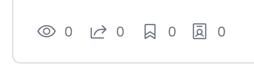

- Banyaknya (n) tampilan
- Banyaknya (n) lowongan dibagikan
- Banyaknya (n) lowongan disimpan / ditandai
- Banyaknya (n) pelamar

### Menerima / Menolak Pelamar

Pada bagian ini, Anda akan mempelajari bagaimana untuk menerima / menolak pelamar. Mohon ikuti langkah-langkah berikut secara seksama:

1. Buka menu `Unggah Pekerjaan` pada navigasi yang terletak di atas aplikasi.

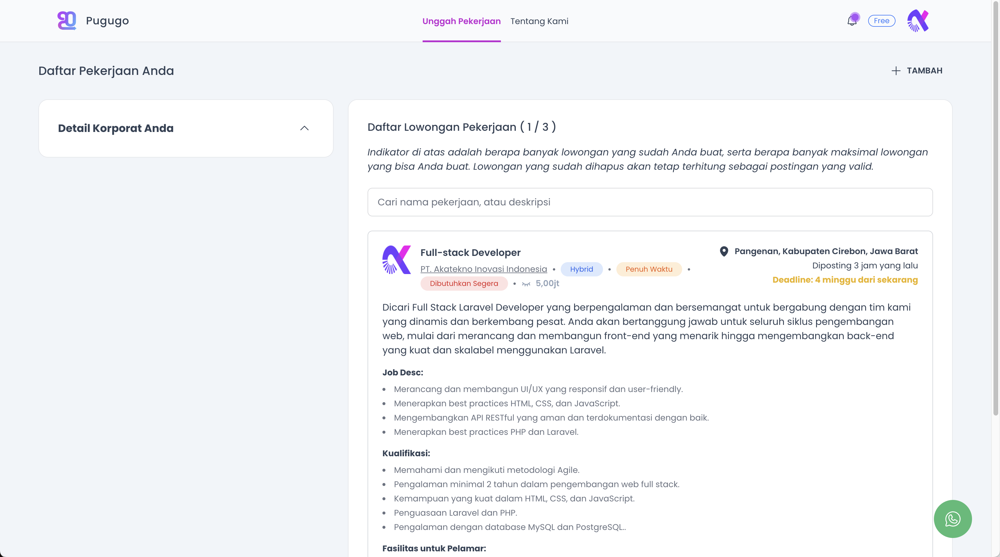

2. Pilih salah satu lowongan pekerjaan.

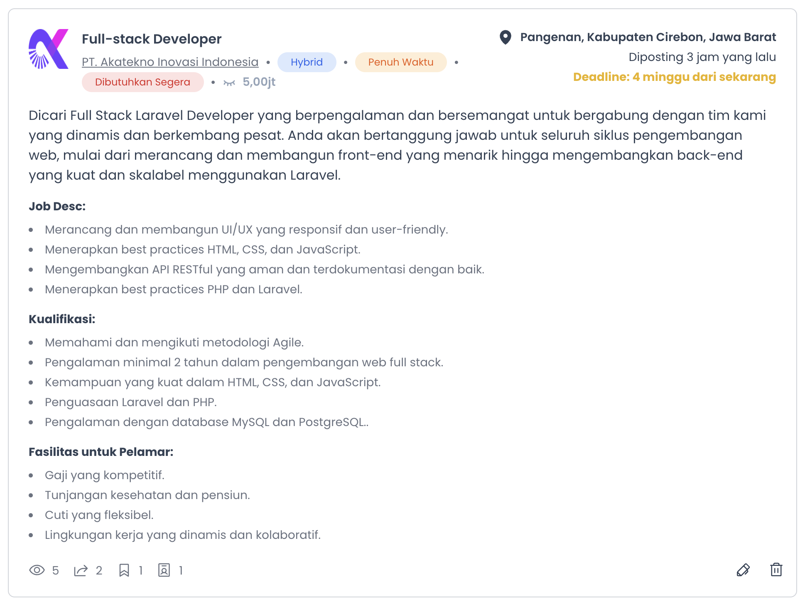

Dapat Anda lihat di atas bahwa lowongan ini telah dilihat sebanyak 5x, dibagikan sebanyak 2x, disimpan dan dilamar sebanyak 1x. Untuk melihat data pelamar yang ada pada lowongan kerja tersebut, tekan tombol `Pelamar`.

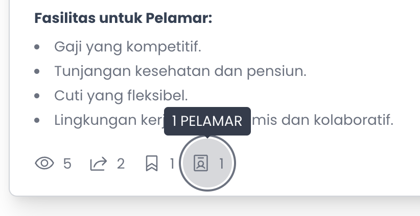

Akan muncul sebuah dialog yang berisikan:
- Filter pelamar berdasarkan skill.
- Badge yang bisa ditekan *on/off* untuk memfilter secara otomatis.
- Seluruh data pelamar.

3. Tekan salah satu pelamar.

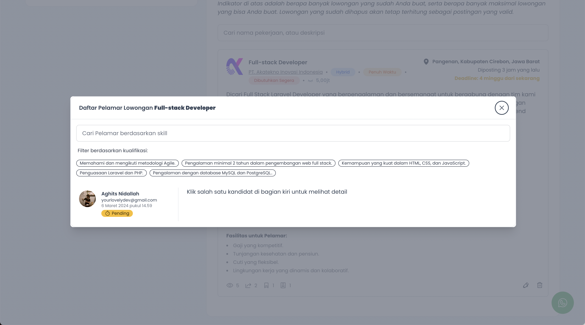

4. Anda akan melihat detail data pelamar tersebut.

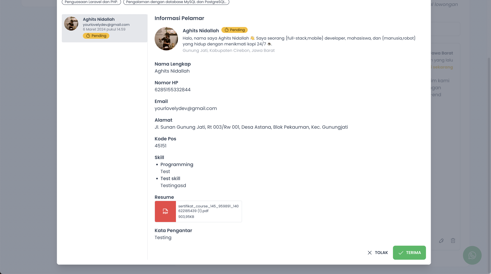

5. Setelah melihat secara sekilas seluruh data pelamar, maka keputusan diterima / ditolaknya ada di tangan Anda. Untuk menerima / menolak pelamar tekan tombol `Terima` atau `Tolak` yang ada di kanan bawah. Anda akan melihat sebuah modal persetujuan sebelum data diterima / ditolak dikirimkan ke aplikasi.

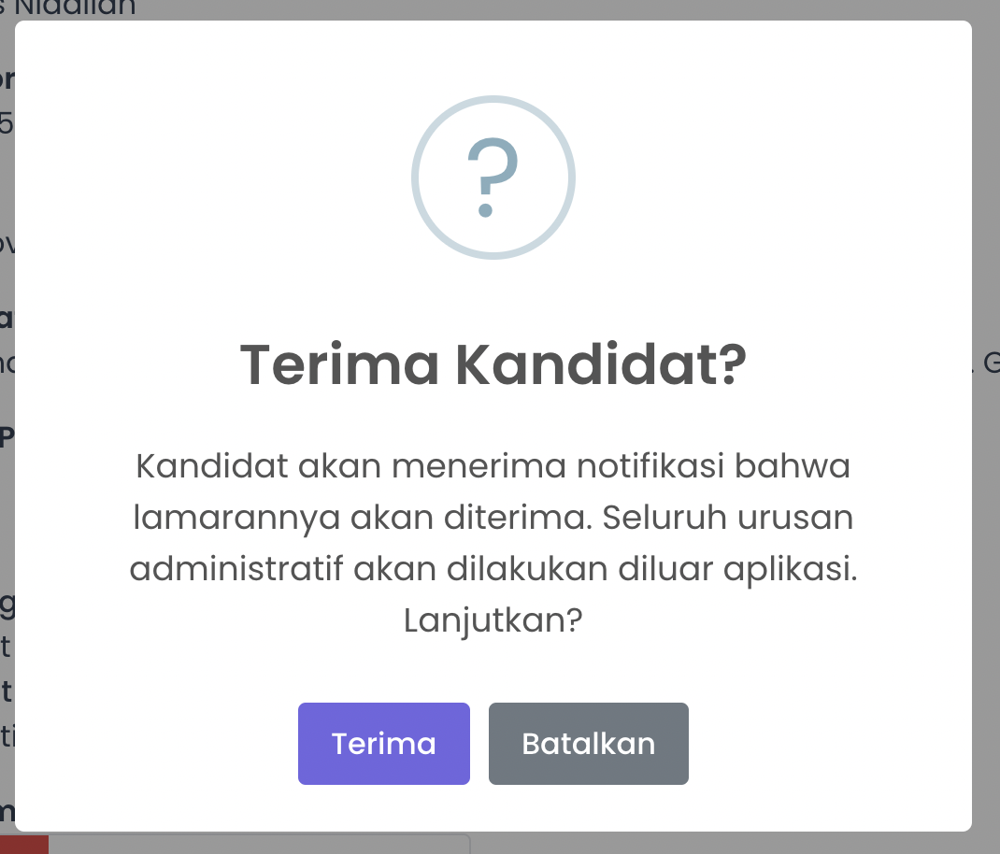

6. Setelah menerima / menolak pelamar, maka status pelamar tersebut akan berubah menjadi `diterima` / `ditolak`. Sebuah notifikasi berisikan diterima/ditolaknya pelamar juga akan terkirim melalui Email dan *in-app notification*.

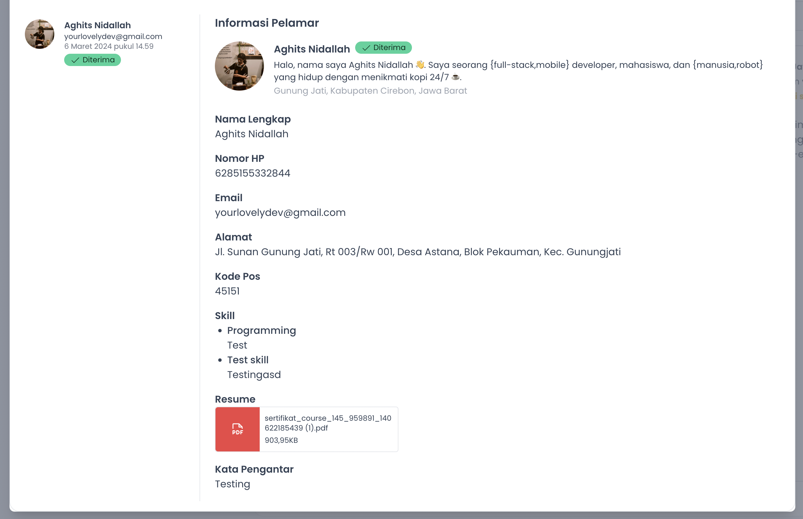

## Pelamar

Pada bagian ini, Anda akan mempelajari bagaimana untuk melengkapi profil, melamar kerja, serta meningkatkan akun ke Premium.

### Melengkapi Profil

Untuk melengkapi profil, Anda harus menekan tombol akun yang ada di kanan atas, lalu klik sub-menu Profil.

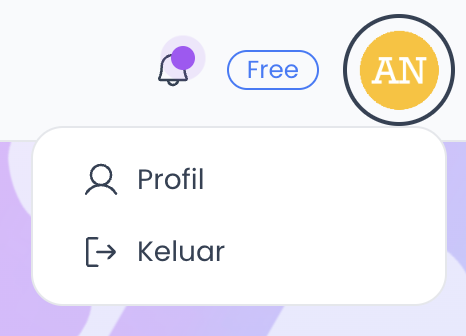

Setelah itu, Anda akan melihat halaman profil seperti ini.

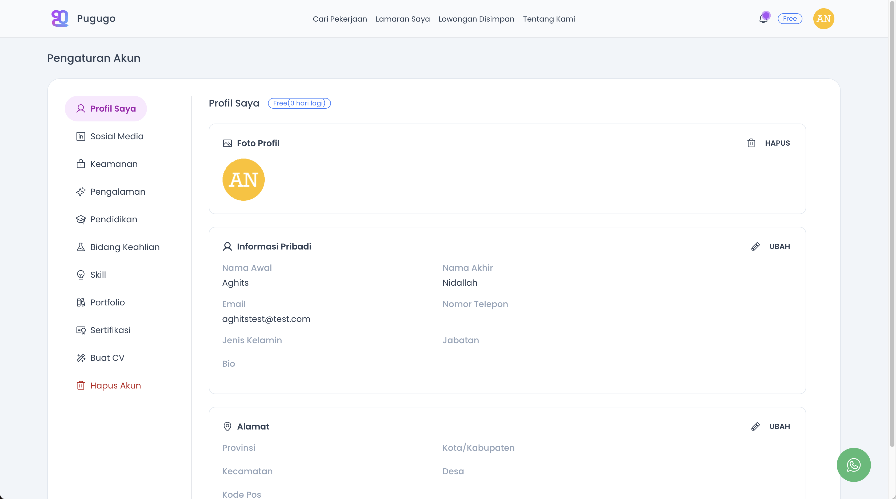

Di bagian kiri, terdapat beberapa menu yang digunakan untuk mengatur profil Anda.

1. Profil Saya - berisi informasi profil yang harus Anda lengkapi.
2. Sosial Media - berisi informasi sosial media.
3. Keamanan - berisi form untuk mengubah kata sandi login.
4. Pengalaman - berisi form untuk menambah pengalaman kerja Anda.
5. Pendidikan - berisi form untuk menambah data pendidikan Anda.
6. Bidang Keahlian - berisi form untuk menambah data keahlian Anda.
7. Skill - berisi form untuk menambah *soft skill* atau *hard-skill* Anda.
8. Portfolio - berisi form untuk menambah portfolio Anda.
9. Sertifikasi - berisi form untuk menambah sertifikasi yang telah Anda tempuh.
10. Buat CV - modul spesial yang memungkinkan Anda untuk membuat CV secara otomatis berdasarkan data-data yang telah Anda inputkan pada sistem.

Di bagian kanan berisi inputan-inputan dari masing-masing menu yang ada di bagian kiri. *Screenshot* di atas menunjukkan bahwa halaman saat ini adalah halaman `Profil Saya`. Masing-masing bagian akan dijelaskan secara lengkap.

#### Profil Saya

Menu ini berisi informasi pribadi. Terdapat beberapa sub-bagian yang butuh dilengkapi.

1. **Foto Profil**

Foto Profil diisi dengan logo korporat atau perusahaan Anda. Harap menggunakan logo yang jelas dengan resolusi yang direkomendasikan 512x512 dengan format PNG atau format JPG.

2. **Informasi Pribadi**

Informasi Pribadi diisi dengan identitas diri Anda. Terdapat beberapa inputan yaitu:
- Nama Awal, diisi dengan nama awal Anda.
- Nama Akhir, diisi dengan nama akhir Anda, jika nama akhir Anda mengandung lebih dari 1 kata, maka cantumkan seluruh nama Anda kecuali nama awal.
- Email, diisi dengan email Anda, digunakan untuk login, disarankan untuk tidak mengganti email jika tidak ada pendelegasian akun.
- Nomor Telepon, diisi dengan nomor telepon yang valid, gunakan angka 62 di awal, dan isikan seluruh nomor tanpa ada spasi atau strip.
- Jenis Kelamin, pilih salah satu yang sesuai dengan jenis kelamin Anda.
- Jabatan, diisi dengan posisi yang Anda jabat sekarang.
- Bio, diisi dengan biodata singkat Anda, tidak perlu diisi secara lengkap.

3. **Alamat**

Informasi Alamat diisikan dengan alamat kantor saat ini. Terdapat pilihan Provinsi, Kota/Kabupaten, Kecamatan, Desa, serta Kode Pos.

#### Sosial Media

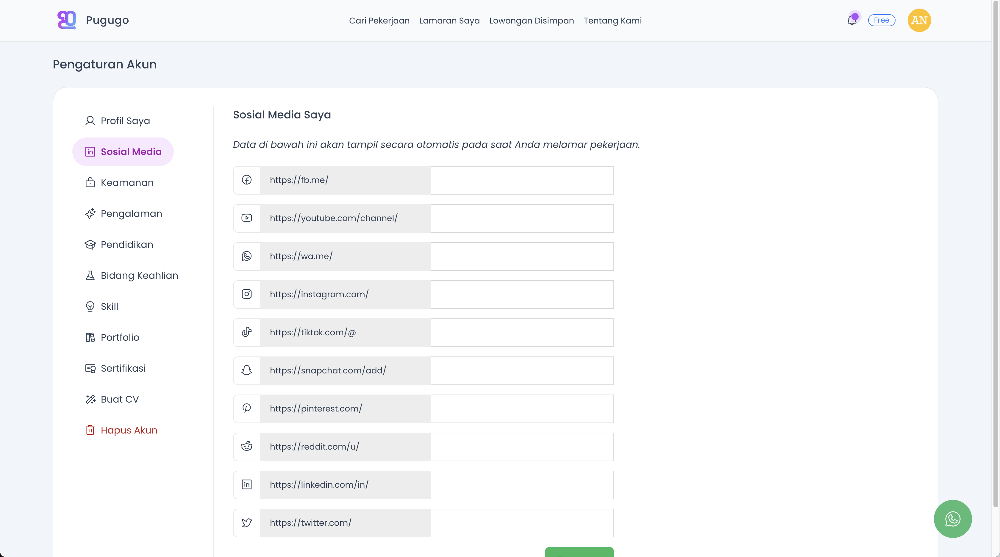

Pada bagian ini terdapat beberapa sosial media yang dapat kami akomodir dan ditampilkan pada saat Anda melamar ke sebuah perusahaan. Sosial Media yang kami akomodir antara lain:

- Facebook
- YouTube
- WhatsApp
- Instagram
- TikTok
- Snapchat
- Pinterest
- Reddit
- LinkedIN
- X (sebelumnya dikenal dengan Twitter)

Untuk mengisi sosial media, diharapkan untuk hanya mencantumkan ID dari masing-masing sosial media, karena kami sudah mengakomodir potongan tautan yang digunakan untuk masing-masing sosial media.

#### Keamanan

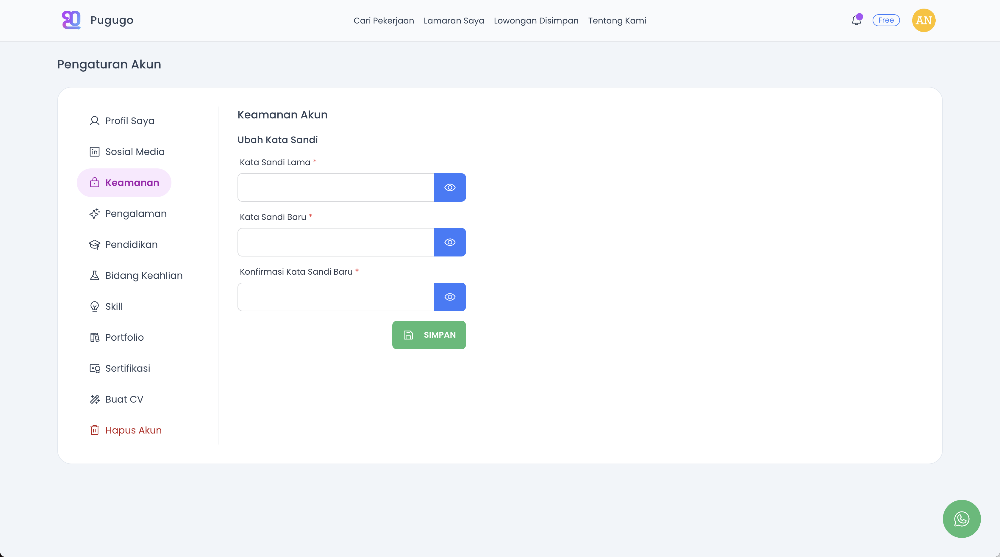

Menu Keamanan ini diperuntukkan hanya untuk mengubah kata sandi. Kami sarankan untuk mengubah kata sandi Anda minimal 1 tahun sekali untuk menghindari akses secara *bruteforce*.

#### Pengalaman

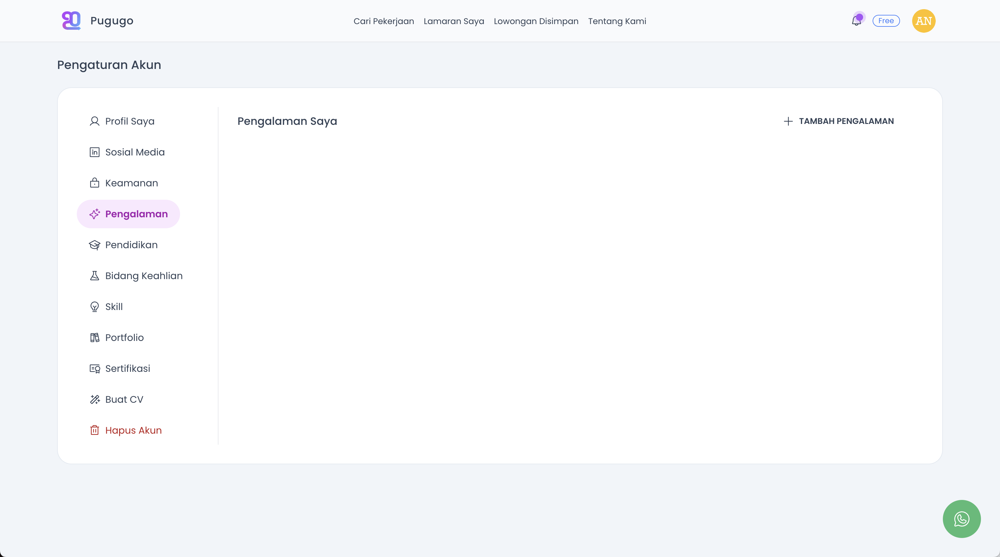

Menu Pengalaman ini digunakan untuk menambahkan pengalaman kerja Anda yang terdahulu. Halaman ini akan menunjukkan seluruh pengalaman Anda yang sudah diinputkan ke sistem. Untuk menambah data pengalaman, silahkan ikuti langkah-langkah berikut:

1. Klik tombol tambah yang ada di kanan atas panel. Setelah itu Anda akan melihat sebuah modal yang berisi inputan-inputan data.

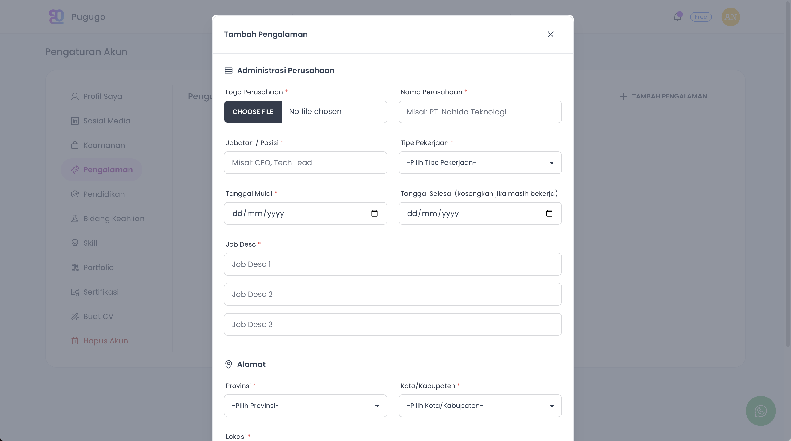

Pada bagian Administrasi Perusahaan, inputan-inputan tersebut adalah:
- Logo Perusahaan - unggah logo perusahaan dengan format PNG atau JPG dengan resolusi yang disarankan 512x512.
- Nama Perusahaan - diisi dengan nama perusahaan dimana Anda pernah bekerja.
- Jabatan / Posisi - diisi dengan jabatan yang pernah Anda pegang di perusahaan tersebut.
- Tipe Pekerjaan - pilih salah satu tipe pekerjaan yang sesuai. Terdapat opsi Harian, Magang, Penuh Waktu, Paruh Waktu, Kontrak.
- Tanggal Mulai - pilih tanggal Anda mulai bekerja di perusahaan tersebut.
- Tanggal Selesai (opsional) - pilih tanggal Anda selesai bekerja di perusahaan tersebut, kosongkan jika masih bekerja.
- Job Desc (wajib isi satu) - diisi dengan *job desc* Anda pada perusahaan tersebut.

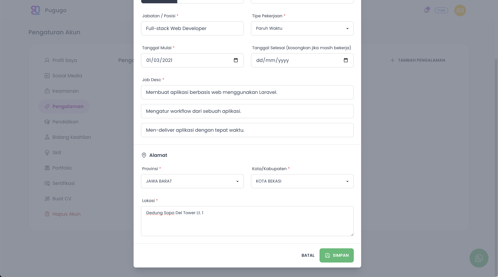

Pada bagian Alamat, inputan-inputan tersebut adalah:
- Provinsi - pilih Provinsi tempat di mana Anda bekerja.
- Kota / Kabupaten - pilih Kota / Kabupaten tempat di mana Anda bekerja.
- Lokasi - diisi dengan alamat lengkap perusahaan Anda bekerja.

2. Setelah semuanya dirasa lengkap, silahkan tekan tombol simpan untuk menyimpan data pengalaman Anda. Setelah Anda menekan tombol simpan, akan ada sebuah dialog yang menyatakan data pengalaman Anda berhasil disimpan di sistem. Anda juga akan dapat melihat data pengalaman kerja yang baru diinputkan.

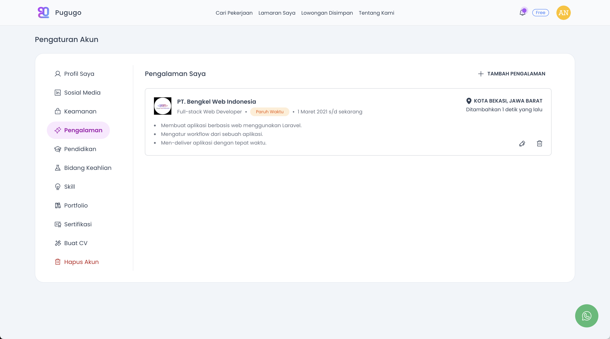

#### Pendidikan

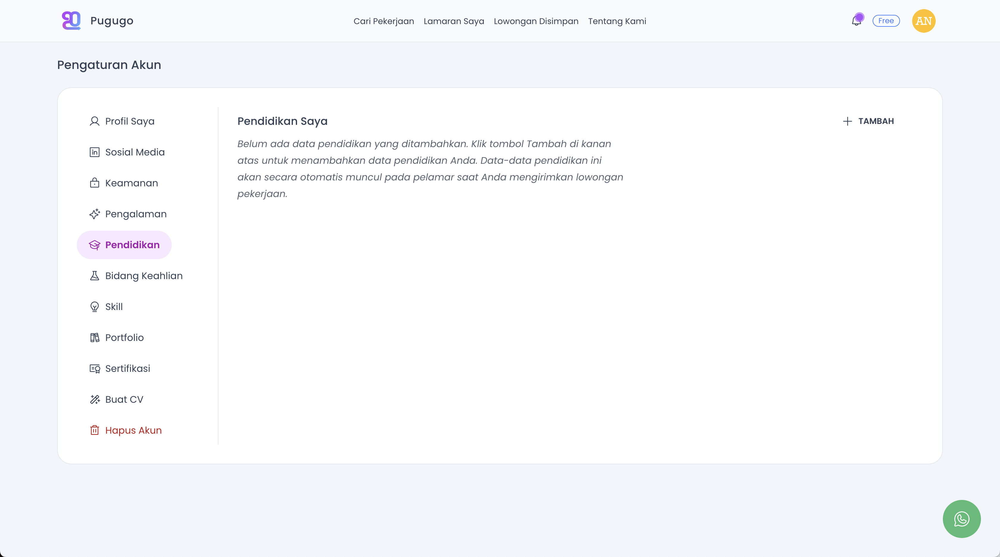

Menu Pendidikan ini digunakan untuk menambahkan pendidikan yang telah Anda tempuh. Halaman ini akan menunjukkan seluruh pendidikan Anda yang sudah diinputkan ke sistem. Untuk menambah data pendidikan, silahkan ikuti langkah-langkah berikut:

1. Klik tombol tambah yang ada di kanan atas panel. Setelah itu Anda akan melihat sebuah modal yang berisi inputan-inputan data.

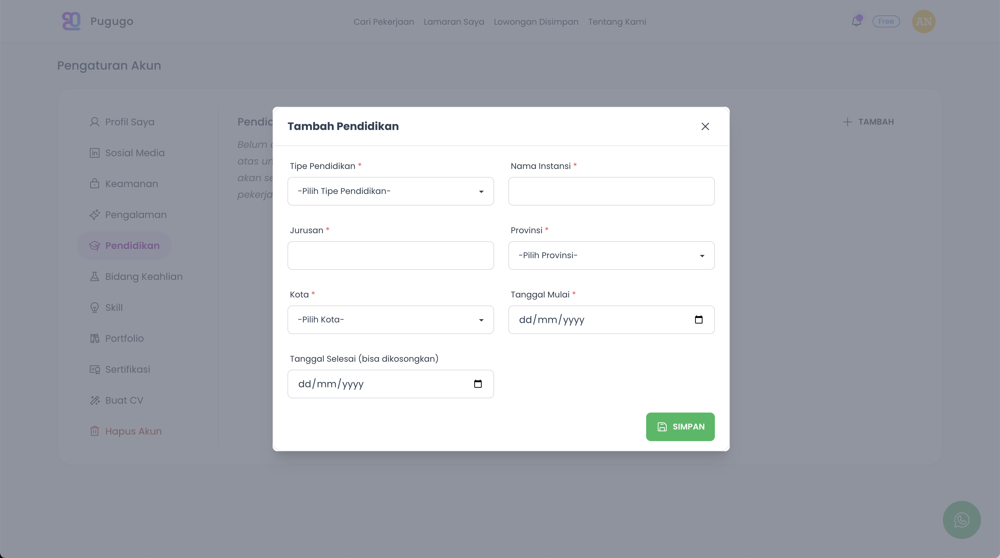

Pada modal ini, inputan-inputan tersebut adalah:
- Tipe Pendidikan - pilih salah satu yang ingin Anda tambahkan, terdapat beberapa opsi yaitu SMA, SMK, Diploma, S1, S2, dan S3.
- Nama Instansi - diisi dengan nama instansi pendidikan di mana Anda menempuh jenjang pendidikan.
- Jurusan - diisi dengan jurusan yang Anda tempuh di instansi tersebut.
- Provinsi - diisi dengan Provinsi instansi pendidikan tersebut berada.
- Kota / Kabupaten - diisi dengan Kota / Kabupaten instansi pendidikan tersebut berada.
- Tanggal Mulai - pilih tanggal Anda mulai belajar di instansi pendidikan tersebut.
- Tanggal Selesai (opsional) - pilih tanggal Anda selesai belajar di instansi pendidikan tersebut, kosongkan jika masih menempuh jenjang tersebut.
- Nilai Rata-rata UN / IPK (akan muncul setelah memilih Tipe Pendidikan) - diisi dengan nilai rata-rata UN atau IPK Anda.

2. Setelah semuanya dirasa lengkap, silahkan tekan tombol simpan untuk menyimpan data pendidikan Anda. Setelah Anda menekan tombol simpan, akan ada sebuah dialog yang menyatakan data pendidikan Anda berhasil disimpan di sistem. Anda juga akan dapat melihat data pendidikan yang baru diinputkan.

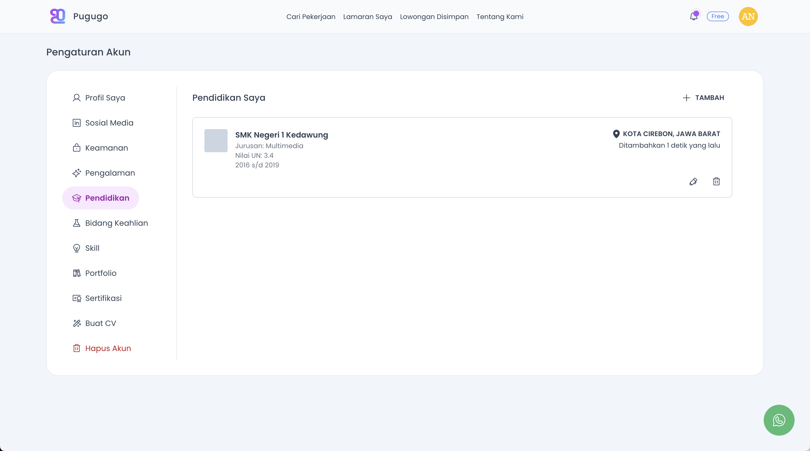

#### Bidang Keahlian

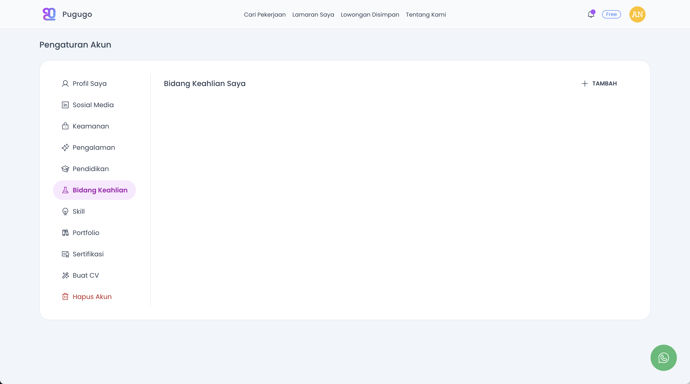

Menu Bidang Keahlian ini digunakan untuk menambahkan bidang keahlian yang telah Anda kuasai. Halaman ini akan menunjukkan seluruh bidang keahlian Anda yang sudah diinputkan ke sistem. Untuk menambah data bidang keahlian, silahkan ikuti langkah-langkah berikut:

1. Klik tombol tambah yang ada di kanan atas panel. Setelah itu Anda akan melihat sebuah modal yang berisi inputan-inputan data.

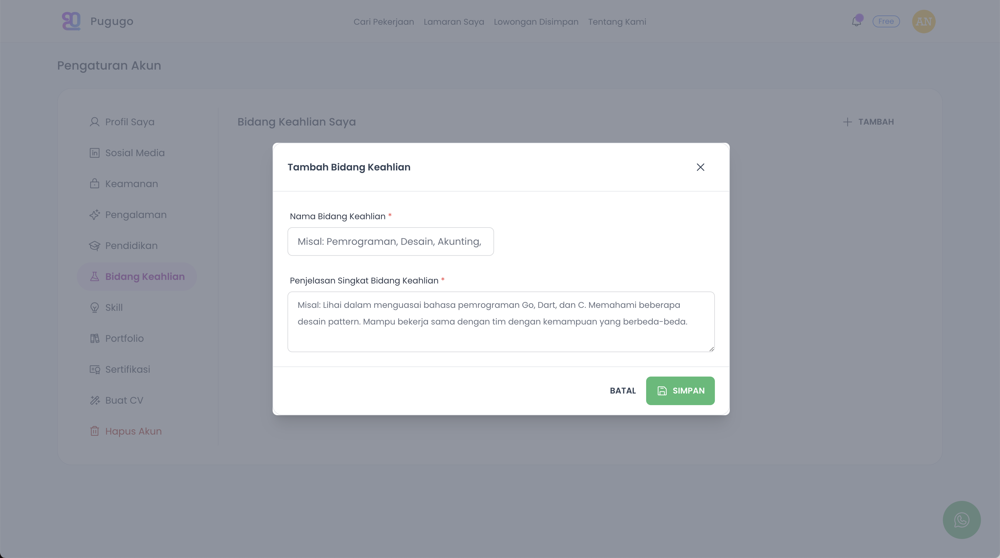

Pada modal ini, inputan-inputan tersebut adalah:
- Nama Bidang Keahlian - diisi dengan bidang keahlian yang Anda kuasai.
- Penjelasan Singkat Bidang Keahlian - diisi dengan penjelasan singkat tentang bidang yang dikuasai.

2. Setelah semuanya dirasa lengkap, silahkan tekan tombol simpan untuk menyimpan data bidang keahlian Anda. Setelah Anda menekan tombol simpan, akan ada sebuah dialog yang menyatakan data bidang keahlian Anda berhasil disimpan di sistem. Anda juga akan dapat melihat data bidang keahlian yang baru diinputkan.

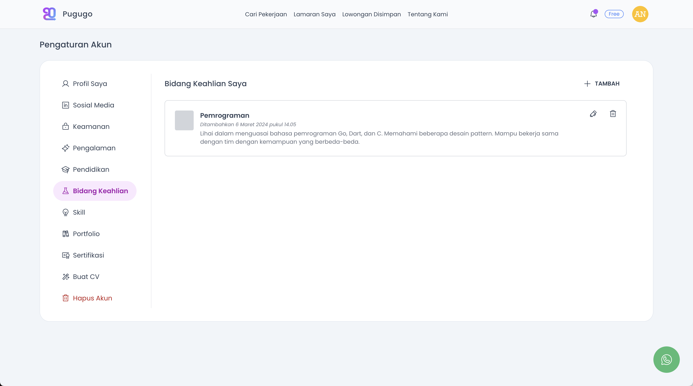

#### *Skill*

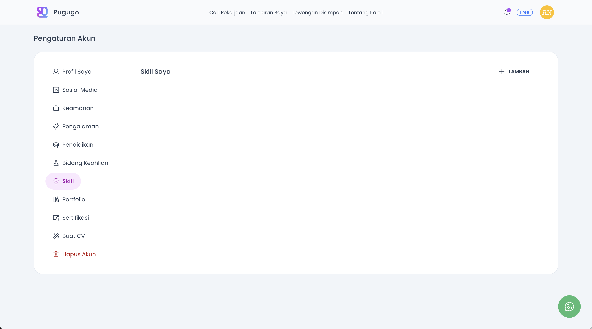

Menu *Skill* ini digunakan untuk menambahkan *skill* yang telah Anda kuasai. Halaman ini akan menunjukkan seluruh *skill* Anda yang sudah diinputkan ke sistem. Untuk menambah data *skill*, silahkan ikuti langkah-langkah berikut:

1. Klik tombol tambah yang ada di kanan atas panel. Setelah itu Anda akan melihat sebuah modal yang berisi inputan-inputan data.

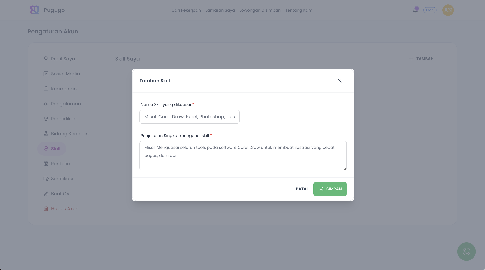

Pada modal ini, inputan-inputan tersebut adalah:
- Nama *Skill* - diisi dengan *skill* yang Anda kuasai.
- Penjelasan Singkat *Skill* - diisi dengan penjelasan singkat tentang skill yang dikuasai.

2. Setelah semuanya dirasa lengkap, silahkan tekan tombol simpan untuk menyimpan data *skill* Anda. Setelah Anda menekan tombol simpan, akan ada sebuah dialog yang menyatakan data *skill* Anda berhasil disimpan di sistem. Anda juga akan dapat melihat data *skill* yang baru diinputkan.

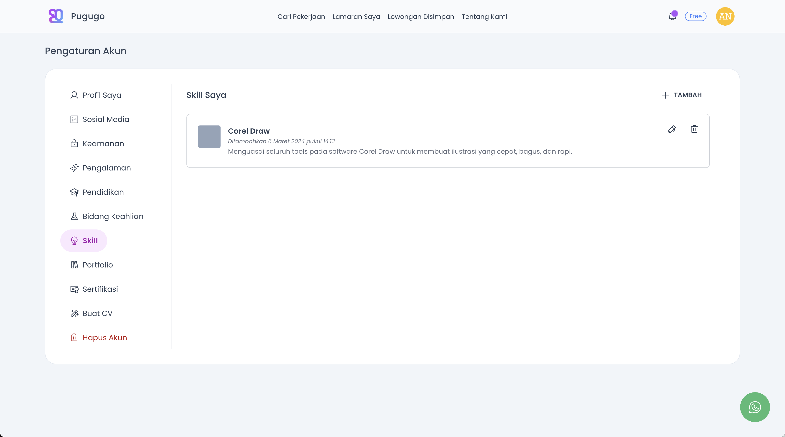

#### Portfolio

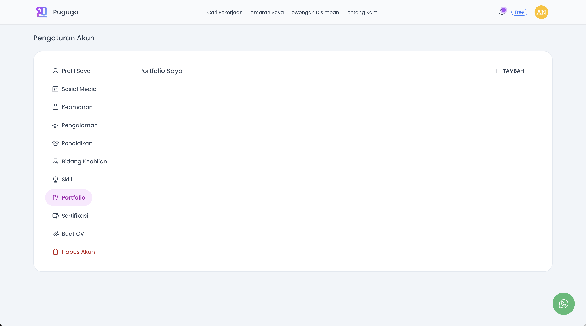

Menu Portfolio ini digunakan untuk menambahkan Portfolio yang telah Anda selesaikan. Halaman ini akan menunjukkan seluruh Portfolio Anda yang sudah diinputkan ke sistem. Untuk menambah data Portfolio, silahkan ikuti langkah-langkah berikut:

1. Klik tombol tambah yang ada di kanan atas panel. Setelah itu Anda akan melihat sebuah modal yang berisi inputan-inputan data.

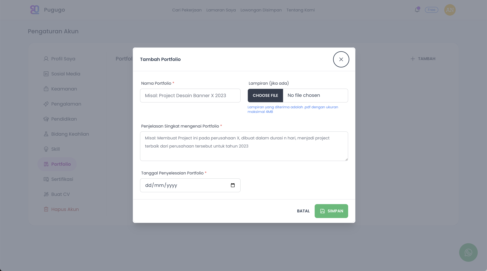

Pada modal ini, inputan-inputan tersebut adalah:
- Nama Portfolio - diisi dengan Portfolio yang Anda telah selesaikan.
- Lampiran (opsional) - unggah hasil dari Portfolio Anda terkait projek tersebut. Lampiran yang dapat diunggah adalah file berbentuk PDF dengan maksimal ukuran 2MB.
- Penjelasan Singkat Portfolio - diisi dengan penjelasan singkat tentang portfolio yang diselesaikan.
- Tanggal Penyelesaian Portfolio - diisi dengan tanggal penyelesaian portfolio.

2. Setelah semuanya dirasa lengkap, silahkan tekan tombol simpan untuk menyimpan data Portfolio Anda. Setelah Anda menekan tombol simpan, akan ada sebuah dialog yang menyatakan data Portfolio Anda berhasil disimpan di sistem. Anda juga akan dapat melihat data Portfolio yang baru diinputkan.

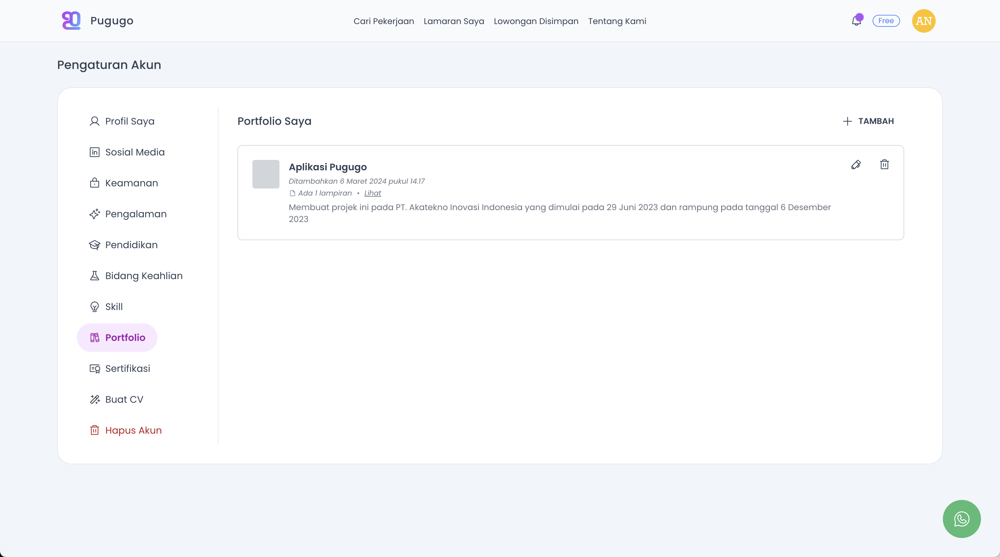

#### Sertifikasi

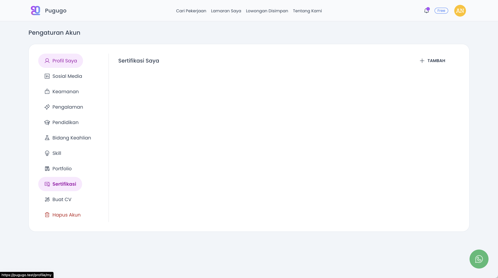

Menu Sertifikasi ini digunakan untuk menambahkan Sertifikasi yang telah Anda selesaikan. Halaman ini akan menunjukkan seluruh Sertifikasi Anda yang sudah diinputkan ke sistem. Untuk menambah data Sertifikasi, silahkan ikuti langkah-langkah berikut:

1. Klik tombol tambah yang ada di kanan atas panel. Setelah itu Anda akan melihat sebuah modal yang berisi inputan-inputan data.

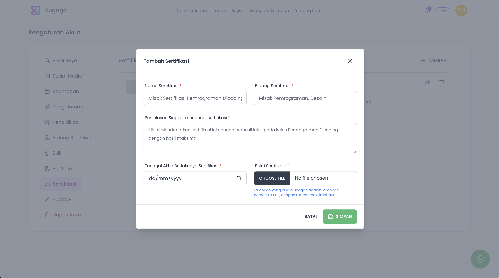

Pada modal ini, inputan-inputan tersebut adalah:
- Nama Sertifikasi - diisi dengan Sertifikasi yang Anda telah selesaikan.
- Bidang Sertifikasi - diisi dengan bidang pada sertifikasi yang Anda telah selesaikan.
- Penjelasan Singkat Sertifikasi - diisi dengan penjelasan singkat tentang sertifikasi yang diselesaikan.
- Tanggal Akhir Berlakunya Sertifikasi - diisi dengan tanggal akhir berlakunya sertifikasi.
- Lampiran (opsional) - unggah hasil dari Sertifikasi Anda terkait sertifikasi tersebut. Lampiran yang dapat diunggah adalah file berbentuk PDF dengan maksimal ukuran 2MB.

2. Setelah semuanya dirasa lengkap, silahkan tekan tombol simpan untuk menyimpan data Sertifikasi Anda. Setelah Anda menekan tombol simpan, akan ada sebuah dialog yang menyatakan data Sertifikasi Anda berhasil disimpan di sistem. Anda juga akan dapat melihat data Sertifikasi yang baru diinputkan.

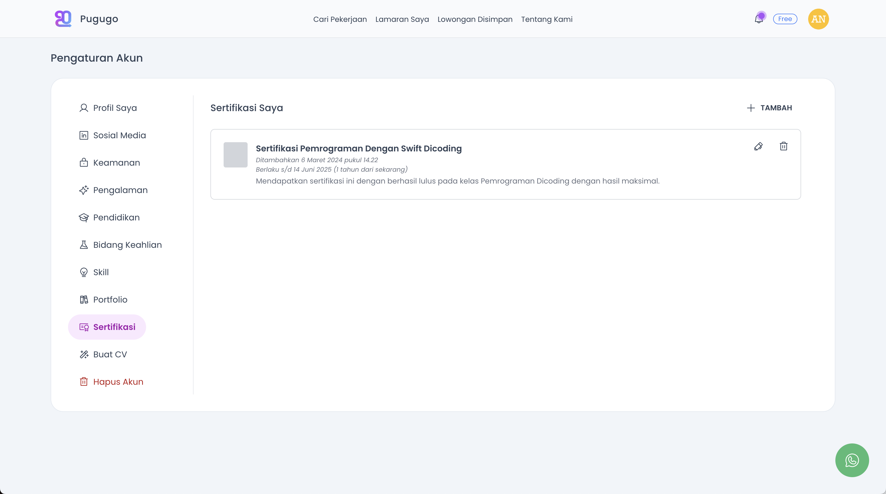

#### Buat CV

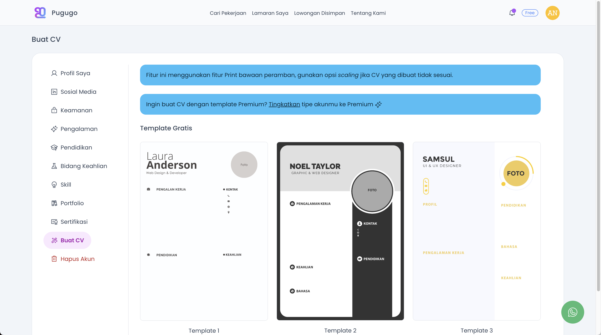

Menu ini digunakan untuk membuat CV secara otomatis melalui sistem. Terdapat 2 jenis CV yaitu CV *free template* dan *premium template* yang mengharuskan Anda untuk meng-*upgrade* akun Anda untuk mendapatkan fitur ini. Untuk membuat CV, ikuti langkah-langkah berikut:

1. Tekan salah satu *template* CV yang ingin Anda buat, lalu klik tombol Cetak yang terletak di kanan bawah panel.

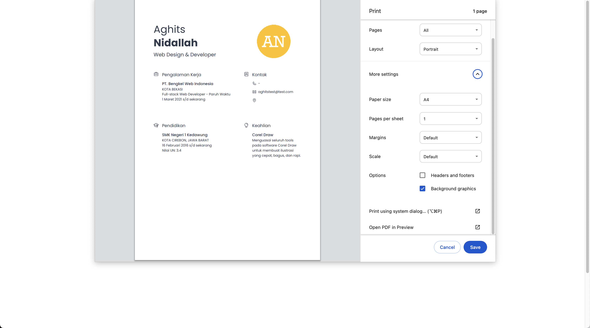

2. Setelah itu, Anda akan melihat halaman cetak yang secara otomatis sudah mengikuti *template*. Anda hanya perlu mengatur beberapa pengaturan tampilan cetak, lalu tekan tombol Simpan.

3. Data CV akan tersimpan dalam bentuk PDF di PC / Laptop Anda. Data CV lengkap memiliki contoh seperti ini:

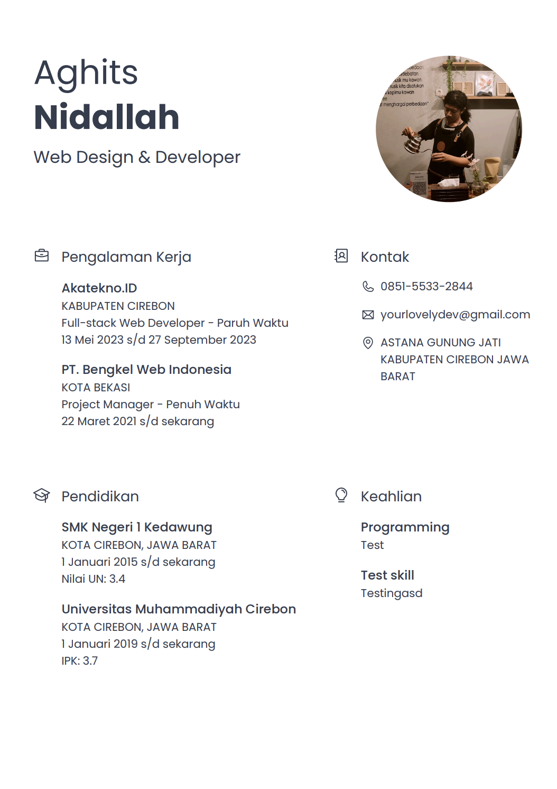

### Mendapatkan Informasi Lowongan Baru

Seluruh pelamar yang sudah terdaftar pada sistem akan mendapatkan notifikasi melalui Email dan melalui *in-app notification*.

Melalui email:

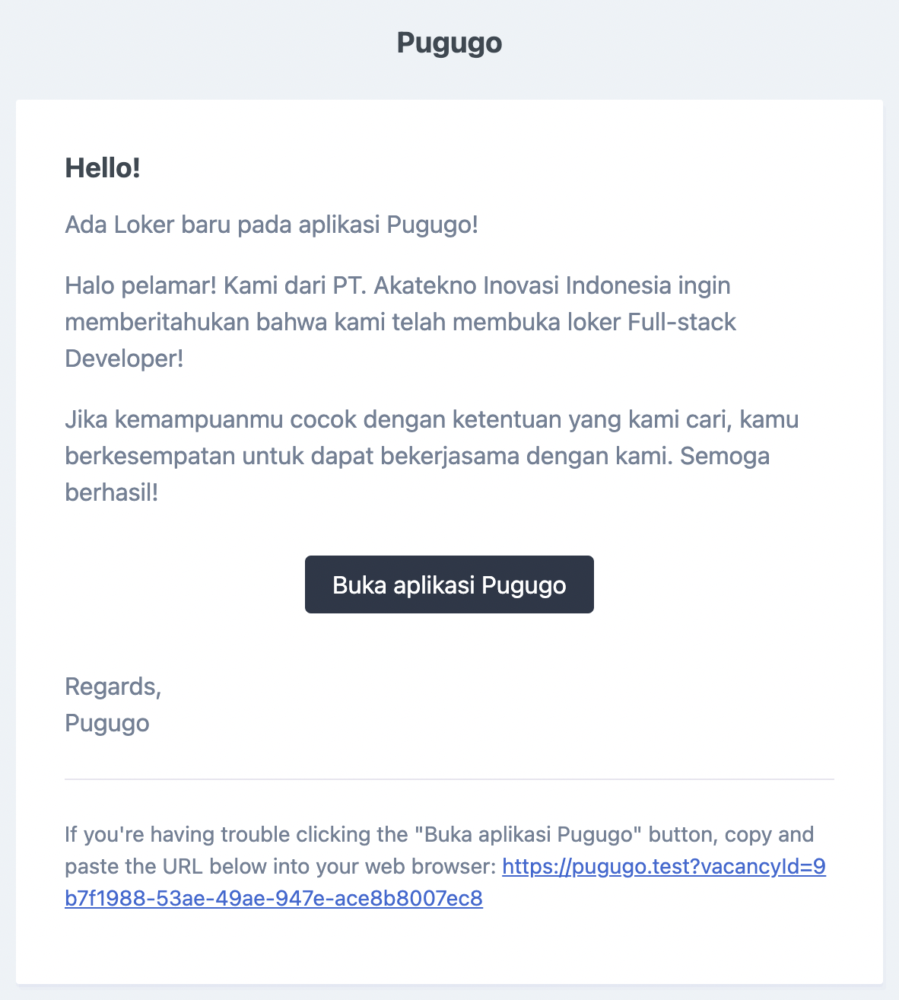

Melalui *in-app notification*:

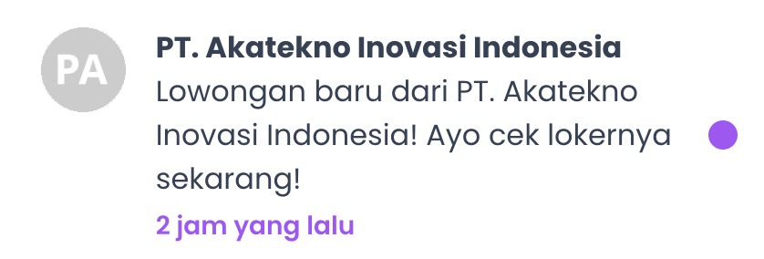

### Melamar Pekerjaan

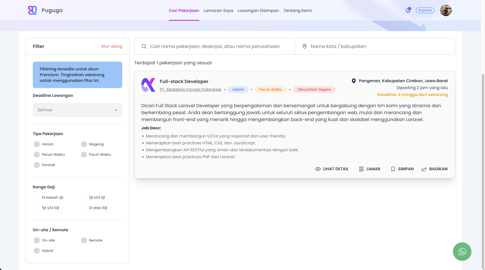

Pada bagian ini, Anda akan mempelajari cara untuk melamar pekerjaan pada aplikasi Pugugo. Secara teknis pada saat aplikasi ini dijalankan, *seharusnya* akan terdapat banyak lowongan kerja yang tersedia pada aplikasi ini. Pelamar akan diberikan banyak opsi lowongan kerja yang sesuai untuk dipilih dan dilamar. Untuk melamar sebuah lowongan pekerjaan, silahkan ikuti langkah-langkah berikut:

1. Temukan lowongan kerja yang sesuai dengan bakat dan minat Anda. Seperti contoh adalah lowongan menjadi *Full-stack Web Developer* yang diterbitkan oleh PT. Akatekno Inovasi Indonesia.

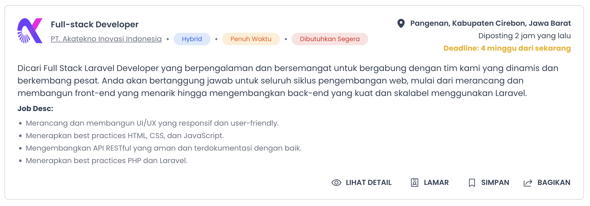

Sebelum melamar, Anda dapat melakukan banyak hal seperti:
- Melihat detail dari lowongan kerja tersebut.
- Menyimpan lowongan kerja tersebut.
- Membagikan lowongan kerja tersebut.
- Melihat detail dari perusahaan yang menerbitkan lowongan kerja tersebut.

2. Baca ketentuan dan persyaratan yang dibutuhkan untuk lowongan tersebut dengan cara menekan tombol `Lihat Detail`.

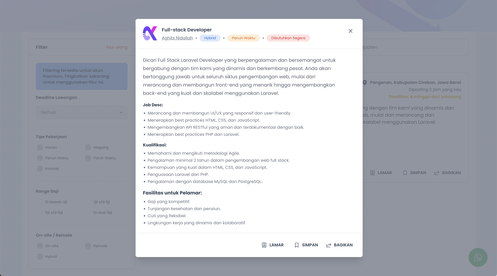

Setelah membaca ketentuan dan persyaratan secara seksama, silahkan tekan tombol `Lamar`.

3. Mengisi persyaratan lamaran kerja.

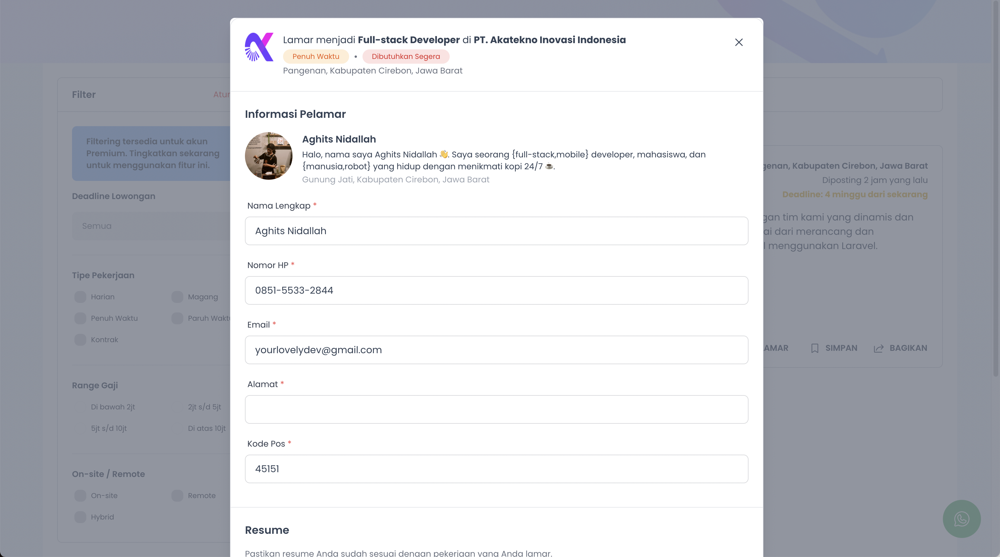

Setelah Anda menakan tombol `Lamar`, terdapat beberapa inputan yang beberapa harus diisi, pada bagian Informasi Pelamar, terdapat inputan sebagai berikut:
- Nama Lengkap - diisi dengan nama lengkap Anda. Jika Anda sudah melengkapi inputan ini pada halaman Profil, inputan ini akan terisi secara otomatis.
- Nomor HP - diisi dengan nomor HP Anda **yang dapat dihubungi**. Jika Anda sudah melengkapi inputan ini pada halaman Profil, inputan ini akan terisi secara otomatis. Namun perlu diperhatikan bahwa nomor HP harus berformat awal 62 dan diisi tanpa strip atau spasi.
- Alamat - diisi dengan alamat lengkap Anda sekarang tinggal, inputan ini tidak akan terisi secara otomatis.
- Kode Pos - diisi dengan Kode Pos tempat Anda sekarang tinggal, inputan ini akan terisi secara otomatis.

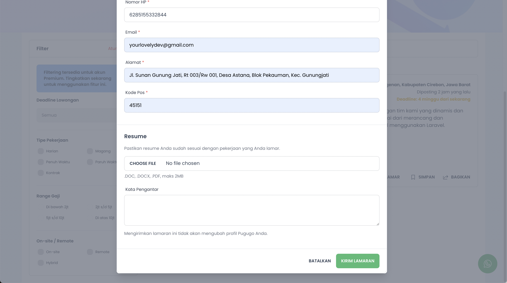

Pada bagian *Resume*, terdapat beberapa inputan juga yang dapat diisi untuk meningkatkan Anda lolos ke tahap selanjutnya:
- *Resume* - input unggahan dokumen *resume*, Anda dapat mengunggah file berupa Dokumen Microsoft Word, atau PDF dengan ukuran maksimal 2MB.
- Kata Pengantar - input isian yang akan tampil pada saat perusahaan membuka detail pelamar pada lowongan kerja tersebut.

Setelah dirasa semuanya sudah lengkap, silahkan tekan tombol `Kirim Lamaran` yang ada di kanan bawah modal. Aksi ini akan mengirimkan data Lamaran Anda ke perusahaan terkait.


Data Lamaran yang sudah dikirim tidak dapat diubah atau dihapus dari sistem. Pastikan data Lamaran yang Anda kirim sudah sesuai dengan yang diinginkan oleh perusahaan dan mengirim kata pengantar yang baik dan benar.


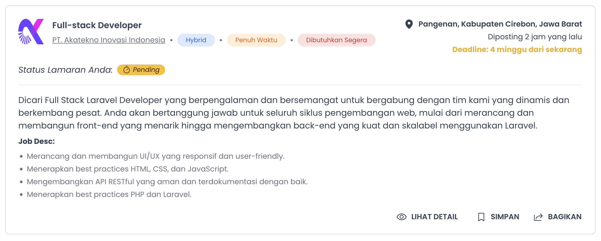

Setelah Anda mengirim lamaran, maka Anda tidak dapat melamar pada lowongan kerja tersebut untuk yang ke-dua kalinya. Akan terdapat `Status Lamaran` yang menandakan bahwa lamaran Anda pada lowongan tersebut masih `Pending`, `Ditolak` atau `Diterima`.

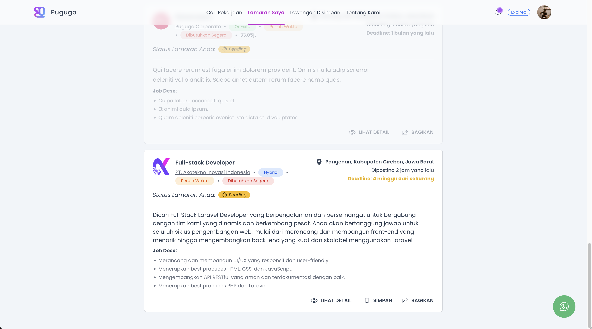

Anda juga dapat melihat seluruh lowongan yang sudah Anda lamar pada menu `Lamaran Saya` yang terdapat pada menu navigasi yang terdapat pada bagian atas aplikasi.

### Menyimpan Lowongan Pekerjaan

Untuk menyimpan sebuah lowongan, pilih salah satu lowongan yang terdaftar, lalu klik tombol `Simpan`.

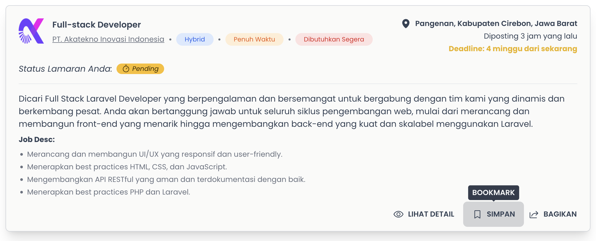

Seluruh lamaran yang sudah Anda simpan dapat dibedakan melalui warna tombol `Simpan`.

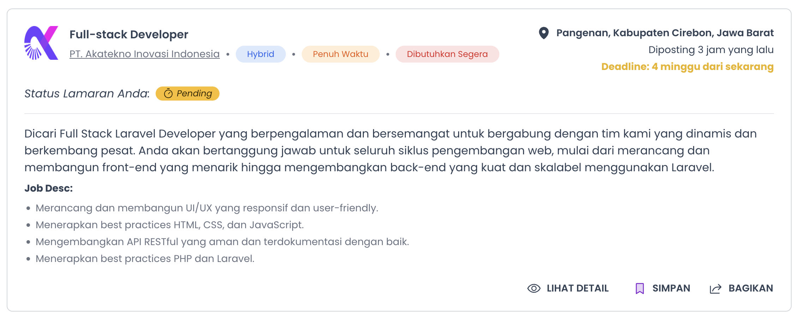

Anda dapat melihat seluruh lowongan yang sudah disimpan pada menu `Lowongan Disimpan` yang terdapat pada menu navigasi yang terdapat pada bagian atas aplikasi.

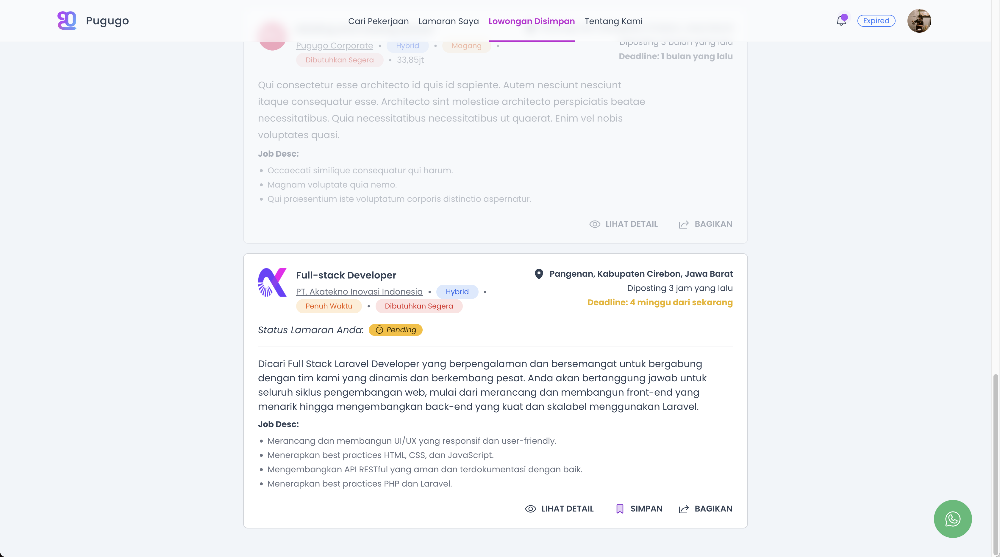

### Membagikan Lowongan Pekerjaan

Untuk menyimpan sebuah lowongan, pilih salah satu lowongan yang terdaftar, lalu klik tombol `Bagikan`.

Anda akan melihat sebuah dialog bahwa tautan lowongan telah disalin ke *clipboard*

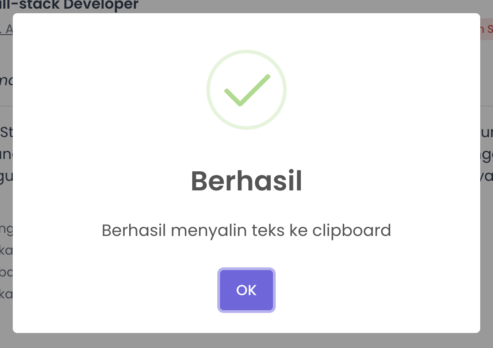

Hasil tautan yang disalin seperti ini: `https://pugugo.test?vacancyId=9b7f1988-53ae-49ae-947e-ace8b8007ec8`.

## Premium Plan

Pada bagian ini, akan menjelaskan bagaimana caranya Korporat / Pelamar dapat membeli *Premium Plan* dari sistem. Akan terdapat perbedaan *Premium Plan* dari masing-masing tipe akun, bisa dilihat pada *screenshot* di bawah:

*Premium Plan* Pelamar:

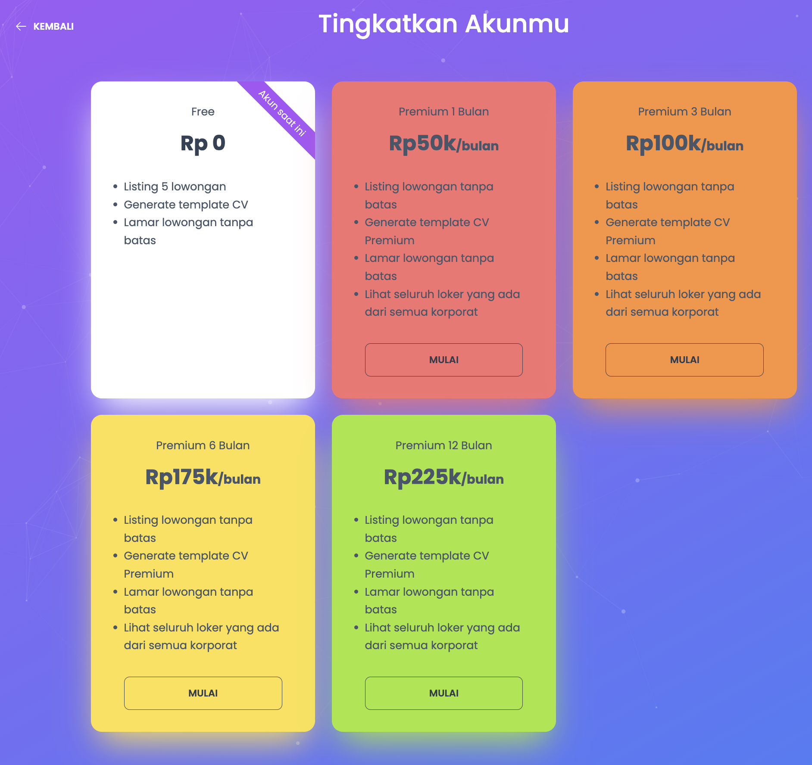

*Premium Plan* Korporat:

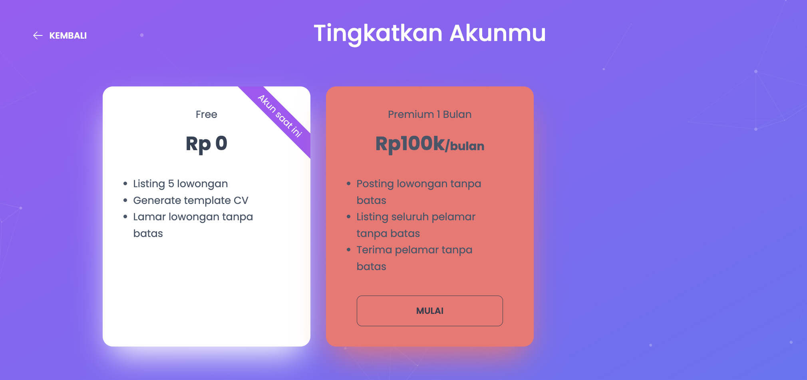

Untuk mengajukan sebuah *Premium Plan* silahkan tekan tombol `Mulai` pada harga yang sesuai untuk akun Anda. Setelah itu akan muncul sebuah modal berisikan informasi *plan* tersebut dan Anda diwajibkan untuk mengirimkan bukti transfer kepada nomor yang tertera di modal.

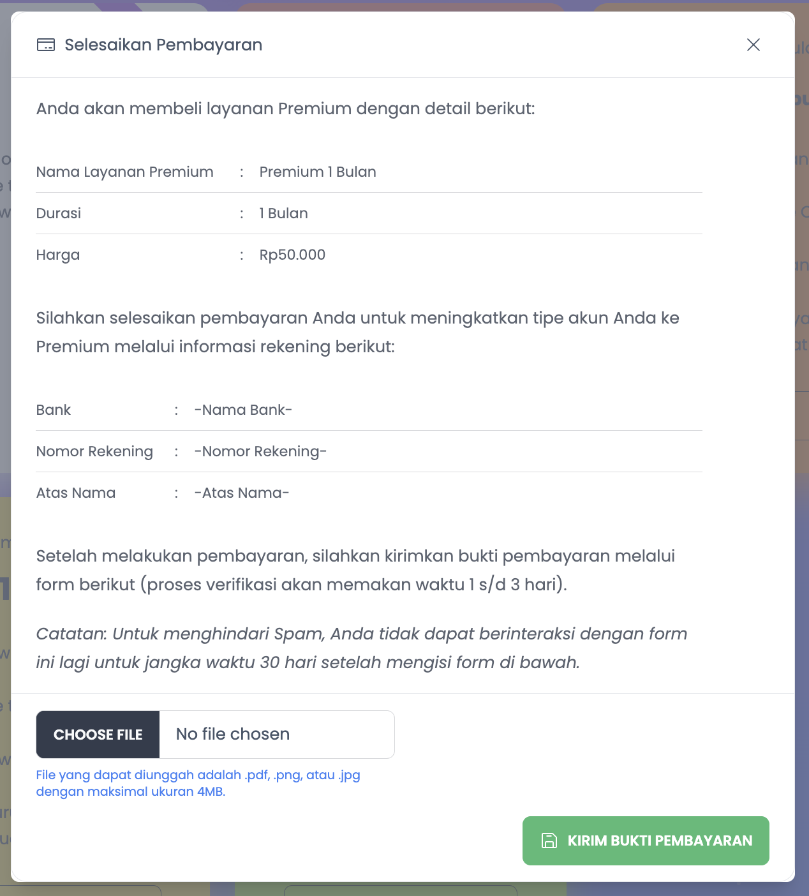

Setelah mengunggah dan memastikan data benar, klik tombol `Kirim Bukti Pembayaran`. Bukti pembayaran dapat berupa file gambar PNG atau JPG, serta PDF, dengan ukuran file tidak melebihi 4MB.

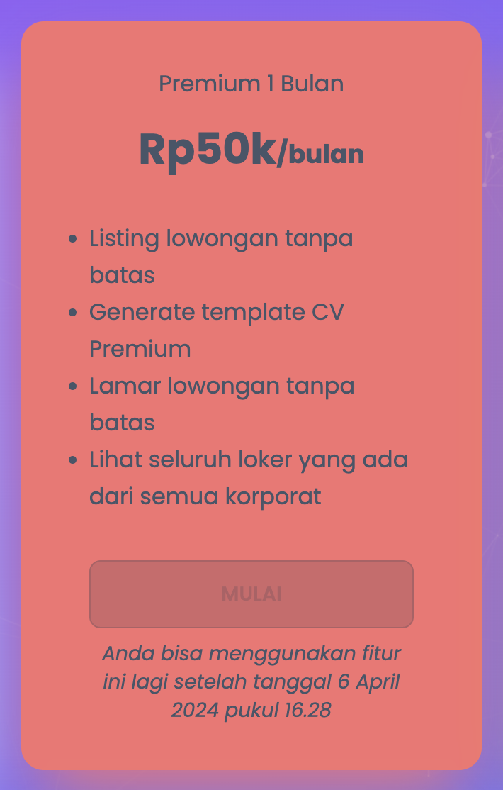

Setelah mengirimkan bukti pembayaran, Anda tidak dapat menggunakan layanan ini lagi terhitung 30 hari setelah Anda mengirimkan bukti pembayaran. Fitur ini dirancang untuk mencegah spam dan mencegah oknum tidak bertanggung jawab untuk merusak sistem.

Anda juga harus menunggu seorang Admin Pugugo untuk memverifikasikan pembayaran, jika data yang dikirimkan benar dan sudah diverifikasi, maka akun Anda akan berubah menjadi *Premium*.

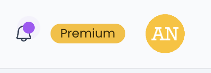

## Kode Referral


**Penting!** Kode Referral hanya berlaku untuk sesama pelamar, dan hanya akan muncul ketika pelamar tersebut sudah memiliki Premium Plan.


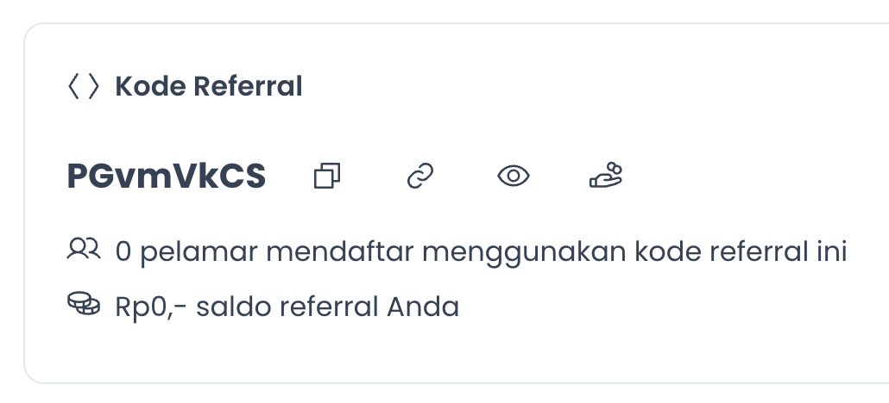

Bagian Kode Referral akan dapat diakses dari halaman profil, dan masing-masing akun memiliki kode referral yang unik.

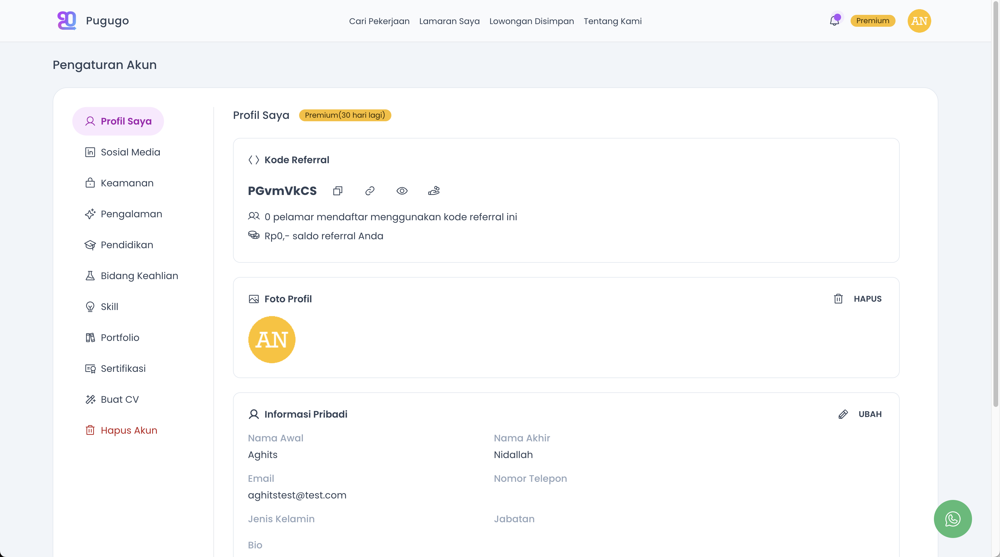

Akan terdapat 4 tombol yang dapat ditekan dan masing-masing memiliki aksi yang berbeda.
1. Salin Kode Referral
2. Salin Tautan Referral
3. Lihat Histori Referral
4. Tarik Saldo Referral

Kita akan membahas masing-masing tombol secara detil di bawah ini:

### Salin Kode Referral

Untuk menyalin kode referral, Anda hanya harus menekan tombol Salin Kode Referral

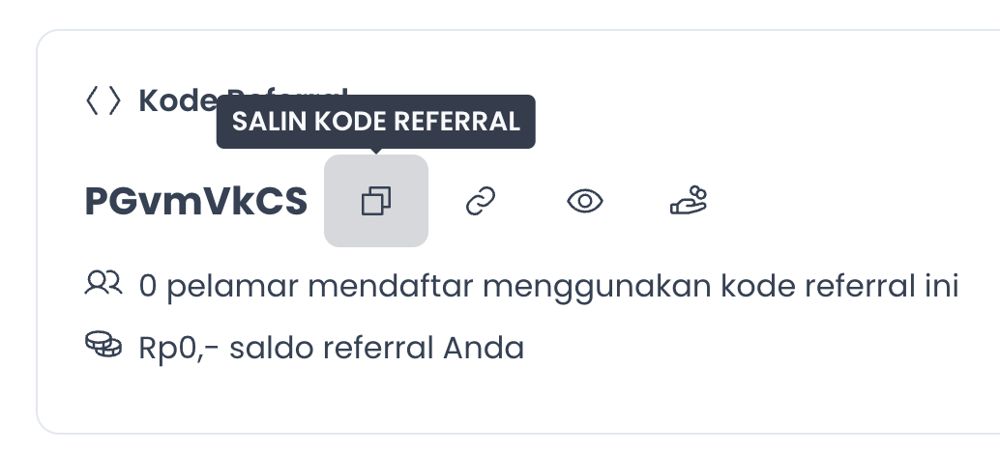

Hasil dari Kode Referral yang disalin akan masuk ke *clipboard* dan dapat ditempel, contoh dari hasil aksi tersebut adalah sebagai berikut `PGvmVkCS`.

### Salin Tautan Referral

Untuk menyalin tautan referral, Anda hanya harus menekan tombol Salin Tautan Referral

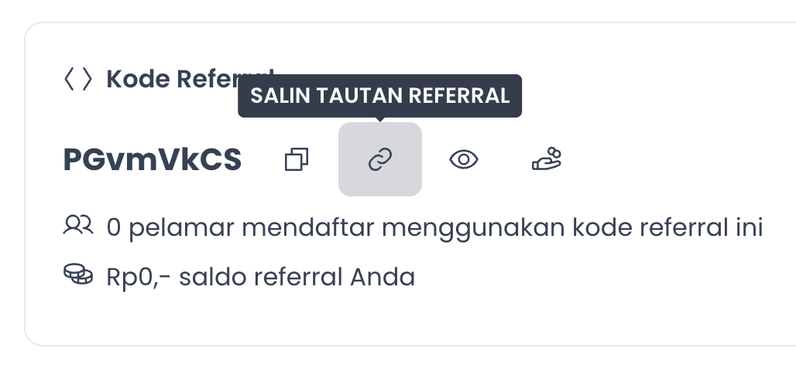

Hasil dari Tautan Referral yang disalin akan masuk ke *clipboard* dan dapat ditempel, contoh dari hasil aksi tersebut adalah sebagai berikut `https://pugugo.test/register?referralCode=PGvmVkCS`.

### Lihat Histori Referral

Untuk melihat histori referral, yaitu poin referral yang didapatkan / diambil, Anda hanya harus menekan tombol Lihat Histori Referral

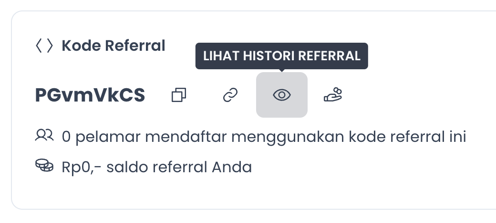

Akan tampil sebuah modal berikut:

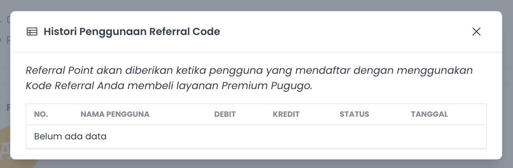

Contoh data lengkapnya adalah sebagai berikut:

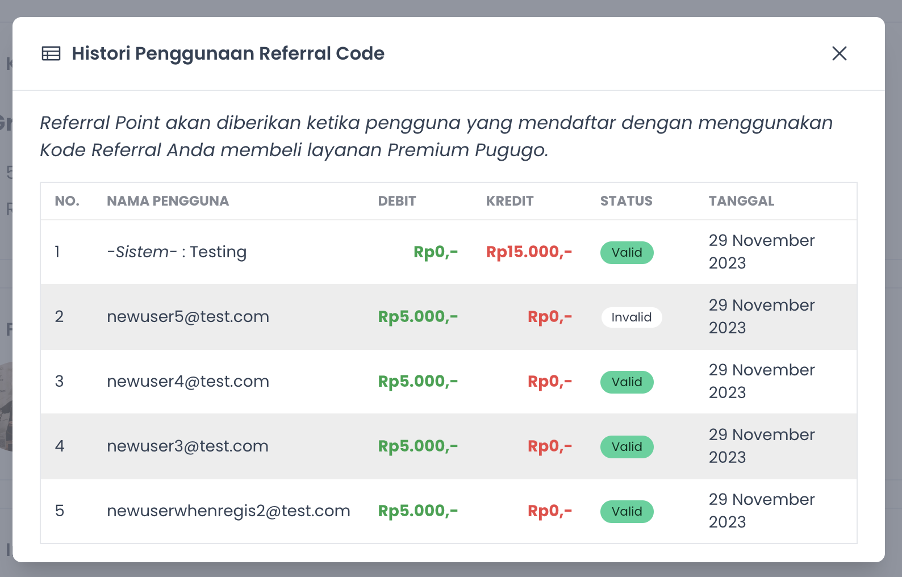

Penjelasan dari masing-masing status adalah sebagai berikut:
- Valid - pengguna menggunakan kode referral tersebut dan **sudah mendaftar Premium Plan dan sudah diverifikasi**.
- Invalid - pengguna menggunakan kode referral, namun **belum mendaftar Premium Plan atau belum diverifikasi**.

### Tarik Saldo Referral

Untuk menarik saldo referral, Anda hanya harus menekan tombol Tarik Saldo Referral.

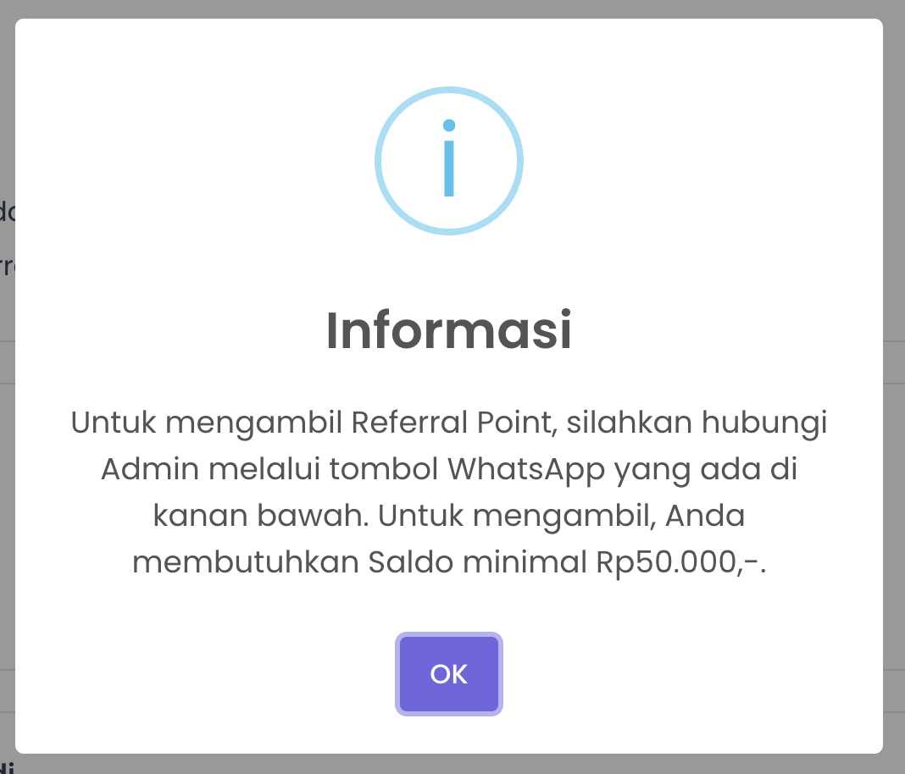

Anda harus mengikuti langkah-langkah yang dijelaskan pada dialog di atas, lalu menunggu Admin untuk memberikan saldonya ke rekening Anda.