For years, I've been fighting to get Sidecar-like functionality between my Mac and Android tablet. Spoiler: it's been absolute hell.

I've tried everything. Duet, Xdisplay, MirrCast, AirDroid Cast, AirScreen, you name it. Every single one disappointed me. They're either locked behind subscriptions, riddled with ads, or just don't work. And when they do work, the configurability is a joke.

I was fed up. There was no cheap, reliable option unless you're a networking wizard or you wait for someone else to solve it. **Well, it's 2026, and I finally found the solution**.


## Enter Sunshine

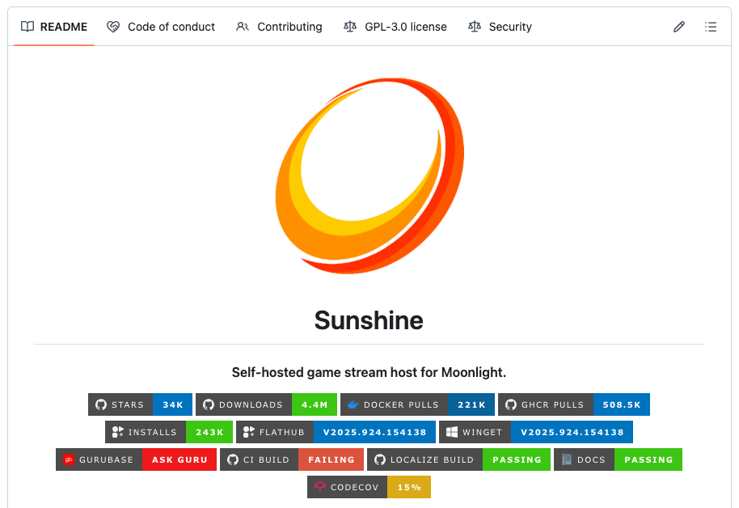



Sunshine is a game streaming host for Moonlight that supports hardware encoding across AMD, Intel, Nvidia, and Apple Silicon GPUs. While it's designed for game streaming, I realized it could be repurposed for display extension, and honestly, it works better than any dedicated screen-sharing app I've tried.


### Installing Sunshine


**Warning!** You need Homebrew installed first.


Installation is dead simple. Open your terminal and run:

```sh
brew update
brew tap LizardByte/homebrew
brew install sunshine
```

This updates your Homebrew formulae, adds the LizardByte tap (think of it like a PPA on Ubuntu or AUR on Arch), and installs Sunshine.


### Running Sunshine

**Option 1: As a background service**

If you want Sunshine running all the time:

```sh
brew services start lizardbyte/homebrew/sunshine
```

This starts Sunshine as a background service that launches automatically on login.

**Option 2: On-demand (my preference)**

I don't need this running 24/7, so I run it manually:

```sh
/opt/homebrew/opt/sunshine/bin/sunshine $HOME/.config/sunshine/sunshine.conf
```

That command is way too long to type repeatedly, so I aliased it in my `.zshrc`:

```sh
# .zshrc
alias sunshine="/opt/homebrew/opt/sunshine/bin/sunshine $HOME/.config/sunshine/sunshine.conf"
```

Now I just type `sunshine` whenever I need it.


## Accessing Sunshine's Dashboard

Once running, navigate to [https://localhost:47990](https://localhost:47990/) in your browser.

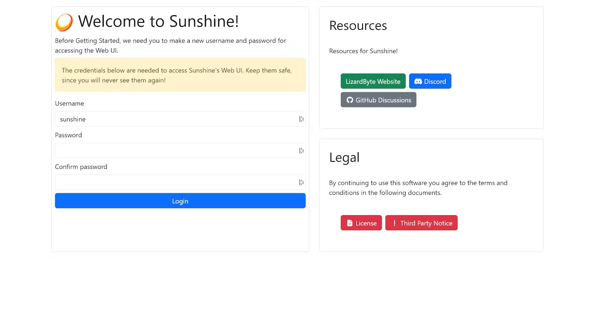

On first launch, you'll create a username and password. After submitting, you'll need to authenticate again through your browser's login dialog (yes, twice, it's annoying but necessary).

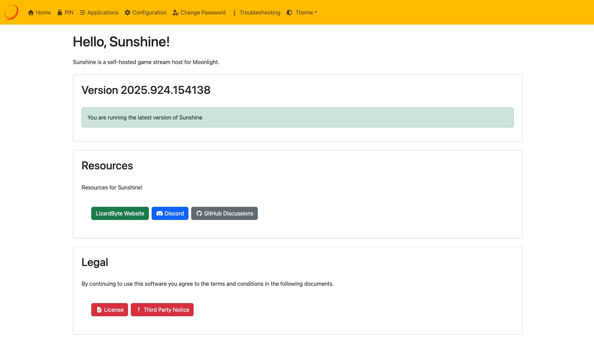

Now you're in the dashboard. But we're not done yet.


## Installing Moonlight on Your Android Device

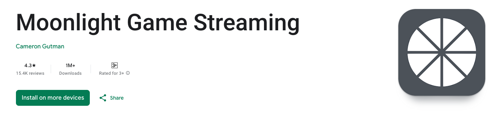

Straightforward: grab Moonlight from the Play Store. I'm using a Xiaomi Pad 6, but any Android tablet should work.

We'll come back to the Android side later. First, we need to set up a virtual display on MacOS.


## Creating a Virtual Display

You could use an HDMI dummy plug to trick MacOS into thinking there's a monitor connected, but there's an easier way: BetterDisplay.

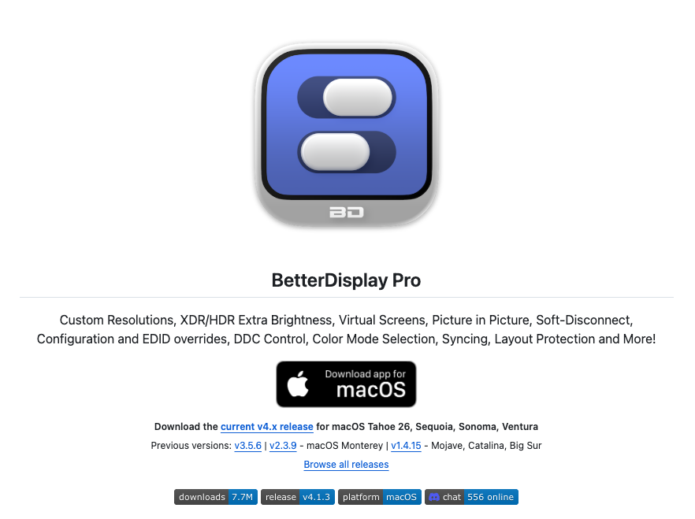



After installing BetterDisplay, click its icon in the Menu Bar, navigate to `Tools`, and select `Create New Virtual Display`.

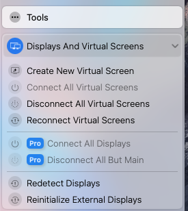

You'll see this prompt:

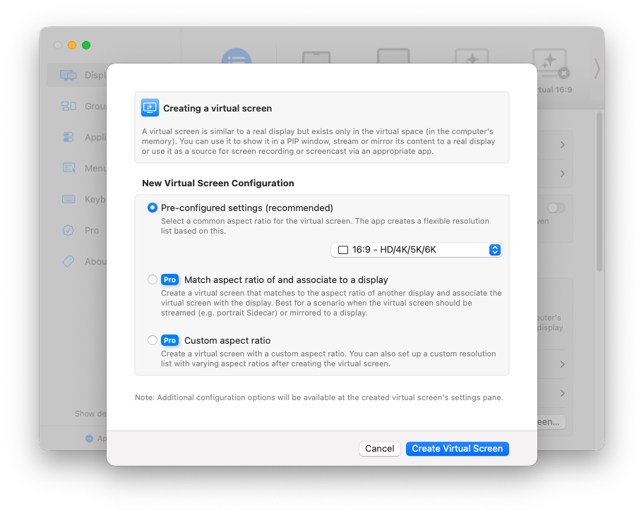

Leave the defaults and click `Create Virtual Screen`. Then toggle `Connect to this virtual screen` to on. This activates the virtual display so you can configure it.

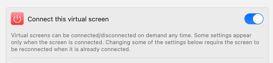


## Connecting the Virtual Display to Sunshine

### Find Your Display ID

You need the virtual display's ID. In BetterDisplay, click `Display Information` for your virtual screen.

Scroll down to find the `CGDirectDisplayID` value. Mine is `7`. Yours will likely be different.

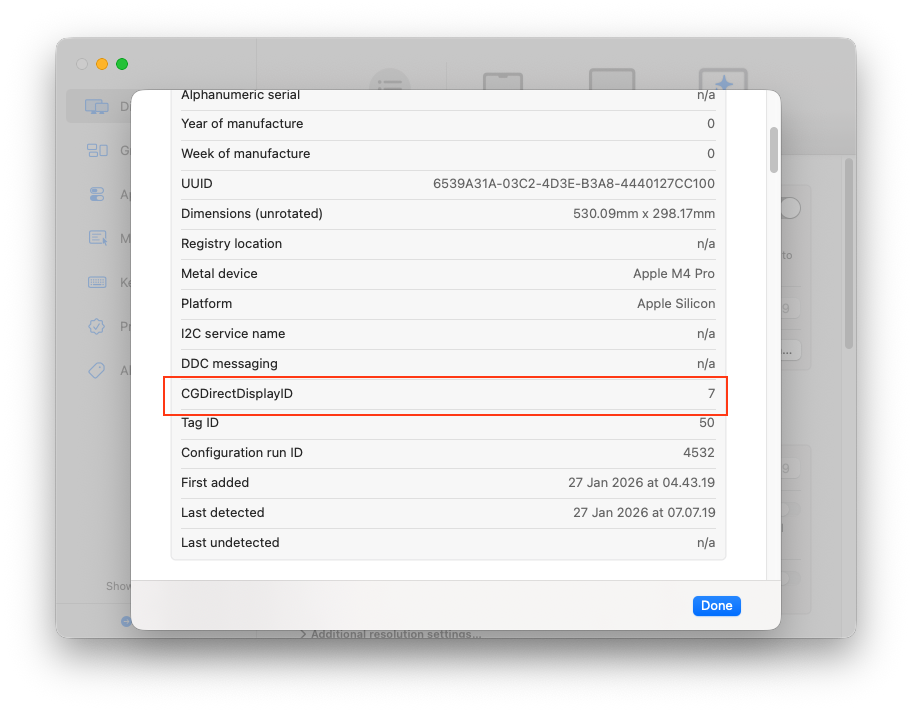

### Configure Sunshine

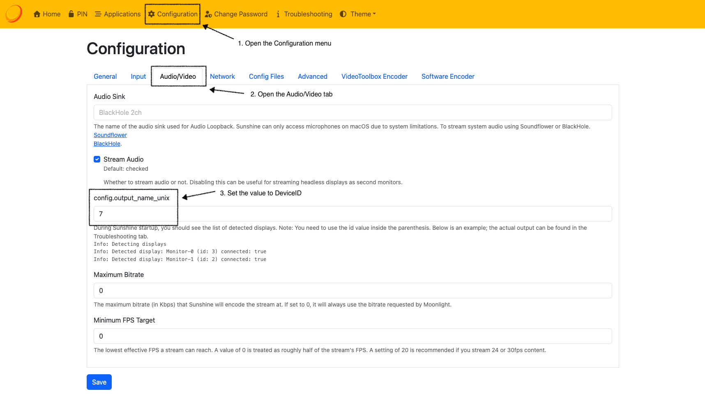

1. Open Sunshine's Dashboard at `https://localhost:47990`
2. Go to `Configuration` → `Audio/Video`
3. Set `config.output_name_unix` to your `CGDirectDisplayID` (mine is `7`)
4. Save

That's it. Sunshine now knows which display to stream.


## Pairing Your Tablet


**Warning!** Both devices must be on the same network. If you're on different networks, use Tailscale.


Open Moonlight on your tablet.

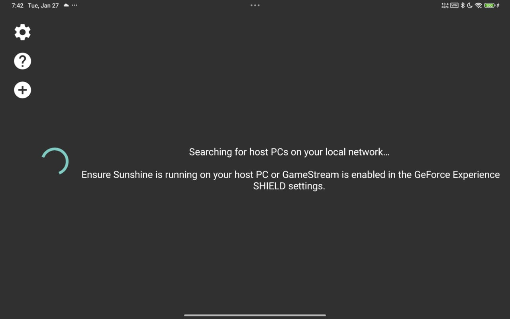

Tap the (+) button to add a PC. You'll need your Mac's IP address.

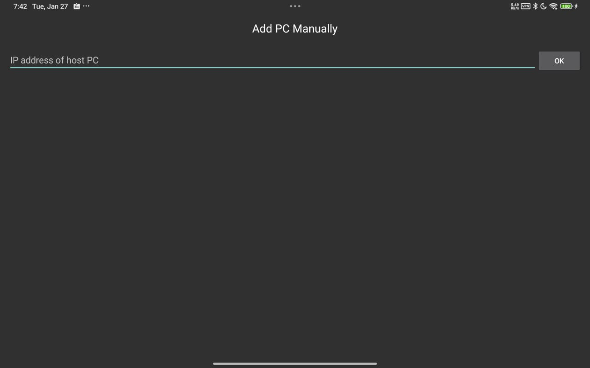

To find your IP: hold `Option` and click the Wi-Fi icon in your Mac's menu bar. Your IP address will be listed there.

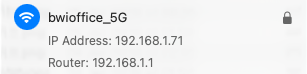

Enter the IP in Moonlight and tap `OK`.

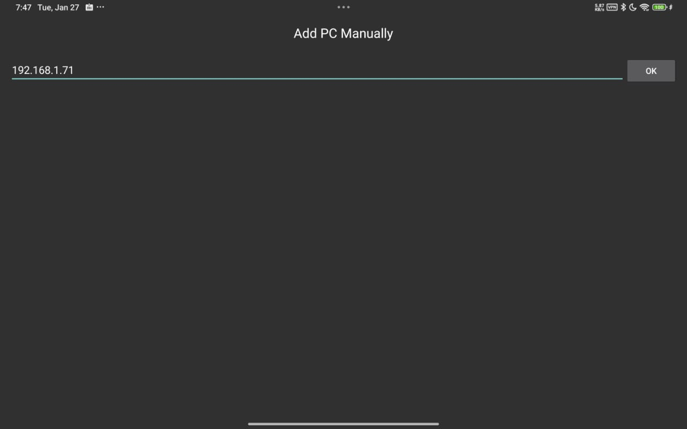

If it finds your Mac, you'll see it on the homepage.

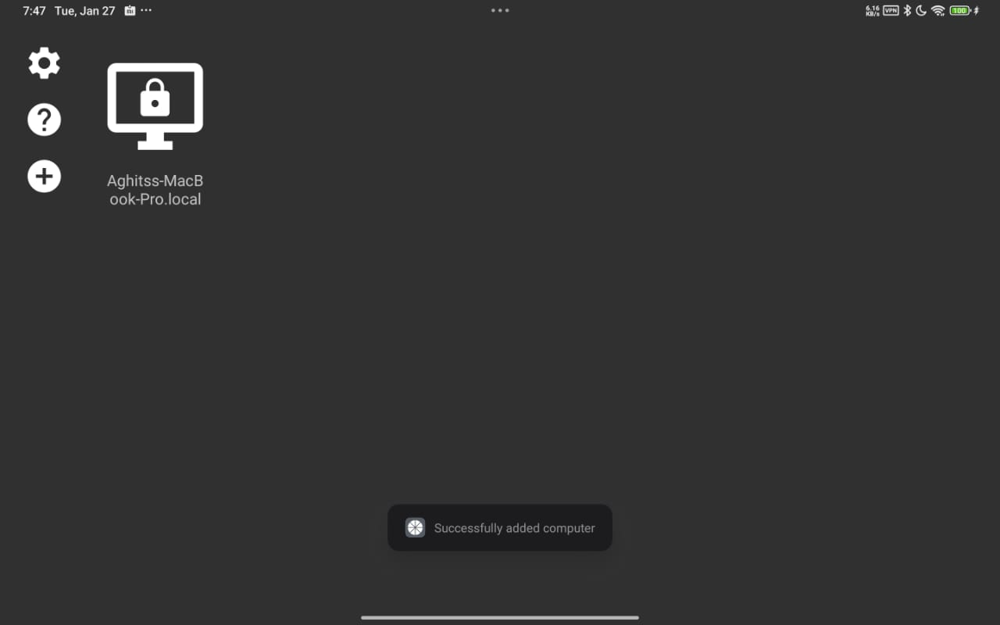

Tap your Mac, and Moonlight will display a PIN.

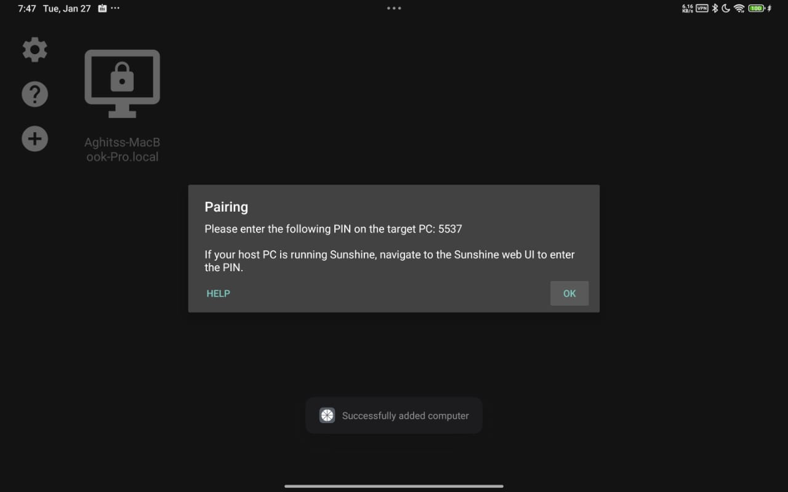

Back on your Mac, open Sunshine's Dashboard and go to the PIN section.

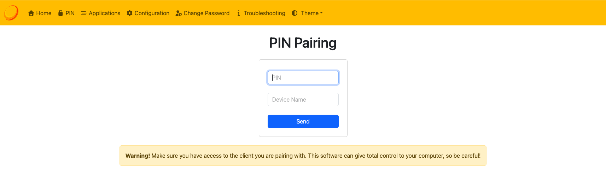

Enter the PIN and device name, then click `Send`.

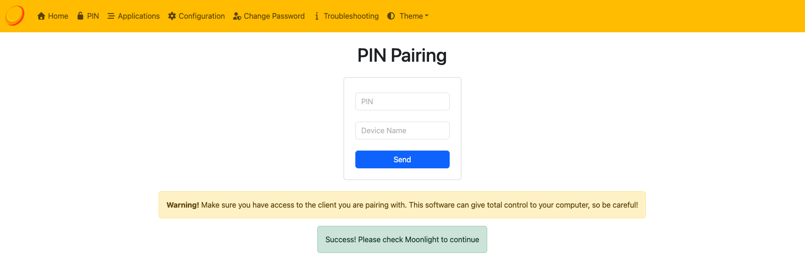

Once paired, you'll see `Desktop` as an option in Moonlight.

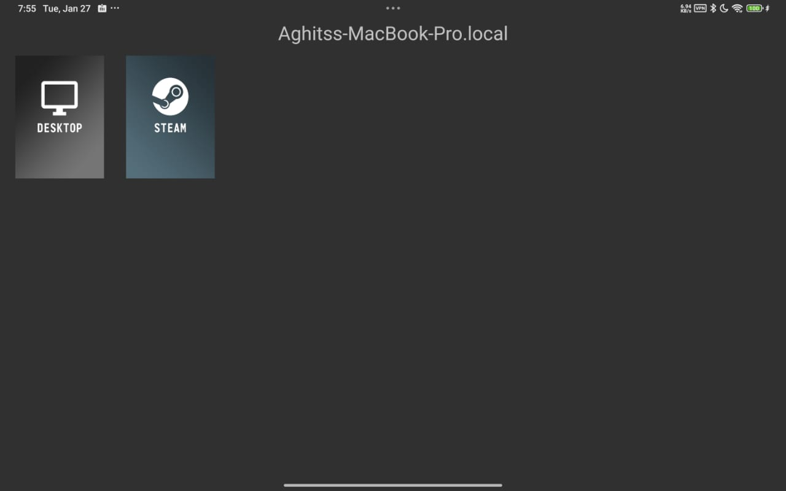

Tap `Desktop`, and boom. You've got a second display. Here's my setup while writing this:

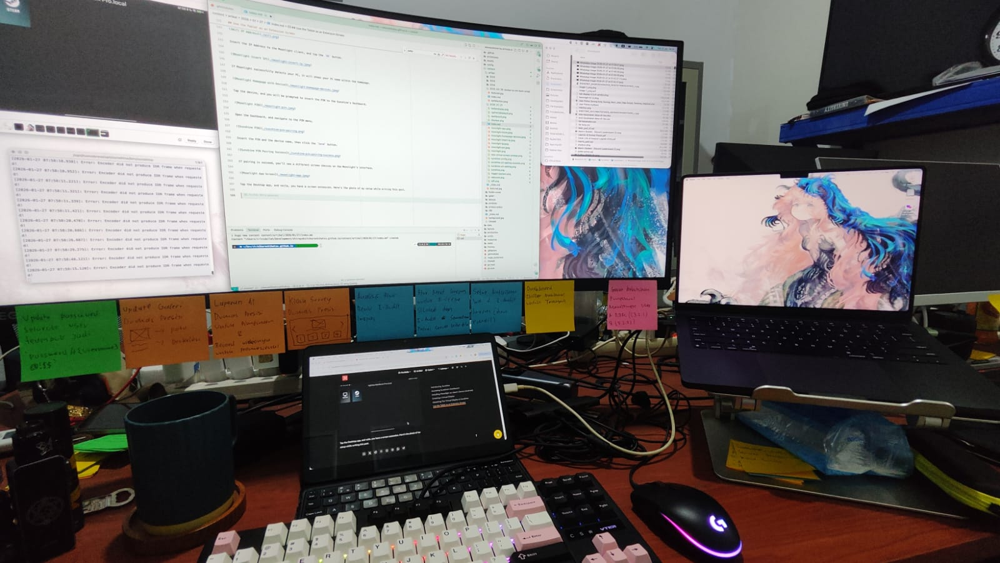

And here's how I arranged my screens:

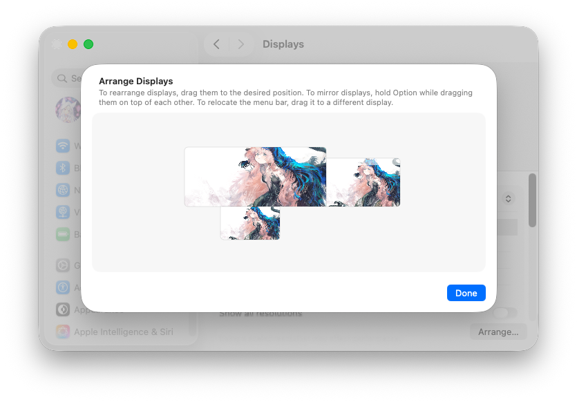


## Final Thoughts

This setup delivers the best Sidecar-like experience I've had between Mac and Android. The latency is genuinely impressive, around 40ms, which blows every paid screen-extension app out of the water.

Is it perfect? No. I wouldn't want to do heavy work on the extended display. It's best for static content or background apps. But for those moments when I'm running out of screen real estate? This solution is a lifesaver.

After years of frustration with overpriced, underperforming apps, I finally have something that actually works. And it's completely free.