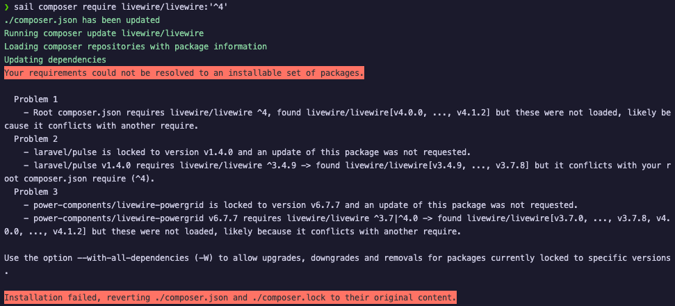
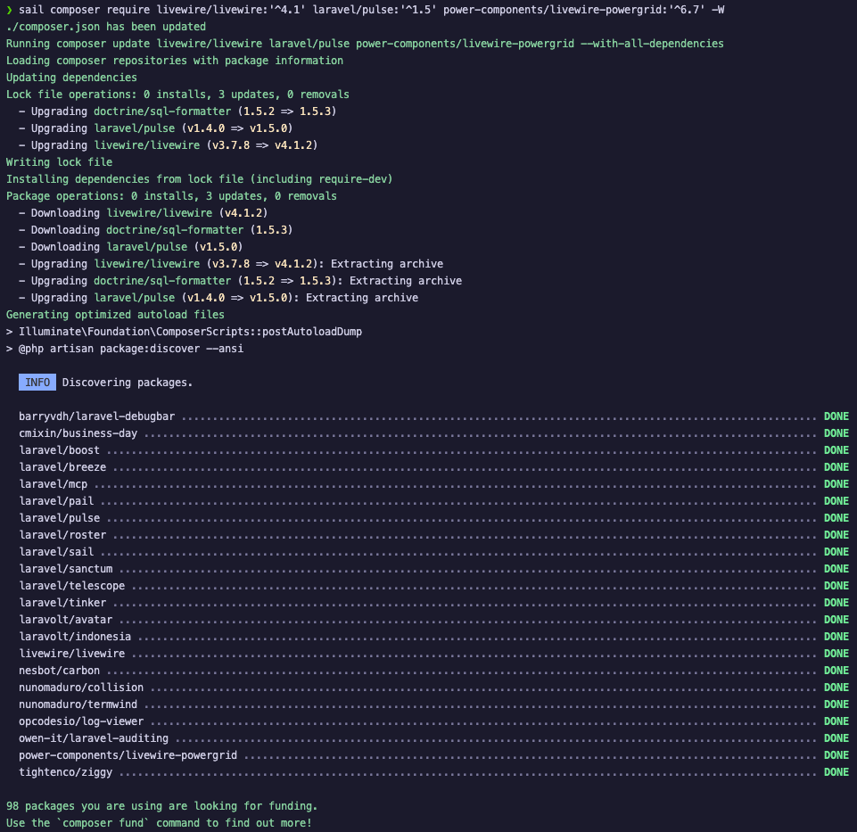

I was trying to update packages to fix security issues when I hit the classic dependency nightmare: `laravel/pulse` and `power-components/livewire-powergrid` needs `livewire/livewire:^3`, but I need to upgrade to `livewire/livewire:^4`. Composer refuses to budge, can't update one without the other, can't update both separately. Classic.

## The Error



Here's what happens when you try to update just Livewire:

```bash
❯ sail composer require livewire/livewire:'^4'
./composer.json has been updated
Running composer update livewire/livewire
Loading composer repositories with package information
Updating dependencies
Your requirements could not be resolved to an installable set of packages.

  Problem 1
    - Root composer.json requires livewire/livewire ^4, found livewire/livewire[v4.0.0, ..., v4.1.2] but these were not loaded, likely because it conflicts with another require.
  Problem 2
    - laravel/pulse is locked to version v1.4.0 and an update of this package was not requested.
    - laravel/pulse v1.4.0 requires livewire/livewire ^3.4.9 -> found livewire/livewire[v3.4.9, ..., v3.7.8] but it conflicts with your root composer.json require (^4).
  Problem 3
    - power-components/livewire-powergrid is locked to version v6.7.7 and an update of this package was not requested.
    - power-components/livewire-powergrid v6.7.7 requires livewire/livewire ^3.7|^4.0 -> found livewire/livewire[v3.7.0, ..., v3.7.8, v4.0.0, ..., v4.1.2] but these were not loaded, likely because it conflicts with another require.

Use the option --with-all-dependencies (-W) to allow upgrades, downgrades and removals for packages currently locked to specific versions.

Installation failed, reverting ./composer.json and ./composer.lock to their original content.
```

Composer is basically saying: "I found the versions you want, but I refuse to install them because of locked dependencies."

## The Solution

Update all conflicting packages in a single command with the `-W` flag (with-all-dependencies):



```bash
❯ sail composer require livewire/livewire:'^4.1' laravel/pulse:'^1.5' power-components/livewire-powergrid:'^6.7' -W
./composer.json has been updated
Running composer update livewire/livewire laravel/pulse power-components/livewire-powergrid --with-all-dependencies
Loading composer repositories with package information
Updating dependencies
Lock file operations: 0 installs, 3 updates, 0 removals
  - Upgrading doctrine/sql-formatter (1.5.2 => 1.5.3)
  - Upgrading laravel/pulse (v1.4.0 => v1.5.0)
  - Upgrading livewire/livewire (v3.7.8 => v4.1.2)
Writing lock file
Installing dependencies from lock file (including require-dev)
Package operations: 0 installs, 3 updates, 0 removals
  - Downloading livewire/livewire (v4.1.2)
  - Downloading doctrine/sql-formatter (1.5.3)
  - Downloading laravel/pulse (v1.5.0)
  - Upgrading livewire/livewire (v3.7.8 => v4.1.2): Extracting archive
  - Upgrading doctrine/sql-formatter (1.5.2 => 1.5.3): Extracting archive
  - Upgrading laravel/pulse (v1.4.0 => v1.5.0): Extracting archive
Generating optimized autoload files
> Illuminate\Foundation\ComposerScripts::postAutoloadDump
> @php artisan package:discover --ansi

   INFO  Discovering packages.

  barryvdh/laravel-debugbar ...................................................................................................... DONE
  cmixin/business-day ............................................................................................................ DONE
  laravel/boost .................................................................................................................. DONE
  laravel/breeze ................................................................................................................. DONE
  laravel/mcp .................................................................................................................... DONE
  laravel/pail ................................................................................................................... DONE
  laravel/pulse .................................................................................................................. DONE
  laravel/roster ................................................................................................................. DONE
  laravel/sail ................................................................................................................... DONE
  laravel/sanctum ................................................................................................................ DONE
  laravel/telescope .............................................................................................................. DONE
  laravel/tinker ................................................................................................................. DONE
  laravolt/avatar ................................................................................................................ DONE
  laravolt/indonesia ............................................................................................................. DONE
  livewire/livewire .............................................................................................................. DONE
  nesbot/carbon .................................................................................................................. DONE
  nunomaduro/collision ........................................................................................................... DONE
  nunomaduro/termwind ............................................................................................................ DONE
  opcodesio/log-viewer ........................................................................................................... DONE
  owen-it/laravel-auditing ....................................................................................................... DONE
  power-components/livewire-powergrid ............................................................................................ DONE
  tightenco/ziggy ................................................................................................................ DONE

98 packages you are using are looking for funding.
Use the `composer fund` command to find out more!
> @php artisan vendor:publish --tag=laravel-assets --ansi --force

   INFO  No publishable resources for tag [laravel-assets].

Found 1 security vulnerability advisory affecting 1 package.
Run "composer audit" for a full list of advisories.
```

That's it. By specifying all the interdependent packages together and using `-W`, Composer resolves everything in one go.

## Key Takeaway

When you hit circular dependency conflicts, don't try updating packages one by one. List all the conflicting packages in a single `composer require` command with the `-W` flag. It forces Composer to resolve the entire dependency tree at once instead of fighting you at every step.

(Oh, and that remaining security vulnerability? It's in dev dependencies. I'll fix it later. Priorities, right?)