> The whole series is going to take more than 1 hour read. So please brew a coffee, or a black tea, or anything that has caffeine to boost your mental clarity throughout this yaps that I'm about to spit.

## Introduction

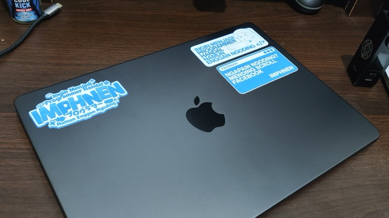

The MacBook Pro M4 Pro (yes, the "Pro", twice), was one of the state-of-the-art devices within that period. Comparing all of the consumer laptops I've found, this alone is the most promising laptop to meet my needs.

20 hours of battery life, big and blazing fast storage, undeniable CPU strength (oh, with Ray Tracing too. Although I haven't used it for anything yet, unless for Minecraft), more Thunderbolt 5 ports, HDMI port (what I needed the most), and an SD Card reader.

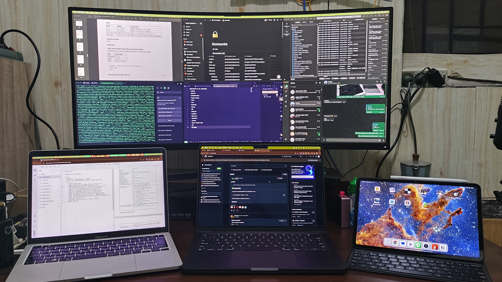

This laptop was an upgrade from MacBook Pro M1 8/512 13" JP, I bought the Japanese version since I was broke at that time, but needed that performance for development purposes. Back then, before the MacBook itself, I used the ASUS X441UV, which after upgrades, I got 1TB of storage, 16G of RAM, and extra 512G of storage by using a caddy.

My ASUS laptop did fine since I was using Linux, but Docker killed it. Containers loaded slowly, builds took forever, and hot-reload during development was painfully slow.

Now, until this date, I've been using the MacBook Pro M4 Pro 24/1TB 14". This huge leap in RAM is based on the condition where my MBP M1 could run out of memory due to Docker containers usage. I once had 5 containers running and it crashed my M1 so bad it force-restarted. I monitored the RAM, and it used 32G of swap file. That's when I knew I needed more RAM.

My expectations were met, great screen, tactile keyboard, big touchpad, crushing performance, and outstanding sound quality. It can run Docker, with 14 containers, across +30 services, without breaking a sweat.

The unboxing experience itself is mostly the same as other Apple products, that slow-falling anticipation until you see the product itself. Apple beats every other brand in terms of unboxing experience.

## The Specs & What They Mean in Real Life

### Hardware Configuration

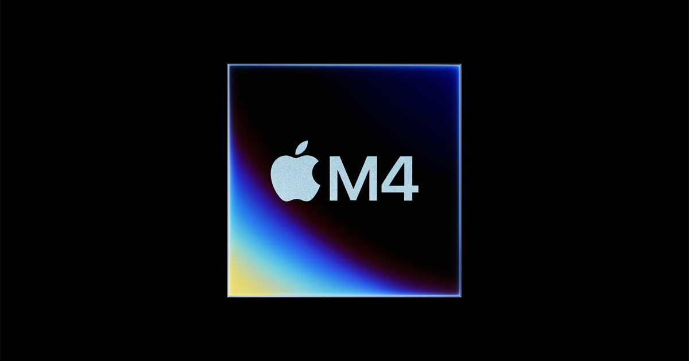

M4 Pro chip starts at 12 CPU cores (up to 14) and 16 GPU cores (up to 20). Even though it has fewer cores than Intel's Core i9 15th Gen (which has 24 cores), it still outperforms Intel in single-core performance, power efficiency, and integrated graphics.

This line of MacBook offers the RAM size of 24G and 48G of RAM, I specifically chose 24G of RAM since it meets my price budget and current workload. 48G of RAM is overkill, I don't have workloads that push past 24G. I buy what I need now, not what I might need later. Future-proofing RAM is bullshit for development work unless you're doing creative stuff like video editing.

For the storage itself, 1TB of storage already meets my criteria, development environment is mostly small files that pile up in dependencies. Laravel projects average about 200M for the initial codebase (Composer vendors + Node modules). There are no big files that eat up storage such as 4K video, or ProRAW formats that easily took up space.

14" of Liquid Retina Display is what I need the most. The transition from 13" to 14" itself is not much, but it actually is BIG in terms of window space that I can actually work with. Before upgrading, I had to use Stage Manager (which sucks) all the time to switch between app windows. Now, with help of Rectangle app, I can split the window into smaller view and can still see the content clearly.

I was considering buying the Nano-texture as well, but after watching some reviews, I decided not to. Why, you ask? Coding is mainly reading texts, Nano-texture ruins the clarity in trade of less glare when outdoor. But let me ask you this question, how often you see a developer doing their work outdoors? Rarely.

The last thing, the most important buying factor, PORTS!!! 3 Thunderbolt 5 ports 😭. More ports = more freedom. MBP M1 was hell, just 2 Thunderbolt ports without Magsafe, so I had to plug the dongle all the time in order to be able to charge, use my external keyboard and mouse, and external screen as well.

_Ports on the left side of the MBP M4 Pro_:
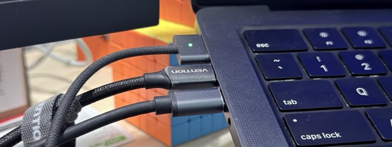

_Ports on the right side of the MBP M4 Pro_:
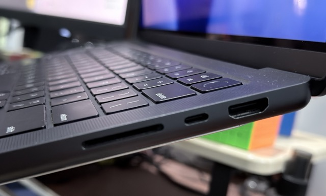

This laptop comes with an extra Thunderbolt port, Magsafe port, HDMI port, and SD Card reader as well. So, at least my 3 problems are fixed within this upgrade. Now I don't really need a dongle specifically for charging and external display itself. Thanks a lot, Apple, for crafting this masterpiece 😭🙏.

### Build Quality & Design

Now, it is the time to be honest, no sugarcoating, no lies in between. After a year, despite being used for heavy work, it still does SOLID performance. No physical degradation, only normal wear and tear (I'll provide the picture later) on my palm rest, a chip on the left Command keycap, and classic Staingate problem.

_Palm rest chip_:
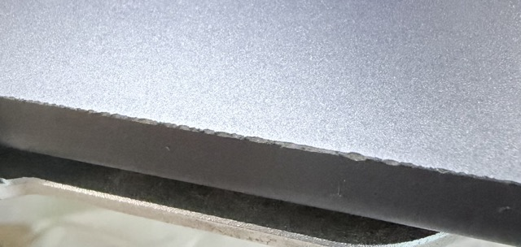

_Command key chip_:
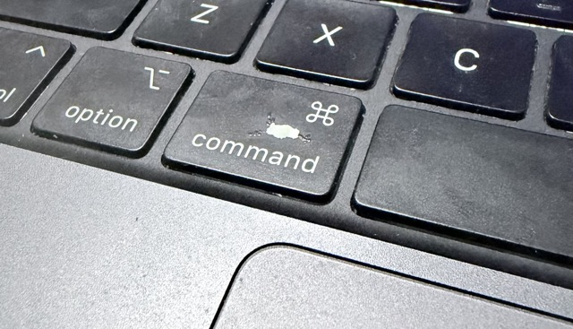

Staingate is where there's a permanent keyboard mark on your screen after prolonged use. It chips away your Mac's anti-reflective coating. Although it still protects your screen perfectly fine, cosmetically, it makes you look like you can't properly clean your Mac. It's a problem all MacBook users' face, so don't worry if you have it. You can make it as an achievement, like a "MacBook ownership" or "I used this MacBook all day and I'm proud of it" kind of thing.

_Staingate_:
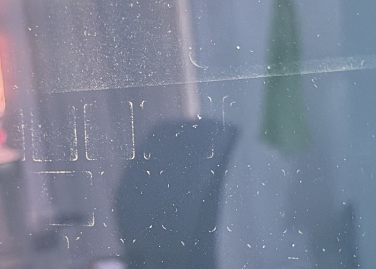

I'm pretty much surprised for the weight of the laptop itself. IT'S SO HEAVY OMG MY BACK ACHE A LOT AFTER CARRYING IT A WHOLE DAY 😭. I mean, 3.4 pounds (1.55kg), man 😭. Turns out the material Apple has given to this majestic laptop is no-joke. Solid aluminum case for protection and weight distribution gave a toll on my back 😭. But yeah, it's still light enough compared to heavy-ahh gaming laptops. $2,499, well spent for a real workstation, not for a portable gaming laptops with jet-engine fans 👀.

The keyboard itself is pretty solid. It feels like it's on the borderline between the blue switch and the brown switch. It still has that tactile experience, but not as loud as blue switch, yet not that deep as brown switch. Man, how do I put this? Just buy one Mac and try it for yourself, for real. No other keyboard can match this exact feeling of typing on a Mac.

Ah yes, the trackpad. This is where Mac users stand out. There is no need to put your finger to the bottom left to left-click, and to the bottom right to right click. The whole area of the trackpad is your control. One finger to left click, two fingers to right click, three fingers to drag the window, and four fingers to swap between the virtual workspace. Mac trackpads are designed for gestures, learn them, it helps you a lot.

_Mac Trackpad Gestures, based on article written by Dan Hinkcley on [Maciverse](https://www.maciverse.com/magic-trackpad-gestures.html#google_vignette)_:
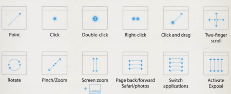

The screen 😱. For $2,499, Apple gives you a solid 3K, top-notch clarity. One downside, though, you're left with a big-ahh notch on top of your screen (thanks for nothing on this one, Apple). For a sidenote, I use [Atoll](https://github.com/Ebullioscopic/Atoll) to make use of this unused space, it makes the notch to be usable and mimic like iPhone's Dynamic Island.

_Atoll usage_:
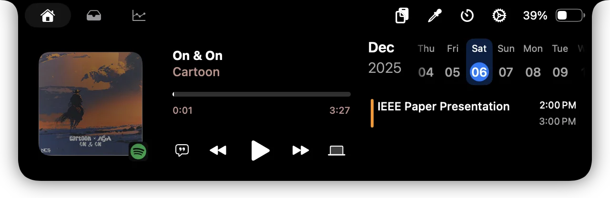

Perhaps, Apple named it Retina Display since it genuinely lives up to the name. Other brands, please adopt this technology, I can't move out from Apple because of this 😭.

## Coding & Development Work

### Performance

Compared to the MBP M1, this MBP M4 Pro cut my development time in half. Back then, within the same project with 20+ Node modules (excluding their dependencies), it went from 12s to roughly 5.5s. To load non-production assets, it also gives the performance boost for roughly 40% faster. To be honest, that doesn't seem like much...until your Mac's RAM fills up with Docker containers.

Docker containers are a big challenge for every laptop. Laptops are meant to be portable, so most of the performance factors are chopped away. But not with MBP M4 Pro, it still gives you the performance needed for a heavy coding session. M1 can handle 6 microservices just fine, but while working with 6 monolithic, production-ready containers? It choked, performance dropped, and heat builds up.

Using this laptop alone, I've run 4 Docker containers + 1 Android VM + 1 iPhone VM + 1 Android device via ADB + Cursor all at once, without issues. The heat this machine produces is still manageable around 80°C on the CPU's internal temperature (tested using [Mac-Stats](https://mac-stats.com/)), feels like 40°C on the palm rest, within non air-conditioned environment. Could be lower within air-conditioned room.

Most of the time, with that similar kind of workload, I'm using around 22G of my 24G RAM, with minimal swap (1G). At peak, I've pushed it to 23G RAM used with 16G of swap. Long live my MBP M4 Pro 😭.

### Development Setup

_My workspace setup:_
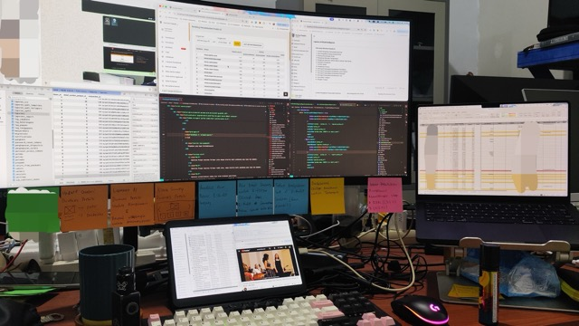

I've been talking a lot about my development work, but not the development setup itself. So, let's talk about it, shall we?

I'm currently using Cursor as my IDE, I have been using it since this App was released and I can't get myself away from it. The power of AI + the familiarity of VSCode boosts my productivity by a lot. I could bring an MVP to pre-production and show it to a customer in under a week, and ship it within a month with the help of AI. The true work here is to review the code whether it passes your criteria or not. It feels like you're the QA team that reviews your team's code.

On Terminal side, ZSH for the win 🔥! Powered with [Oh My Zsh](https://ohmyz.sh/) + [Powerlevel10k](https://github.com/romkatv/powerlevel10k) + [iTerm](https://iterm2.com/), it's a perfect Terminal.

Ah, the package manager. Surely you want to use [Homebrew](https://brew.sh/) as your Package Manager, although I can't find a package manager as perfect as Arch's Pacman / [AUR](https://aur.archlinux.org/) for Mac, but Homebrew itself does its job as a package manager.

In the MBP M4 era, I rarely stumble upon a package / app that still uses `x86_64` architecture, but Rosetta 2 itself is needed for the [OrbStack](https://orbstack.dev/) requirement. Perhaps it needs to emulate few of the remaining `x86_64` containers that haven't been updated to match the power of arm64. So, the only case I need Rosetta 2 is to emulate some of the containers (mostly legacy projects that I haven't refactored yet).

Approximately 2-3 years ago, the native ARM apps are barely exists. I remember that a customer service on iBox told me that "You might have to wait about 3-6 months or so, until native ARM apps are available. Until then, you might want to depends on Rosetta". It doesn't actually need to take that long, turns out developers love Apple, most of the native ARM apps are released within that month.

Now, the Docker. I want to say that OrbStack > Docker Desktop. It is lightweight, runs Docker Engine, can run K8s as well. It does what Docker Desktop can do, but in its lightweight version. Basically, it's designed to run fast on M-series chips, you can find the [OrbStack vs Docker Desktop comparison here](https://docs.orbstack.dev/compare/docker-desktop). The only downside for me for using OrbStack is the Windows support, _but who uses Winbugs in 2026 for coding_? Oh yeah, one of my teammates, he still games 😅.

For the Database GUI, I specifically use [TablePlus](https://tableplus.com/). Out of many Database GUI out there, TablePlus is my man. Simple, clean, lightweight, supports multiple database drivers. How about the database clients? Oh, I use Docker containers to manage those clients. I wanted to focus one database = one project, not one database for multiple projects. More focus = more productivity.

Other development tools such as:
- [Git](https://git-scm.com/) for codebase management, the most essential;
- [APIDog](https://apidog.com/) for API testing tool;
- [Obsidian](https://obsidian.md/) for note-taking and brainstorming, and;
- Nautika for project management.

> Nautika is my app that you can use freely to manage your project or your workplace projects. It adopts multi-tenancy so you can invite others to your workspace or be invited to other people's workspace. Also, it is gamified so it can boost your productivity by competing with others. Have a try here on [https://nautika.shiroyuki.dev](https://nautika.shiroyuki.dev/), I'll be waiting for your feedback 👋.

### Specific Tech Stacks

On the web development world, we heard about React a lot. It's exactly what I've been doing for the past year, learning and implementing its best practice on React. Although I'm not really fluent in JavaScript, I think I did a pretty good job for building [Nautika](https://nautika.shiroyuki.dev) by using React. Other than the React itself, I use Laravel Blade for the front-end templating.

Front-end builds are effortless on the M4 Pro. It builds really fast. On my local machine, building its production assets took 11s compared to my production server which needs 47s build. The server itself needs average of 4.7x build time compared to my MBP M4 Pro (screenshot provided below).

_Below is the build time from MBP M4 Pro_
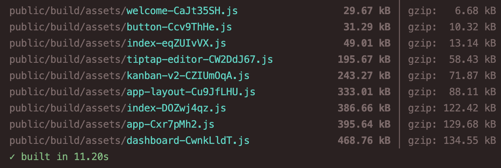

_Below is the build time from Nautika's production server_
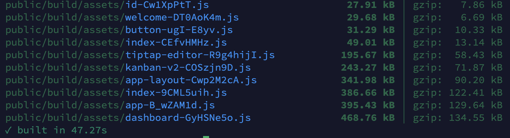

As a context, my server is using 8x Intel(R) Xeon(R) CPU E5-2683 v4@2.10GHz, 8G of RAM and 4G of swap.

For the Back-end development, I use Laravel a lot. Yeah, at this point you guys are probably blabbing about how slow PHP is, and I can't deny it, it is slow as a turtle. But it delivers faster for me and my team. So Laravel is the first thing that comes in mind when building an API, or monolithic apps. Attack me from all sides, but we have FrankenPHP which handles requests 5x faster and can lower average latency by half.

_Here's a result of the benchmark from [Medium post by Ivan Vulvoic](https://vulovic.me/frankenphp-vs-php-fpm-benchmarks-surprises-and-one-clear-winner-173231cb1ad5)_.
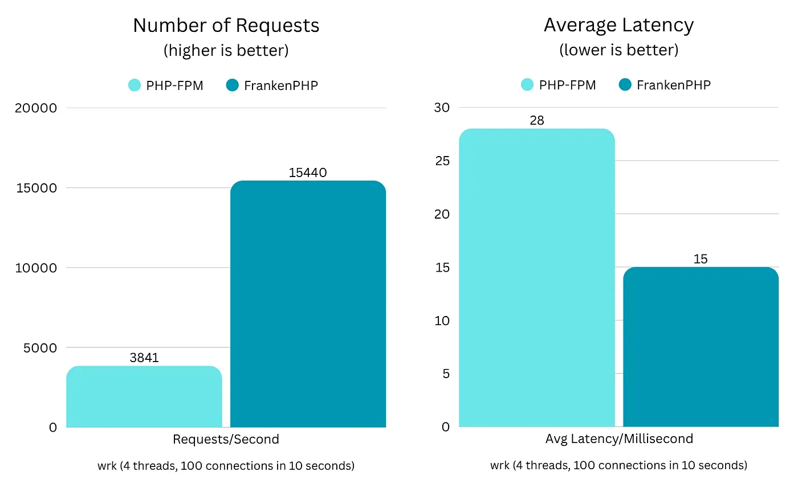

Back then, Laravel development on Mac was hell. No other tools besides XAMPP, which is buggy and you need to hope that your MySQL service won't crash. Then we have Laravel Valet, a specifically designed tool for Laravel environment, faster but need a MySQL standalone installed on your machine. Then we have Laravel Herd, a significantly better Laravel development environment app, but needs Pro version to use other service beside the local hosting. Finally we have Laravel Sail, currently the best out there, yet immensely heavy since you need Docker to run it. Since MBP M4 Pro did a pretty good job on Docker, there's no performance issue whatsoever. Apple FTW 🔥🔥🔥!

Now, realistically speaking about the database performance, there's a lot of factors of what we can consider "good" performance. Optimization is definitely needed for a big, enterprise-level of database. But, for your daily database, let's say we have a table with ~25k rows on `SELECT * FROM` clause.

_On MBP M4 Pro, 27k rows returned at 141ms_.
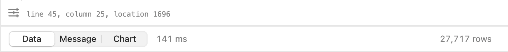

_On the server, 27k rows returned at 2.427s_.
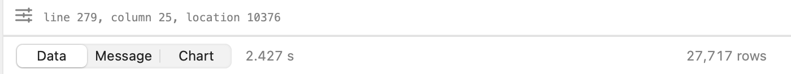

Let the numbers and the screenshot explains. I don't need to provide any more context 😅.

### Battery Life During Coding

Now, a section we've all been waiting for. The battery life. Battery life on past Apple laptops before M-series was a joke. It was draining fast, slow, and crappy. But now, it lasts long, fast, and literally you won't need a charging brick for a whole day.

Apple claims 20 hours of life, but real-world usage varies. The "one day long" premise is easily broken on how you do your job. In my case, battery life on average development work is about ~6h of battery life, compared to the normal ~14h of battery life mostly by writing, browsing, and YouTube videos. Docker is taking a toll on your battery, and I'm not sugarcoating it, it doesn't last long enough on my machine with all of the utilities/services that I needed already installed.

_This screenshot shows battery life graph from an intensive coding session from 11PM to 2AM unplugged, drained ~60% of battery, 3 Docker containers, 1 IDE, 1 browser with multiple tabs, and YouTube Music. Battery life might be extended if I killed unnecessary apps and close some irrelevant tabs_.
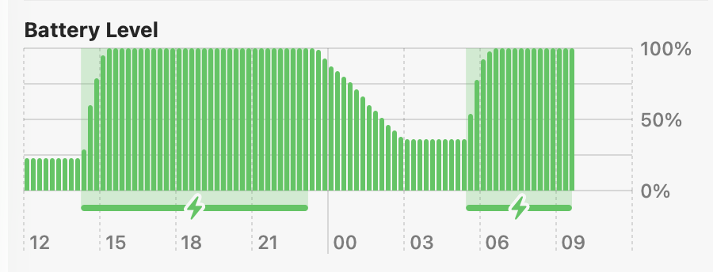

I worked with my laptop plugged most of the time, since I rarely use it on the go, I mostly docked this machine to a place where I can plug this to a power brick, a dongle for external keyboard and mouse, and an external monitor at WQHD 180hz. When unplugged, extra peripherals give me ~4h of battery life.

Extra peripherals drain battery because the external display requires GPU power and the Mac must drive more pixels at 180Hz. This keeps the GPU active and prevents power-saving modes, which explains the drop from ~6h to ~4h battery life.

_This screenshot shows battery health of 1 year of solid intensive coding usage. It drains from 100% to 92%._
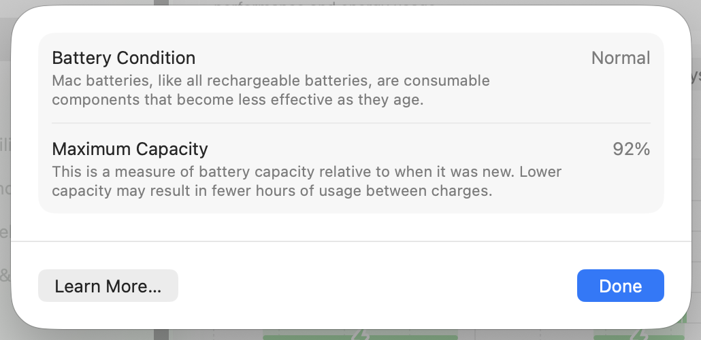

_This screenshot shows detailed System Report of Power usage to show Cycle Count._
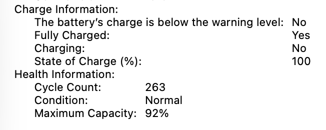

I know that this heavy workload drains a lot of battery, so to keep my laptop in its pristine condition, I have to keep the charge cycle low, and maintain a healthy battery health. Within a year of usage, my Mac's battery health dips into 92% from 100%. For a Mac, 10-15% degradation a year is pretty normal, it will degrade slowly on the second year afterwards.

This battery health feature is overall helpful, but many new Apple users seem to be concerned about. To be honest, you don't really have to worry about it since that's just how batteries age. Every electrical components within your electronics will eventually degrade, and to be extremely honest, most of the consumer laptops will degrade faster than Apple's.

The one thing you should consider a lot is the **battery life**, not the _battery health_. Change the battery once you think it is draining faster on normal usage.

## Afterwards, and what will be covered in the next article

That's all for this session, I'll be with you on the next series within 1 week. Next, we'll be talking about the gaming and my workspace. Stay tuned!

_Thumbnail by [Apple](https://www.apple.com/newsroom/images/2024/05/apple-introduces-m4-chip/tile/Apple-M4-chip-badge-240507.jpg)_
