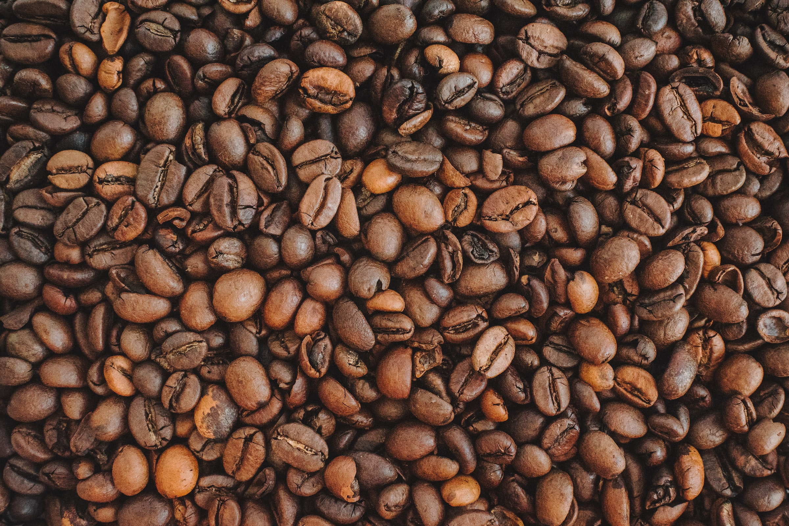
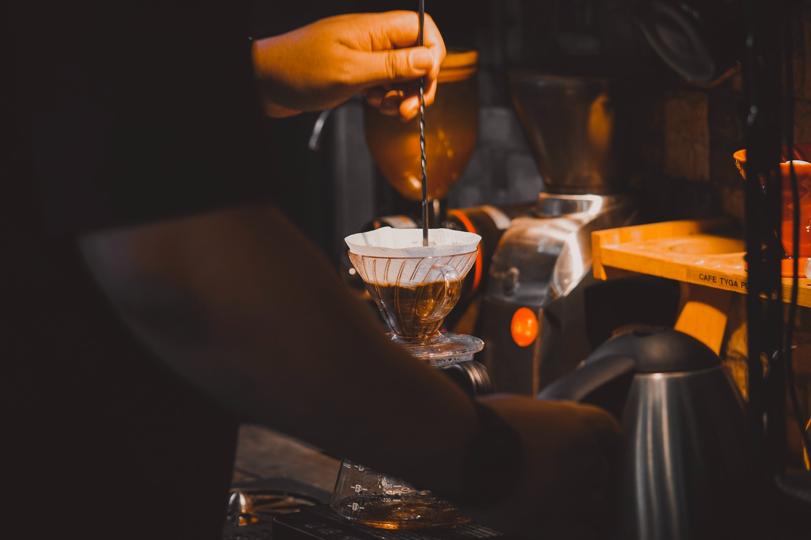
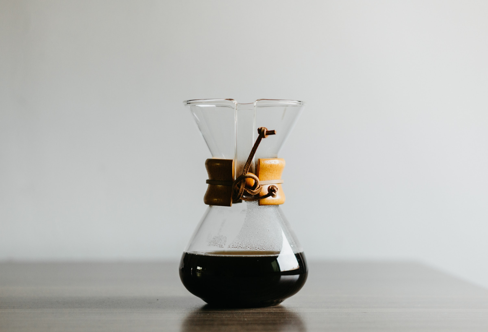
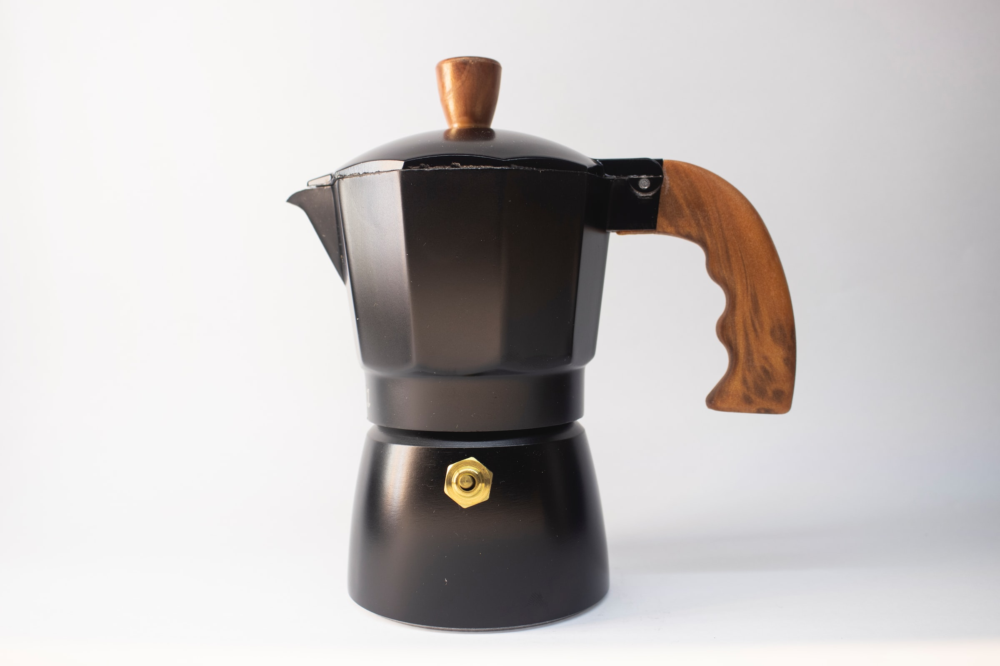

So, coffee has been an exciting (and expensive) part of my life, it has been a year since I'm into this brewing field, and I guess it is my time to show what I have learnt throughout this year. Because I'm into this field, I write this article about coffee and its tools which I have in my home, and potentially, you could.

> This is not a sponsored article, for real. I'm writing this just for fun and for knowledge purposes.

## Coffee Beans

Photo by [Anastasiia Chepinska](https://unsplash.com/@anastasiiachepinska)</a> on [Unsplash](https://unsplash.com/s/photos/coffee-beans)

Coffee beans are the most essential part of a coffee brewing, I mean, you want to brew a cup coffee, not a tea, right? Talking about coffee beans, there are three varieties of coffee you can see on the market:
1. **Arabica**; which has fruity, acid, and vivid taste.
2. **Robusta**; which has bitter, woody, and earthy taste.
3. **Blend**; which is a mix of Arabica and Robusta, and usually used for an espresso brew.

Now you know about the coffee varieties, let's talk about the grind size.

Photo courtesy of [Know Your Grinder](https://knowyourgrinder.com/)

To be honest, let's talk about this grind size in a second. Grind size is hard to measure, it is more like a sense to decide which grind size is which. Grind size is **varies** from every type of grinding machine or grind tool manufacturer, they have their own standard. For example, my Timemore Slim Chestnut has a grind size 5 to 11 for an espresso grind, 15 to 17 for a pourover, and more. *So, take it as a grain of beans when it comes to grind size.*

In general, there are three settings of the grind size (which are indicated in bold). There are:

| Type | Particle Size | General Use |
| --- | --- | --- |
| Extra Coarse | 1.5mm | Cold Brew |
| **Coarse** | **1mm**  | **French Press, Plunger, Percorator** |
| Medium-coarse | 0.8mm to 0.7mm | Cupping, Chemex, Clever Dripper, Flat Bottom |
| **Medium** | **0.6mm** | **Cone-shaped filters** |
| Medium-fine | 0.5mm |  V60, Siphon, Aeropress |
| **Fine** | **0.35mm** | **Moka Pot, Espresso** |
| Extra Fine | 0.1mm | Turkish Coffee/Cezve |

*Table reference are taken from [Roastercoffees](https://id.pinterest.com/pin/1105352302262312962/) on Pinterest*.

## Tools
This section is the most expensive of all, even though it's a one-time buy, the initial cost is relatively high in comparison to the coffee beans. These are some what I have in my home:

### The Grinder, Timemore Chestnut Slim

Photo by Timemore Malaysia on [Bunamarket](https://bunamarket.com/products/timemore-chestnut-slim-plus-coffee-grinder)

Yes, the grinder itself. This tool is the most expensive tool I have. It cost around $100, and it is a hand-grinder. Because it is a hand grinder, I can easily carry the grinder and the beans for a brew to wherever I want. But, the cons are, it is heavy, and not suitable for an espresso grind. I mean, it is possible to make an espresso grind, but it is very time consuming and consume a lot of energy.

A grinder in your hand can help you to make a fresh grounded coffee brew every single day. I prefer a fresh ground coffee because it has more aroma, more flavor, and more complexity.

### Dripper, V60

Photo by [Ke Vin](https://unsplash.com/@cactuspix)</a> on [Unsplash](https://unsplash.com/s/photos/v60) 

By mentioning V60, you need two tools to get. A V60 dripper, and a V60 filter. Filter comes in two types, there are paper filters, and mesh filters. Paper filters are cheap, and potentially filters more softer coffee particles rather than mesh filters. But mesh filters can save you extra money in the long run because it is reusable and washable.

This tool is the cheapest one you can get. Buying a V60 kit will cost you around $10, depends on the material used on V60 dripper and the paper quality. The kit won't include the serving kit such as the carafe to hold the brewed coffee, you can directly put a mug under the V60 dripper if you want.

### Dripper, and a carafe, Chemex

Photo by [Zarak Khan](https://unsplash.com/@zarakvg)</a> on [Unsplash](https://unsplash.com/s/photos/chemex) 

Chemex, to me, is a fancier V60, it has two purposes in one Chemex. A holder for V60 filter, and a carafe. It also make coffee looks beautiful to see under the light.

Brewing in a Chemex is a little bit slower than V60. My brew time is usually 3m 15s for a V60 brew, resulting in 225ml of coffee, but for a Chemex, using the same brew profile, it could be around 4m.

The reason why a Chemex brew is slower is because, there are little to none of airflow. The only airflow Chemex has is only in the pouring tunnel, which are usually clogged during the brewing process. This issue could be fixed by using a chopstick in the tunnel to let it breathe. A V60 dripper has a spiral-shaped little bumps to help the airflow, meanwhile the Chemex has none.

That is the reason why Chemex brew needs coarser coffee beans than a V60 brew. A Chemex bootleg would cost around $10, meanwhile the real one would cost $80.

### Moka Pot

Photo by [Mostafa Mahmoudi](https://unsplash.com/@mostafa_mahmoudi24)</a> on [Unsplash](https://unsplash.com/s/photos/mokapot) 

When it come to espresso brew, this tool is the closest one and the cheapest one to get, at least to mimic the strength of an espresso itself. Moka Pot brew is very technical, and difficult brew to master. It has a lot of things to consider, the coffee, the grind size, the water temperature, the technique used, it all combines into one Moka Pot brew.

It took me 4 months of trials and errors to finally pull a great, strong but balanced shot, which is ideal for my espresso standard. In comparison for an espresso shot to a Moka Pot shot is the amount of coffee and the muddiness. Moka Pot brew tends to have a lot of water, resulting in 2 to 3 shots of espresso (a shot is 30ml, so it should be 90ml), and muddy. This muddiness came from the extra fine grind that passes through the filter, which Moka Pot's filter hole are larger than espresso machine.

The one I have is Conalli Moka Pot, which can produce 3 shots of espresso in a single brew. It costs $20.

### Scale, Latina Newton Scale

Photo by [Philocoffee](https://www.tokopedia.com/philocoffee)</a> on [Tokopedia](https://www.tokopedia.com/philocoffee/latina-newton-scale-timbangan-seduh-kopi) 

For a good brew, it is important to have a scale. To be honest, it is a geeky kind-of-thing, when you bought a scale and a thermometer for a single brew, but really, it is worth the money you spend. The feeling of making a good brew to start your day is just a satisfaction in another level. It cost $15, an entry level scale.

### Thermometer, Latina Thermo Blanco Lollipop

Photo by [Philocoffee](https://www.tokopedia.com/philocoffee)</a> on [Tokopedia](https://www.tokopedia.com/philocoffee/latina-thermo-blanco-lollipop-digital-termometer-kopi-latina-digital) 

Another entry level thermometer, not so accurate but helpful to make a good brew. Again, it's "geeky" to actually have either or both a scale and/or a thermometer. Owning a thermometer will prevent your brew from under-extracting or over-extracting.

Water temperature will greatly impact the quality of the brew, but if you don't have one, use this rule of thumb:
1. If the beans' roast profile is a **light roast**, let the water boils and chill it down for a while for around 30s, this will put down the water temperature to 95ºC. It is my standard temperature for doing a light roast. Preferences might vary.
2. For a **medium roast**, the water temperature needs to be around 88ºC to 92ºC. It also usually used for a specialty roasts where the roaster mix some additive during the process.
3. For a **dark roast**, it should be around 82ºC to 85ºC.

### Kettle, Latina Olive Kettle

Photo by [Philocoffee](https://www.tokopedia.com/philocoffee)</a> on [Tokopedia](https://www.tokopedia.com/philocoffee/latina-olive-kettle-420-ml-teko-leher-angsa-latina-olive) 

If you're noticing, I've been buying this Latina brand recently, because it is fairly cheap, and good for an amateur brew. It can pulls a great brew, so why not? This kettle is small, so it fits me for my daily home brew, it can carry 420ml of water.

As you can see the design, the handle is metal, so the heat from the chamber is also transferred to the handle. So every time I make a brew, my hand burns a little. This one costs $7.

## The end?
So, that's all about my brewing kit. In total, it would costs around $250, it could cost more if I bought mid-end thermometer, kettle, and scale, but I think it's not worth it for now. Just a reminder that even a professional barista can make a good coffee without an expensive machinery. This remarks that anything you own, can brings you to mastery.

### Footnote
Thumbnail by [Julien Labelle](https://unsplash.com/@julien_labelle_photographie) on [Unsplash](https://unsplash.com/s/photos/v60).
