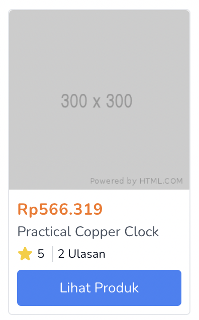

Siapa yang tidak tahu Faker? Sebuah *library* yang berguna untuk membuat *Factory* sehingga kita bisa mendapatkan ratusan, ribuan, atau jutaan data *dummy* dalam waktu singkat. Dalam update Laravel 9.x 28 hari lalu saat tulisan ini dibuat, [Pull Request](https://github.com/laravel/framework/pull/42844) yang dibuat Tim Mac Donald disetujui dan di-merge ke Laravel 9.x.

Seluruh pengguna Laravel 9 saat ini bisa menggunakan *helper* ini langsung pada *view* sehingga mempercepat proses *mockup*.

Contoh langsung cara penggunaan dari Pull Request di atas adalah sebagai berikut:
```blade
// resources/views/sebuah-view.blade.php
@for($i = 0; $i < 10; $i++)
    <dl>
        <dt>Name</dt>
        <dd>{{ fake()->name() }}</dd>

        <dt>Phone</dt>
        <dd>{{ fake()->phoneNumber() }}</dd>
    </dl>
@endfor
```

Atau jika teman-teman ingin melihat cara penggunaan langsungnya, berikut adalah contoh dari sebuah projek yang Saya sedang kembangkan:
```blade
@for ($i = 0; $i < 12; $i++)
    <a href="{{ route('show', $productName = str()->slug(fake()->productName)) }}" class="col-span-12 sm:col-span-6 md:col-span-4 lg:col-span-3 xl:col-span-2 border border-gray-200 rounded">
        <div class="aspect-w-1 aspect-h-1">
            
        </div>
        <div class="p-2">
            <div class="flex flex-col justify-between h-full">
                <p class="font-bold text-orange-500 tracking-wide">
                    Rp{{ number_format(rand(150000, 1000000), 0, '.', '.') }}
                </p>
                <p class="text-gray-600 text-sm mb-1">
                    {{ str()->headline($productName) }}
                </p>
                <p class="flex text-xs items-center mb-2">
                    <x-phosphor-star-fill class="w-4 h-4 text-yellow-400" />
                    <span class="border-r border-gray-300 pr-2 mx-1">
                        {{ rand(1, 5) }}
                    </span>
                    <span>
                        {{ rand(1, 50) }}
                        Ulasan
                    </span>
                </p>
                <button class="transition duration-300 ease-in-out text-center w-full text-sm bg-blue-500 hover:bg-blue-600 rounded p-2 text-white mt-auto">
                    Lihat Produk
                </button>
            </div>
        </div>
    </a>
@endfor
```

dan berikut adalah hasilnya:


Tim Mac Donald berhasil mewakilkan seluruh perasaan Saya pada proses *prototyping* dengan mengeluarkan *statement*
>*When it comes to a Rapid Application Development framework like Laravel, speed of prototyping a feature is through the roof. But often you will want to prototype a view without having the even create any backing models or anything. You just wanna throw some tailwind and some blade at the problem and get some eyes on it.*

Foto oleh [Mohammad Rahmani](https://unsplash.com/@afgprogrammer?utm_source=unsplash&utm_medium=referral&utm_content=creditCopyText) dari [Unsplash](https://unsplash.com/s/photos/laravel?utm_source=unsplash&utm_medium=referral&utm_content=creditCopyText).
