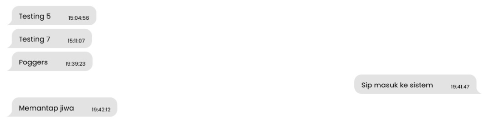
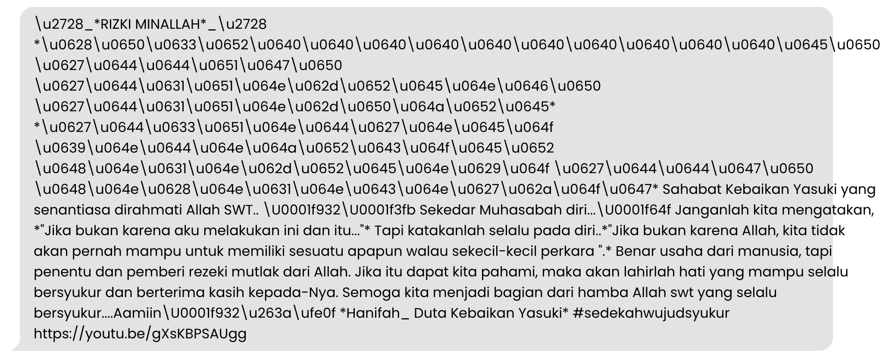
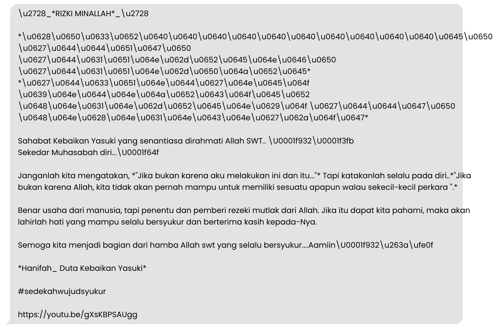

Pada pengembangan aplikasi Dumas Presisi, sebuah projek aplikasi yang saya
_handle_, pengimplementasian komunikasi WhatsApp melalui Website adalah salah
satu fitur yang sudah lama kami ingin implementasikan. Namun karena kurang
luasnya pengalaman dan penguasaan ilmu yang kami miliki, setelah 2 tahun projek
ini di-_launching_ oleh Kapolri pada hari Rabu, 24 Februari 2021, kami baru bisa
mengimplementasikan fitur ini sebagai sarana konsultasi Masyarakat.

Proses pengintegrasian kami rasa cukup rumit karena adanya beberapa _gateway_
yang harus kami untuk sarana analisis dan _debugging_. Jika dihitung berdasarkan
hari, kami baru bisa mengimplementasikan fitur ini setelah 1 bulan pengembangan.

## Prototyping
Dibantu oleh [TailwindCSS](https://tailwindcss.com/) dan [DaisyUI](https://daisyui.com/),
kami bisa mengimplementasikan _mockup_ fitur ini secara mudah. Apalagi dengan
pembaharuan DaisyUI v2.51.4, penambahan fitur _Chat Bubble_ sangat membantu
kecepatan pembuatan mockup ini. Berikut adalah _screenshot_ mockup pertama kami:



Sangat simpel bukan? Belum ada yang istimewa saat ini. Sebagai informasi tambahan,
fitur ini dipresentasikan keesokan harinya kepada pimpinan. Tentunya kami
berharap adanya masukkan dan kritik dari pimpinan terhadap fitur yang kami
bangun.

Semua berjalan lancar... sampai hal yang tidak kami duga pun terjadi.

## Permasalahan
_Issue_ yang sama sekali tidak kami duga karena tidak muncul pada saat _testing_,
muncul pada saat presentasi. Tidak ada yang "terlukai" oleh _bug_ ini, namun
kami harus menyelesaikannya secepat mungkin.

> "Apa sih masalahnya sehingga kami merasa _issue_ tersebut harus bisa diselesaikan? Toh kan cuma _plain text_ yang di-_render_?"

Haha, pada permukaan, betul yang kami render ini adalah _plain text_, namun jika
_plain text_-nya terlihat seperti ini, apakah enak dipandang mata?



Hotline WhatsApp Dumas Presisi adalah sama seperti nomor WhatsApp pada umumnya,
kami menerima keluhan, saran, bahkan _broadcast_ yang secara _random_ dikirimkan
oleh masyarakat. Jadi, seluruh pesan yang dikirimkan kepada Hotline kami, akan
kami terima apa adanya juga pada aplikasi.

Setelah membaca sekilas pesan di atas, kami memetakan ada 4 permasalahan:
1. Line break
1. Formatting
1. Emoji
1. Link

Mari kita selesaikan permasalahan ini satu per satu 🔥.

### 1. Line Break yang tidak ter-render
Di PHP, untuk pesan _plain text_ seperti ini, mudah bagi kita para pengembang
untuk mengubah `New Line` menjadi `Break Line` yang bisa di-_render_ HTML.
Fungsi tersebut adalah `nl2br()`, yang merupakan kependekan dari
`New line to <br/>`.

Pertama, saya membuat sebuah `Service` yang bernamakan `WhatsAppService`, kurang
lebih, seperti ini file-nya:

```php
<?php

namespace App\Services;

class WhatsAppService
{
    public static function formatMessage(string $raw_message): string
    {
        return $raw_message;
    }
}
```

Service di atas masih belum bisa mengubah `New Line` menjadi `<br/>`, karena itu
kita gunakan fungsi `nl2br` supaya pesan yang kita terima bisa terformat dengan
baik:

```php
<?php

namespace App\Services;

class WhatsAppService
{
    public static function format_message(string $raw_message): string
    {
        $nl2br_message = nl2br($raw_message);

        return $nl2br_message;
    }
}
```

Setelah menerapkan fungsi `nl2br`, berikut adalah hasil dari pesan yang sudah
diformat:



### 2. Formatting yang tidak ter-render secara langsung
Dilansir dari halaman [FAQ WhatsApp](https://faq.whatsapp.com/539178204879377)
terkait dengan _Text Formatting_, kami mendapatkan 4 macam _formatting_ yang
harus diimplementasikan:
- Bold, direpresentasikan dengan string yang diapit oleh bintang ( \*string\* )
- Italic, direpresentasikan dengan string yang diapit oleh garis bawah ( \_string\_ )
- Strikethrough, direpresentasikan dengan string yang diapit oleh _tilde_ ( \~string\~ )
- Monospace, direpresentasikan dengan string yang diapit oleh tiga _backtick_ ( \```string\``` )

Saya berpikir, bagaimana caranya untuk me-_replace_ simbol-simbol itu dengan
tag HTMl ya? Beberapa metode terlintas di otak saya.

Pertama, saya bisa menggunakan `str_replace()` untuk mengubah simbol menjadi
tag HTML. Namun saya juga ingat bahwa tag HTML haruslah ditutup. Berdasarkan
fakta tersebut, saya tidak bisa semerta-merta menggunakan `str_replace()`.

Kedua, saya bisa menggunakan `preg_match()` untuk mengambil seluruh simbol, lalu
mengubahnya menjadi tag HTML. Sama seperti kasus di atas, tag HTML yang di-_replace_
harus juga ditutup kembali. Selain itu, masalah yang akan dihadapi pada saat
saya menggunakan `preg_match()` ialah fungsi tersebut hanya dapat me-_return_
`int` yang mengindikasikan berapa banyak simbol yang ditemukan pada sebuah pesan.

_Approach_ yang saya lakukan menggunakan RegEx sudah benar, cuma saja saya hanya
perlu menemukan fungsi yang tepat. Setelah berdiri sejenak, menyeduh kopi, dan
meminumnya, saya menemukan sebuah solusi yang mujarab, `preg_replace()`.
_Long life coffee, our source of motivation_ ☕️☕️☕️. 

`preg_replace()` adalah sebuah fungsi yang mencari sebuah pola berdasarkan
bahasa ekspresi regular yang kita berikan, mendapatkan kata-kata berdasarkan pola
yang kita berikan, lalu mengubahnya sesuai dengan apa yang kita inginkan.

> Ekspresi Regular atau yang biasa sering kita sebut sebagai RegEx adalah
bahasa ter-alien yang pernah saya pelajari. Bukan hanya sulit dipahami, namun
juga kita harus memahami beberapa aturan baku. Saya pribadi baru bisa memahami
bagaimana RegEx bekerja setelah belajar intensif selama 1 bulan.

Penasaran bagaimana saya mengimplementasikannya? Kita lanjut ke
[Part 2](../whatsapp-text-formatting-pada-php-part-2) ya! Sampai jumpa di sana 👋.

---

Thumbnail oleh <a href="https://unsplash.com/@asterfolio?utm_source=unsplash&utm_medium=referral&utm_content=creditCopyText">Asterfolio</a> dari <a href="https://unsplash.com/wallpapers/apps/whatsapp?utm_source=unsplash&utm_medium=referral&utm_content=creditCopyText">Unsplash</a>
