4 Reality adalah sebuah tim Virtual YouTuber (biasa disebut VTuber) yang
berada di Indonesia. Dinamakan 4 Reality karena penemu dari tim VTuber ini
terdiri dari 4 karakter: `Kurokami Itsuki`, `Raihan Ikeda`, `Karen`, dan
`Vyula`.

Disamping munculnya Generasi ke-1 4 Reality, mereka juga menggagas tim Utaite
(yang berfokus kepada konten cover lagu / menyanyi), juga terdiri dari 4
karakter: `Cyanpile`, `Aura Lily`, `Yua Deyanara`, `Miasviel`.

Website ini dibangun dengan menggunakan:
- [Vue.js](https://vuejs.org/) v3 - menggunakan compiler [Vite](https://vitejs.dev/) v1
- [TailwindCSS v2](https://v2.tailwindcss.com/)
- [Vercel](https://vercel.com)

# Pengembangan

Pengembangan website ini didasarkan pada rasa kesukaan saya terhadap salah satu
karakter Utaite `Aura Lily`, suatu Peri cantik yang _charming_ dan lucu. Setelah
menjelajahi server Discord 4 Reality, saya bertemu `Karen` yang juga memanage
seluruh asset dari tim ini. Dengan inisiatif ingin membuatkan `Aura Lily` sebuah
_wallpaper_, saya mendapatkan desain karakternya dengan mudah.

Berikut adalah desain wallpaper `Aura Lily` yang selanjutnya akan menjadi ide
pengembangan website 4 Reality:

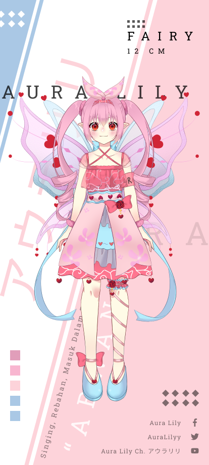

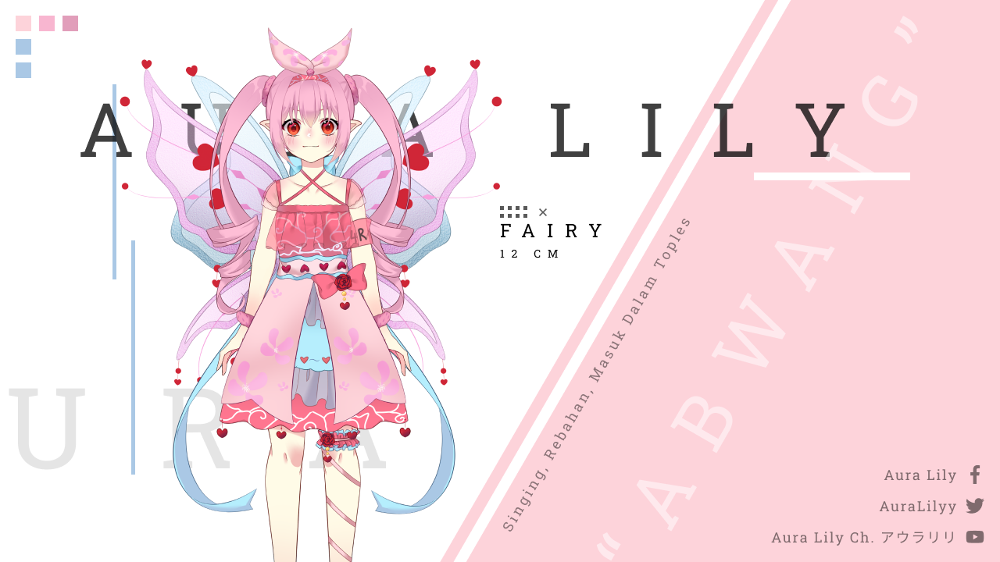

Dulu saya sangat menyukai konsep dari _Broken Grid_, namun tantangan terbesar
yang akan saya hadapi ketika pengembangan adalah yang saya sebut sebagai
_stylesheet chaos_. Kondisi dimana akan ada banyak sekali _stylesheet_ yang
redundan dan cenderung hanya bisa dipakai satu kali untuk karakter yang
spesifik. Beruntung saya menemukan _framework_ CSS yang bisa mengatasi ini,
[TailwindCSS](https://tailwindcss.com/).

Bisa dibayangkan bagaimana sulitnya membuat suatu halaman profil karakter
yang memuat banyak informasi seperti:
- Nama talent
- Jenis karakter yang diperankan
- Sosial media
- Motto
- Palet warna yang digunakan
- Informasi tambahan lainnya

Setelah desain `Aura Lily` yang sedemikian rumit selesai, selanjutnya saya
berfikir "Bagaimana jika saya kembangkan kembali website ini?". Lihat pernyataan
_kembangkan kembali_, pernyataan ini muncul karena website 4 Reality pada saat
itu sudah ada, namun sangat jauh dari kata "layak".

Template Bootstrap 4 yang seadanya, ditambah dengan asset _raw_ yang begitu
besar hingga mencapai 10MB per gambar sehingga _load time_ sangat terpengaruh,
serta desainnya yang sangat simpel (karena template, tentunya). 

## Dilema Profile Section

Tantangan selanjutnya bukanlah bagaimana saya memikirkan tentang bagaimana
desain websitenya, namun tentang bagaimana saya bisa menyajikan 8 talent
sekaligus dalam suatu halaman, tanpa perlu mengganti halaman.
_Vue Dynamic Component_ akhirnya digunakan untuk menyimpan setiap informasi
talent. Jadi pengunjung website tinggal meng-klik ikon talent yang ingin dilihat
maka secara otomatis detail dari talent tersebut akan muncul.

Berikut adalah rancangan dari _Profile Section_:

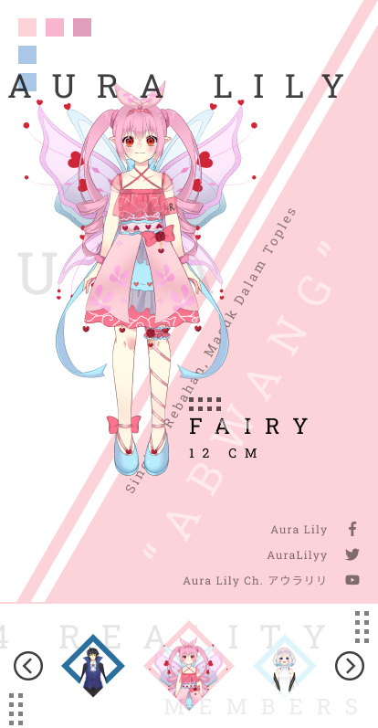

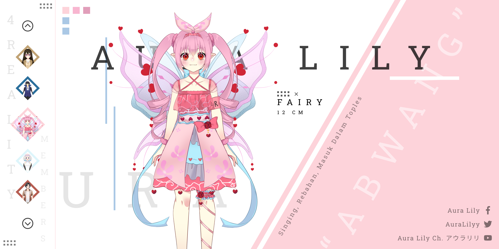

Namun tentu saja, ada informasi yang tidak akan terlihat jika desain dari
Profile Section ini berbentuk _scrolling_, tidak ada informasi "Bagian mana
talent ini berasal? Apakah dia VTuber, atau Utaite? Lalu bagaimana jika ada
Generasi 2, Generasi 3, dan seterusnya?" Tentu saja, ini adalah dilema
tersendiri. Saya memiliki 2 opsi:

1. Menampilkan informasi karakter apa yang diperankan oleh talent pada detail
   profilnya, dengan risiko desain akan menjadi tidak seimbang karena penambahan
   kata "Gen 1" atau "Utaite" yang tegas.
1. Mengkategorikan karakter berdasarkan peranan masing-masing talent, dengan
   cara membuat "Tab"

Saya memutuskan untuk menggunakan opsi 2, opsi yang paling mudah
diimplementasikan, serta tidak mengubah keseluruhan desain yang sudah ada.
Berikut adalah tampilan yang saya ambil dari website langsung

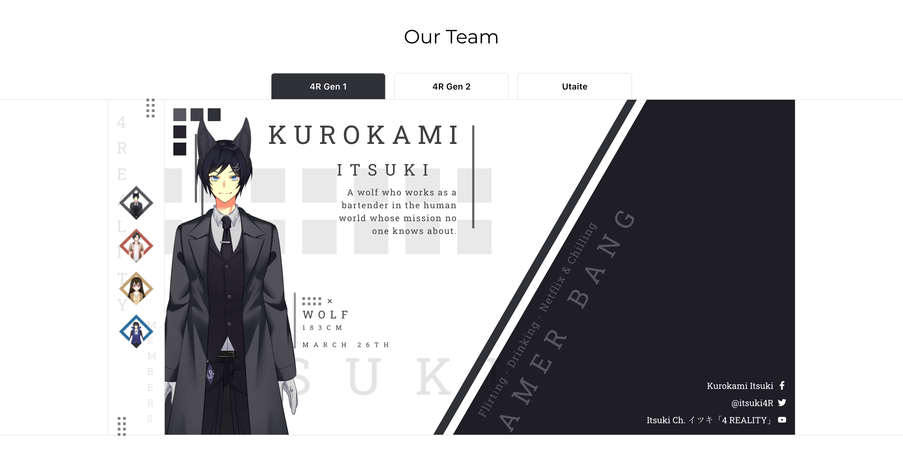

## Terus bagian lainnya gimana, _Tsu_?

> Sebagai konteks, _Tsu_ disini adalah sapaan dari kata _Hatsu_ (初 / はつ).
> Nickname saya pada saat itu adalah _HatsuShiroyuki_ (初白雪) - Salju Putih
> Pertama.

Itulah kalimat pertanyaan yang `Karen` ucapkan ketika saya selesai mengerjakan
_Character Section_, sebuah pertanyaan sederhana namun cukup menguras otak saya
untuk memikirkan bagaimana desain yang cocok untuk _section_ `Home`,
`Visi Misi`, `Kontak Kami`, dan `Footer`.

Betul-betul bukan hal yang mudah, karena impresi pertama yang saya berikan
adalah nuansa _Broken Grid_ yang _chaotic_, namun tetap seimbang dan enak
dipandang.

### Home

_Section_ `Home` secara harfiah hanya menampilkan _overview_ dari keseluruhan
website. Setelah menguras otak cukup lama hanya untuk _section_ `Home`, saya
mengirimkan draft section home ini kepada `Karen` dan `Itsuki`:

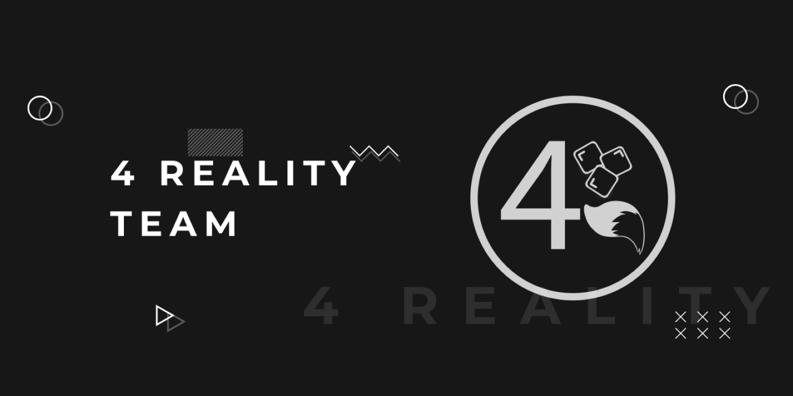

Tidak ada penolakan, namun lebih kepada saran:

> Gimana kalau di bawah 4 Reality Team ini lu tambahin kata-kata ini, Tsu:
> "Together Everyone Achieves More And There is no I in Team."
>
> — <cite>Itsuki</cite>

> Sama sekalian di atas ada header, terus warnanya jangan tok hitam. Agak ke
> abu-abu juga boleh keknya.
>
> — <cite>Karen</cite> 

_Challenge accepted_, Ki, Ren. Setelah beberapa menit menyesuaikan perubahan,
berikut adalah desain yang saya kirimkan lagi ke mereka:

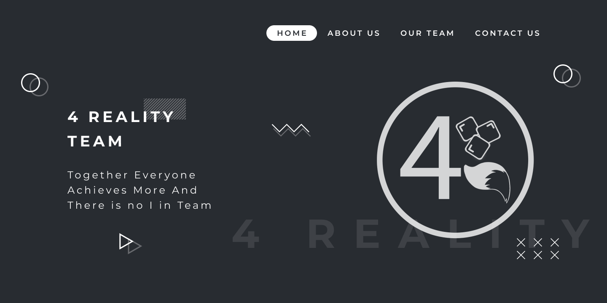

Semua menyetujui desain _Home Section_, dilanjut ke _About Us Section_.

### About Us

_Section_ ini juga adalah sebuah tantangan tersendiri karena kita ingin
menampilkan 1 visi dan 3 misi mereka, namun sekaligus menceritakan secara
singkat tentang tim mereka.

Saya menggagas ide dimana saya akan menggunakan _sub-section_ atas untuk Tentang
Tim, dan _sub-section_ bawah untuk Visi dan Misi. Tentunya desain ini tidak
diterima dengan baik, dan cenderung merusak nuansa _Broken Grid_ yang digunakan:

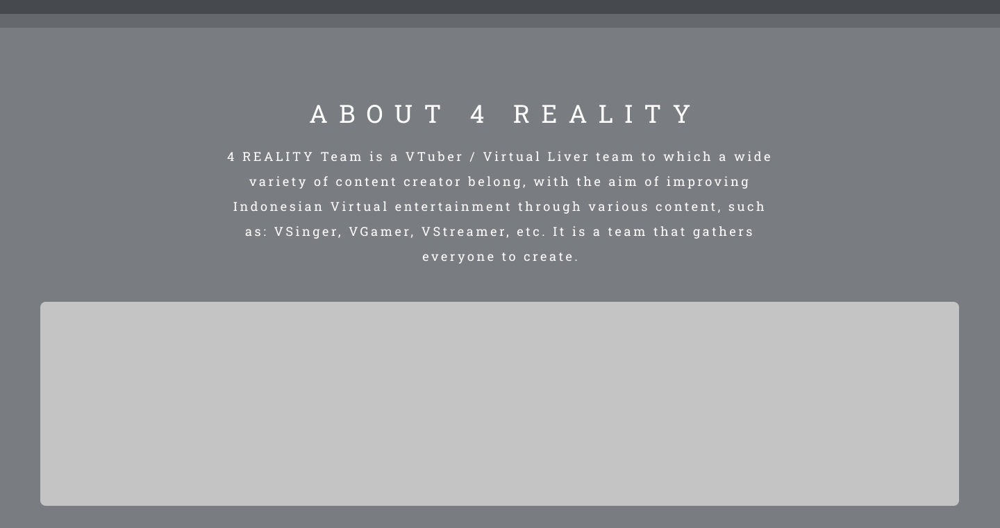

Tentu saja, saya rasa kalian sebagai pembaca juga sama kesalnya "kok gitu?".
Secara teknis tentu akan merusak tema, namun bagaimana lagi, otak juga sudah
_stuck_ 💀. Saya meminta waktu untuk mengistirahatkan otak saya selama beberapa
hari, juga untuk mencari inspirasi untuk _section_ ini.

2 hari telah berlalu, dan saya mengirimkan desain ini:

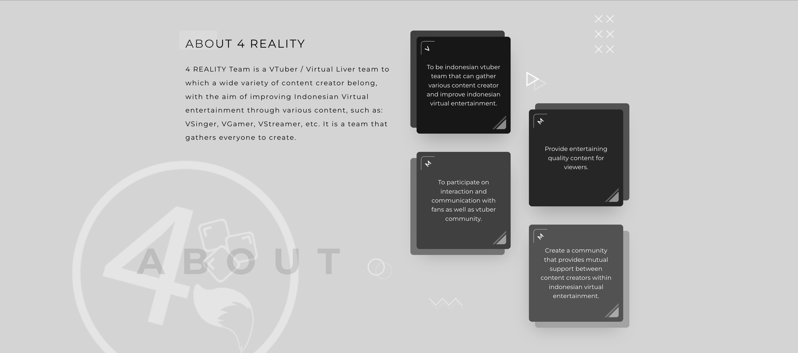

Konsep yang saya buat untuk _About Us Section_ adalah sebagai berikut:

1. Pojok kiri atas berisi 'V' atau 'M', yang berarti Visi atau Misi.
1. Konten visi atau misi tidak terlalu panjang.
1. Susunan _Card_ akan berurut ke bawah, bukan zig-zag pada tampilan Tablet.
1. About 4 Reality yang ada di bagian kiri berbentuk `sticky`, jadi akan secara
   otomatis `scroll` ke bawah ketika user juga `scroll` ke bawah. Ini alasan
   utama mengapa bagian kiri terkesan kosong.

Desain diterima oleh semua anggota 4 Reality, lalu saya langsung menggabungkan
desain yang ada, lalu _slicing_ desain tersebut ke kode.

## Slicing

Slicing adalah tahap paling lama, memikirkan bagaimana tampilan dapat sesuai
pada setiap _viewport_ bukanlah suatu hal yang mudah. Pengetahuan akan
_responsive web design_ akan sangat berguna pada tahap ini.

Untuk _Home Section_, relatif mudah, hanya memakan waktu beberapa jam untuk
dapat menjadikannya responsif di seluruh viewport.

_About Us Section_ juga relatif mudah. Tampilkan _Card_ secara zig-zag di bagian
kanan pada _viewport_ Desktop, tampilkan secara berurutan dari atas ke bawah
pada _viewport_ Tablet, dan hapus _property sticky_ pada _viewport_ Mobile.

_Character Section_ ini tantangan berat dari seluruh _section_.
1. Saya harus membangun seluruh _desain_ yang unik pada setiap
   _Talent_. Ditambah lagi ada permintaan unik dari beberapa _Talent_ yang entah
   menginginkan opsi 2 warna, atau penggunaan arah nama yang berbeda (cek
   detail `Aura Lily` sebagai contoh).
1. Saya harus mengkategorikan setiap _Talent_ kepada bagian yang sesuai.
1. Saya harus memastikan seluruh desain dapat dilihat dengan baik di seluruh
   _viewport_, lagi-lagi harus responsif.

Sisanya untuk _section_ Kontak dan Sosial Media hanya berupa _section_ simpel
yang tidak terlalu bagus, tetapi masih selaras dengan tema warna yang digunakan.

## Akhir kata

Sejauh karir saya dalam pengembangan website, 4 Reality ini adalah website
ter-kompleks yang pernah saya buat. Namun hasil dari kerja keras ini terbayar
dengan baik karena Website 4 Reality menjadi pemenang dalam 2 event Wibucode:

1. Juara 1 Event Front-end 2021 Wibucode pada tanggal 14 Juni 2021
   
   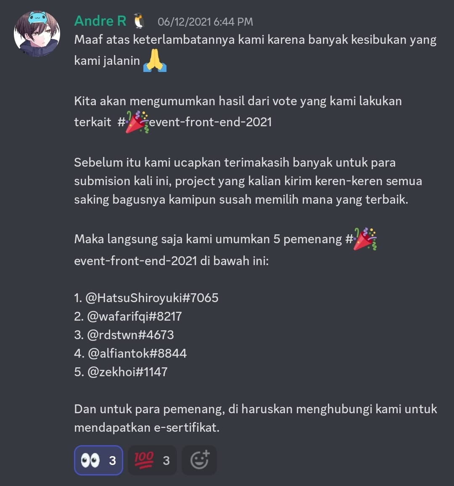

   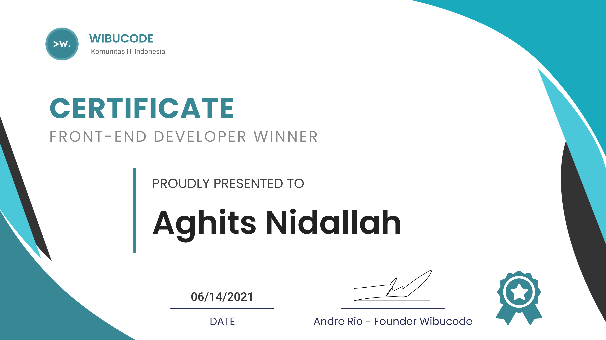

1. Juara 2 Event Tailwind CSS 2021 Wibucode pada tanggal 13 Desember 2021

   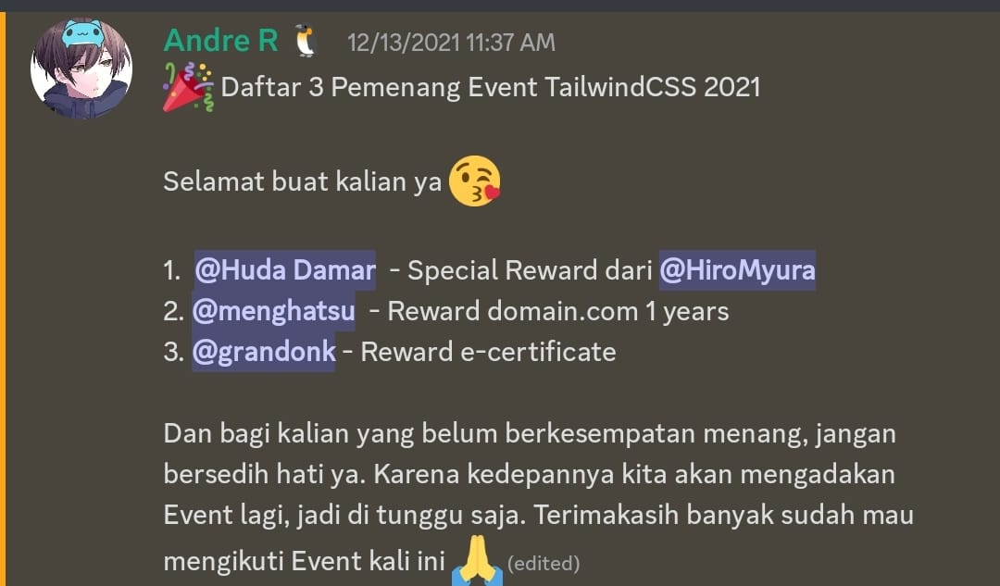

Sebuah prestasi kecil yang membanggakan 😬.

Terima kasih saya ucapkan kepada seluruh pihak yang terkait pada pengembangan
Website ini. Terutama `Karen` yang selalu memberikan umpan balik yang positif
dan membangun, `Itsuki` dan `Nervia (staf)` yang sering memberikan kritik
pedas dan tajam, serta `Aura Lily` yang menjadi motivasi utama dibalik
pengembangan Website ini.