Dumas Presisi adalah sebuah aplikasi berbasis web, yang digunakan secara aktif
oleh Kepolisian Negara Republik Indonesia untuk menampung aspirasi serta
keluhan-keluhan masyarakat terhadap anggota Polri sampai dengan saat ini.

Bekerja sama dengan Itwasum Polri, Bareskrim Polri, dan Divpropam Polri, kami
bersinergi untuk membawa Polri untuk menjadi sebuah instansi yang modern,
terintegrasi, dan Presisi.

Presisi sendiri merupakan sebuah slogan yang digaungkan oleh Kapolri Jenderal
Sigit Listyo Prabowo yang memiliki arti Prediktif, Responsibilitas, dan
Transparansi Berkeadilan. Menggantikan slogan sebelumnya, Promoter yang
memiliki arti Profesional, Modern, dan Terpercaya.

## Sejarah Dumas Presisi

Dumas Presisi adalah sebuah aplikasi yang diusung oleh Itwasum Polri, atau
dikenal sebagai Inspektur Pengawasan Umum Polri, suatu satuan kerja yang
berada di bawah naungan Kapolri secara langsung, yang bekerja untuk mengawasi
dan membantu pimpinan pada tingkat Mabes Polri.

Aplikasi ini diluncurkan pada tanggal 24 Februari 2021 dalam kegiatan Rakerwas
Itwasum Polri T.A 2021 di Gedung Rupatama Mabes Polri oleh Kapolri secara
langsung. Kapolri menegaskan kepada Itwasum Polri untuk menyerap semua informasi
yang disampaikan oleh masyarakat sebagai upaya memperkaya wawasan, serta
menyempurnakan strategi, teknis, dan cara bertindak di lapangan.

## Versi 0 (Development Phase)

Disini adalah awal mula perjalanan kami dimana kami bertiga berada di jembatan
penyebrangan Mabes Polri, terlihat wajah-wajah ceria dengan semangat yang masih
membara. Tidak mengetahui kendala yang akan kami hadapi, kami pun berjalan
selangkah menuju awal dari perjalanan yang panjang ini.

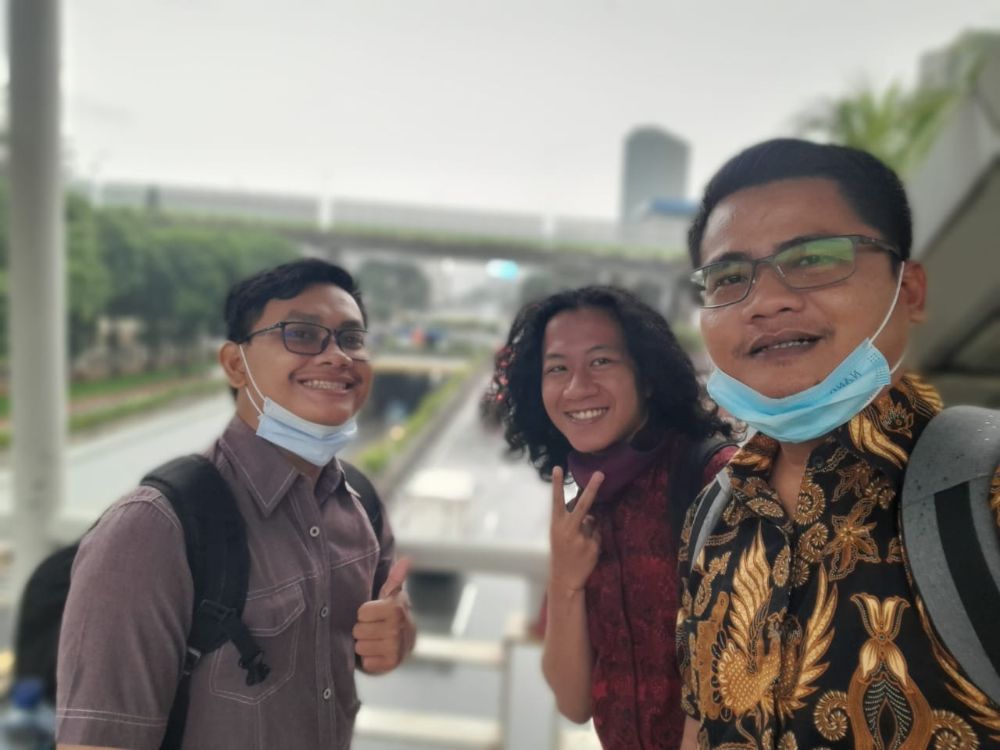

Dumas Presisi pada masa pengembangan adalah sebuah aplikasi yang sangat
sederhana, dengan alur yang sangat sederhana juga. Masyarakat menginputkan
NIK, mengisi formulir pengaduan ke tujuannya (Mabes Polri, Polda, atau Polres),
lalu seorang admin akan menjawab pengaduan tersebut, dan selesai.

Dulu pada saat masa pengembangan, tim kami terdiri dari 3 orang: bapak
Yono Maulana selaku direktur dan konsultan, Aghits Nidallah (saya sendiri),
serta Muhamad Ahmadin. Kami memiliki *timeframe* yang sangat sempit, dengan
durasi waktu kurang dari 1 bulan, kami harus men-*deliver* aplikasi yang sudah
siap pakai, dan dapat disosialisasikan langsung kepada masyarakat. Karena itu,
kami memutuskan untuk menggunakan Laravel dengan alasan *development experience*
yang *robust* dan efisien. Alhasil, Dumas Presisi selesai pada tahap pengembangan
dan siap digunakan dengan waktu pengembangan dalam waktu 2 minggu.

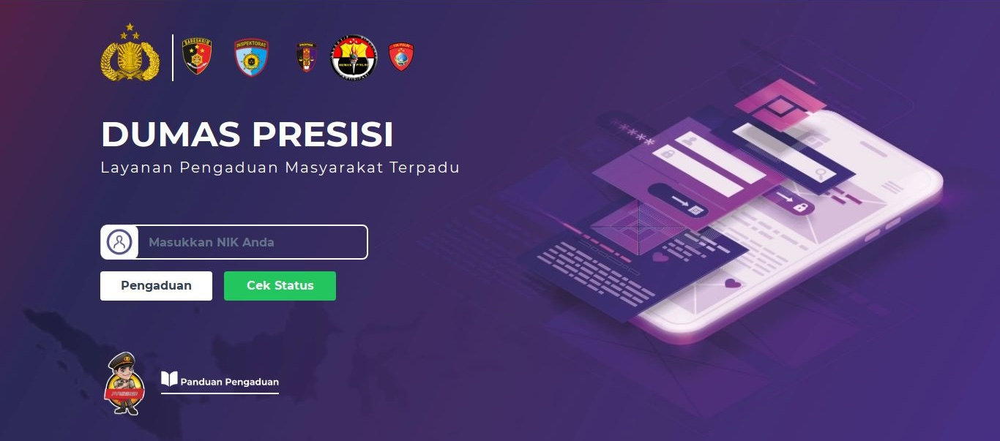

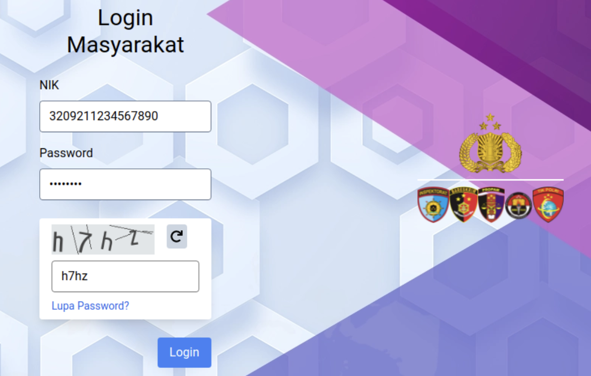

Tentu saja, fase ini adalah suatu fase yang sangat krusial, umpan balik dan
masukkan dari pihak-pihak terkait tak luput dari fase pengembangan ini.
Kami berusaha setiap hari untuk mengakomodir fitur-fitur yang
belum ada pada aplikasi, secara terus menerus, untuk jangka waktu 3 bulan ke
depan.

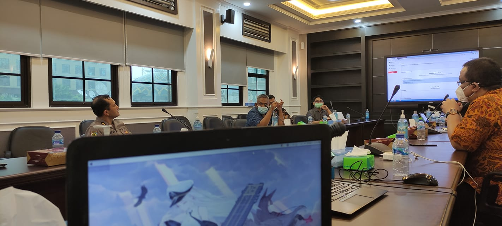

Revisi demi revisi, fitur demi fitur, *bug* demi *bug* kami perbaiki dan
sempurnakan, sampai aplikasi ini menjadi sebuah aplikasi utuh yang dapat
digunakan (secara garis besar). *Fast-forward* beberapa minggu kedepan,
peluncuran aplikasi Dumas Presisi pun dilaksanakan.

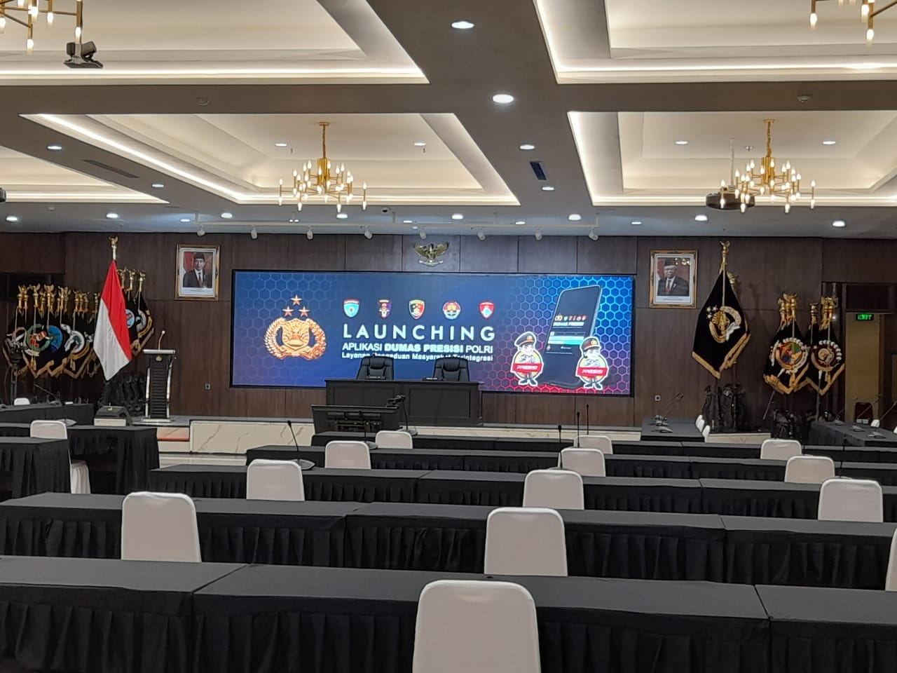

## Versi 1 (Initial Release, Fase Integrasi)

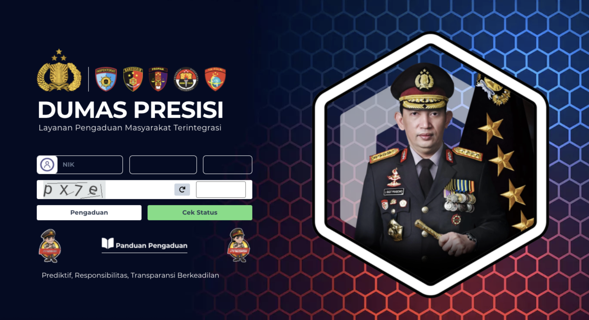

Bulan pertama dirilisnya Dumas Presisi, kami mendapatkan setidaknya 1.300
pengaduan yang dikirimkan oleh masyarakat seluruh Indonesia. Bukan angka yang
fantastis tentunya, namun bagi kami angka tersebut merupakan suatu pencapaian
yang hebat. Fakta bahwa aplikasi kami dipakai secara luas menimbulkan
kepercayaan diri, kepuasan tersendiri, dan kekhawatiran lain yang mungkin
muncul di kemudian hari.

Pada fase ini, kami mulai mengintegrasikan aplikasi kami dengan aplikasi-aplikasi
lain, baik dari internal Polri maupun eksternal Polri. Dari segi internal,
Dumas Presisi terintegrasi dengan Pusiknas Polri di bawah naungan Bareskrim Polri,
serta DBMS di bawah naungan Propam Polri. Dari segi eksternal, kami terintegrasi
dengan Disdukcapil untuk verifikasi NIK, aplikasi E-Lapor Kompolnas, serta
Data Analytics yang dibangun oleh Paques Indonesia.

Pada fase integrasi ini, timbul masalah-masalah baru yang belum pernah kami
hadapi sebelumnya, tentunya dari segi bagaimana kami akan mengolah data yang
akan dikirim / diterima, memikirkan bagaimana caranya data tersebut tetap
aman pada saat pengiriman, serta bagaimana data tersebut tetap tersinkronisasi
walaupun data tersebut sudah berada di aplikasi lain.

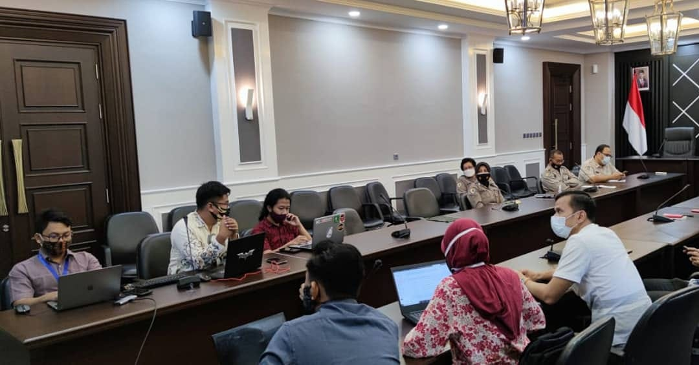

Pada fase ini juga, aplikasi Dumas Presisi terpisah menjadi dua bagian, yaitu
Dumas Presisi *Front-end* dan Dumas Presisi *Back-end*. Jika ditafsirkan menggunakan
terminologi pemrograman, Dumas Presisi masih menjadi suatu aplikasi utuh
secara *full-stack*, namun tidak pada kasus ini.

Dumas Presisi *Front-end* bertugas untuk menerima pengaduan yang dikirimkan oleh
masyarakat dan menyerahkan laporan hasil tindak lanjut yang dikirimkan dari
operator, sementara Dumas Presisi *Back-end* bertugas untuk mendata proses
tindak lanjut yang terjadi di belakang layar secara aktual.

*Front-end* yang dimaksud adalah aplikasi yang kita bangun, sementara *Back-end*
adalah aplikasi yang dibangun oleh Pusiknas Polri. Dengan adanya dua aplikasi
yang terpisah, terdapat banyak kesulitan yang membutuhkan pengiriman data
secara manual setiap harinya. Tentunya hal ini adalah sebuah beban moral dan
energi bagi kami, dan kami harus menyelesaikannya secepat mungkin.

## Versi 2 (The Great Unity, Fase Refaktor)

Di dalam *codebase* yang terburu-buru, akan terdapat juga kode yang hanya dapat
dibaca pada saat pengembangan dan menjadi bahasa asing pada saat *maintenance*.
Pada tahap ini, *codebase* Dumas Presisi harus diubah secara total menjadi
kesatuan yang utuh.

Salah satu perbaikan besar yang kami lakukan adalah yang kami sebut sebagai
*The Great Unity*, yaitu penyatuan aplikasi *Front-end* dan aplikasi *Back-end*.
Masa refaktor ini berlangsung dari awal Oktober 2021 sampai dengan Januari 2022.
Dengan waktu sesingkat itu, kami berhasil memperbaiki *codebase*, serta
menyatukan aplikasi lain sehingga operator di lapangan memiliki kemudahan.

Disaat selesainya refaktor, banyak operator dari Polda-polda yang merasa
kebingungan dikarenakan perubahan *interface* dan *styling*. Walaupun tidak
secara signifikan berubah total, kami menyadari bahwa perubahan sekecil apapun,
pengguna dengan sangat cepat menyadari "ada sesuatu yang salah" pada sistem
kami.

Berikut adalah tampilan dari Dashboard lama

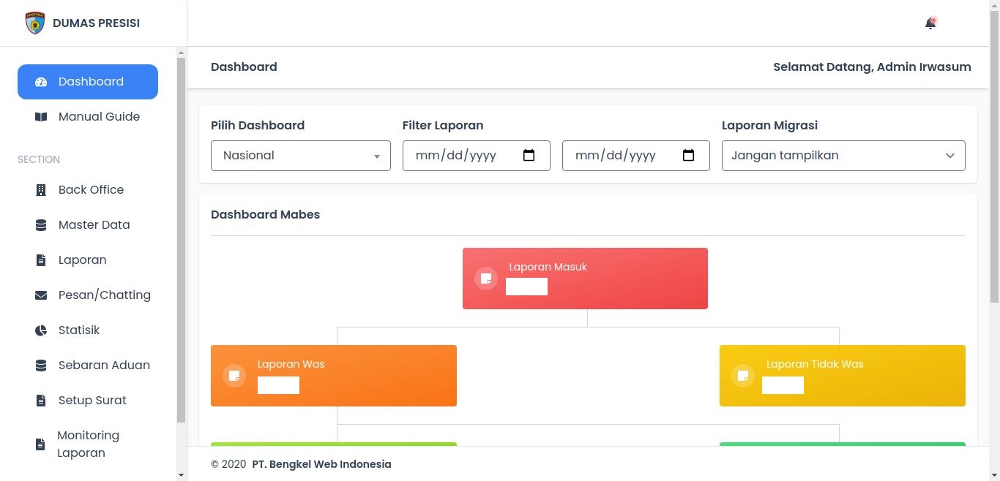

Dan berikut adalah tampilan dari Dashboard baru

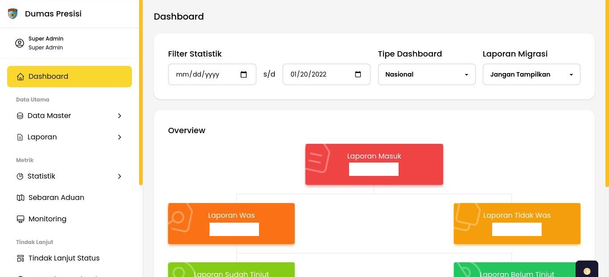

Menyadari permasalah tersebut, kami mengajukan rencana sosialisasi yang dilakukan
untuk memberikan bimbingan kepada operator tingkat Mabes yang berada di Mabes
Polri, serta operator yang berada di Polda jajaran.

Berikut adalah dokumentasi sosialisasi pada Mabes Polri.

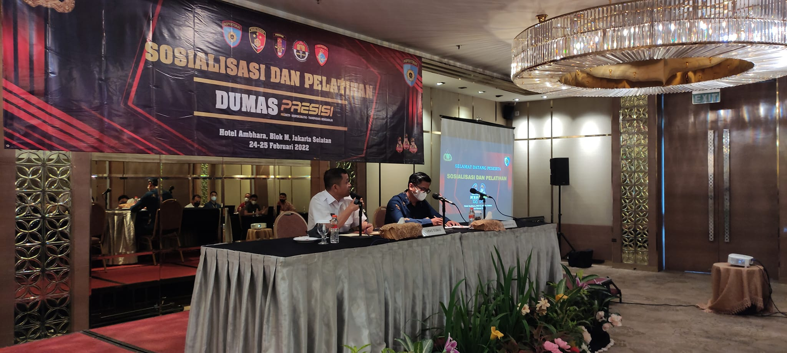

Berikut adalah dokumentasi sosialisasi pada Mabes Polri, untuk operator-operator
di Polda jajaran.

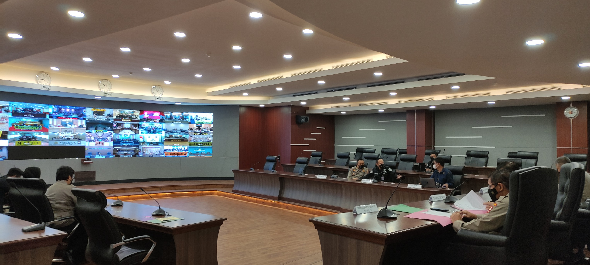

Inti dari kedua sosialisasi ini berfokus kepada tampilan dan fitur-fitur baru
yang berfokus kepada penyajian data statistika yang sewaktu-waktu mungkin
dibutuhkan oleh pimpinan. Kami juga mensosialisasikan bahwa aplikasi *Back-end*
tidak lagi dibutuhkan sehingga Operator Tindak Lanjut dapat mengakses data-datanya
langsung melalui aplikasi Dumas Presisi.

Dalam waktu kurang dari 2 minggu saja, para Operator Tindak Lanjut sudah dapat
beradaptasi dengan perubahan ini. Alasan dari cepatnya adaptasi ini adalah,
kami tidak mengubah alur kerja yang ada di aplikasi *Back-end* lama, walaupun
terdapat sedikit perubahan *styling*. Kami berasumsi bahwa UI dan UX masih
dapat dipertahankan untuk sementara, namun tetap berubah menyempurnakannya
seiring berjalannya waktu.

Perubahan besar dan mendadak akan membutuhkan waktu adaptasi pengguna yang lebih
lama, lebih baik untuk melakukan perubahan-perubahan kecil dan mesosialisasikannya
secara perlahan (atau dengan membuat manual book terkait perubahan tersebut
untuk menghemat biaya).

## Versi 3 (Continuous Maintenance, Fase Stabil)

Membutuhkan waktu hampir 2 tahun untuk Dumas Presisi mencapai titik stabil, dimana
seluruh operator sudah dapat mengoperasikan aplikasi, dimana *bug* sudah jarang
muncul ke permukaan.

Pada fase ini, kami mendapatkan banyak tantangan baru di ranah integrasi dan
ranah penyajian data. Integrasi kami merambah ke beberapa aplikasi pengganti
dari Bareskrim dan Propam. Aplikasi e-Wassidik yang diusung oleh Birowassidik
di bawah naungan Bareskrim Polri, serta aplikasi WA Yanduan yang diusung oleh Biro
Yanduan di bawah naungan Divpropam Polri. Kedua aplikasi ini bertugas untuk
menindaklanjuti pengaduan-pengaduan yang diterima oleh masyarakat yang kasusnya
tidak mungkin ditangani oleh Itwasum.

Di ranah penyajian data, terdapat tantangan terbesar yang kami hadapi, yaitu
permintaan pimpinan terhadap kami untuk membuat suatu fitur yang datanya dapat
dilacak secara detil, dari masing-masing satker Mabes, Polda, dan Polres
di seluruh Indonesia. Fitur ini kami namakan **Backtrace**.

Pada saat pengembangan *Backtrace*, kami menemukan beberapa ketidaksempurnaan perhitungan
data, terlebih lagi disaat kami menyajikan data tersebut secara detil. Karena
hal ini, kami melakukan normalisasi basis data secara masih, sehingga tidak
lagi ada data yang tidak sesuai. Hal ini krusial dikarenakan pimpinan sangat
menginginkan penyajian data yang detil dan penting, untuk digunakan kedepannya
sebagai strategi pengambilan keputusan.

Secara teknis, perbaikan ini memakan waktu yang sangat lama dan berkelanjutan,
hingga pada akhir tahun 2022, kami pun masih memiliki konflik internal dari tim
kami tentang bagaimana data tersebut dapat disajikan dengan benar.

Berikut adalah dokumentasi kami disaat kami berdiskusi tentang bagaimana Dumas
Presisi dan aplikasi-aplikasi yang kami bangun dapat berjalan dengan baik.

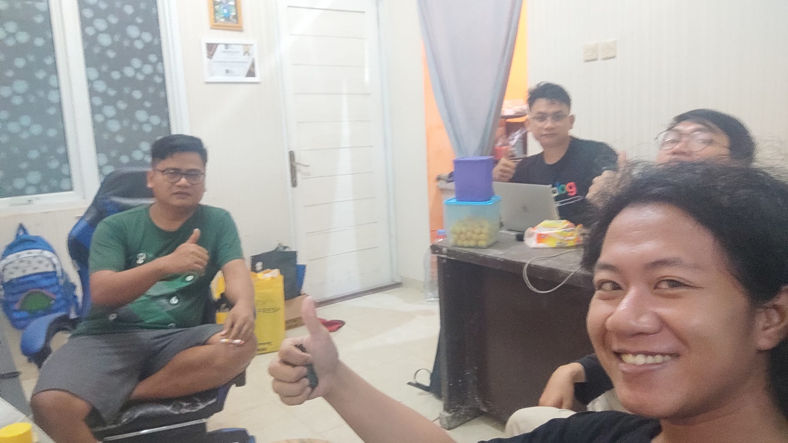

Foto tersebut diambil pada tanggal 27 Januari 2023 pada pukul 01:33. Bisa
dibilang, kami adalah tim yang tidak kenal waktu jika kami mengulas
permasalahan-permasalahan dan mendiskusikan solusi terhadap permasalahan
tersebut. Sebuah tim yang solid, dan terdiri dari para pemuda (tua dikit)
yang kritis.

## Kelanjutan dari Dumas Presisi

Sampai saat ditulisnya artikel ini, Dumas Presisi memiliki rencana untuk
berintegrasi dengan aplikasi-aplikasi lain. Namun rencana tersebut masih belum
kami ketahui secara pasti kapan dan bagaimana eksekusi dan penerapannya secara
eksak.

Satu hal yang pasti, Dumas Presisi akan masih terus berjalan, dan melayani
seluruh masyarakat Indonesia dengan sepenuh hati.

Akhir kata, kami ingin menyampaikan bahwa sejak awal aplikasi ini diluncurkan
oleh Kapolri Jenderal Listyo Sigit Prabowo, Dumas Presisi telah:
- Mengalami perubahan versi sebanyak 3x;
- Mengalami berbagai krisis teknis dan non-teknis, yang semuanya dapat terselesaikan dengan baik;
- Terintegrasi dengan lebih dari 5 aplikasi;
- Memiliki lebih dari 10 fitur utama, dan 35 sub-fitur yang secara aktif digunakan;
- Menerima lebih dari 30 ribu aduan yang sudah terselesaikan;
- Digunakan oleh lebih dari 1 ribu akun operator di seluruh Indonesia;
- Menjadi produk unggulan Polri Presisi terbaik dari hasil lembaga survey Charta Politika, periode bulan Mei hingga Oktober 2021, dengan menempati tingkat 3 teratas dengan perolehan persentase sebanyak 20%;